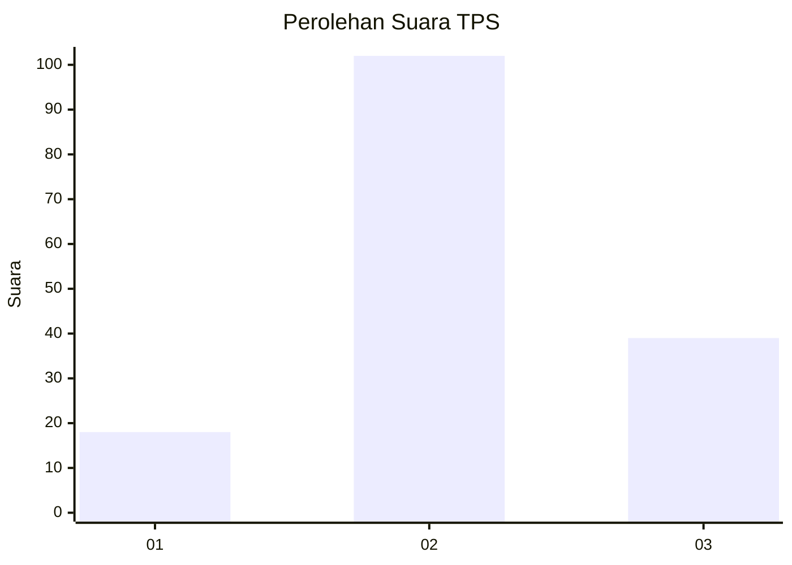
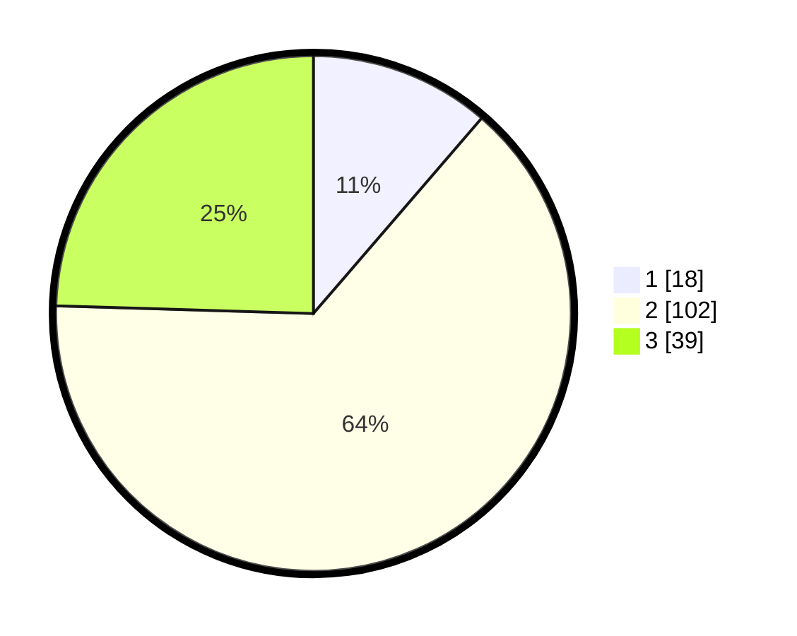

# Hasil

## Grafik

## Tabel

| No. | Nama Paslon    | Suara | Suara (raw) | Persentase |
|:--- |:-------------- | -----:| -----------:| ----------:|
| 1   | ANIES MUHAIMIN | 18    | [18][p-1]   | 11,32      |
| 2   | PRABOWO GIBRAN | 102   | [102][p-2]  | 64,15      |
| 3   | GANJAR MAHFUD  | 39    | [39][p-3]   | 24,53      |

[p-1]: https://github.com/gigit-pemilu/pemilu-2024-35-jawa-timur/blob/main/pilpres/hitung-suara/sub/35-jawa-timur/sub/09-jember/sub/11-wuluhan/sub/2003-tamansari/sub/022-tps/sub/paslon-1.txt
[p-2]: https://github.com/gigit-pemilu/pemilu-2024-35-jawa-timur/blob/main/pilpres/hitung-suara/sub/35-jawa-timur/sub/09-jember/sub/11-wuluhan/sub/2003-tamansari/sub/022-tps/sub/paslon-2.txt
[p-3]: https://github.com/gigit-pemilu/pemilu-2024-35-jawa-timur/blob/main/pilpres/hitung-suara/sub/35-jawa-timur/sub/09-jember/sub/11-wuluhan/sub/2003-tamansari/sub/022-tps/sub/paslon-3.txt

## Foto C Plano

https://sirekap-obj-formc.kpu.go.id/0c10/pemilu/ppwp/35/09/11/20/03/3509112003022-20240214-215241--aaf7abc8-f33b-4c30-a9b0-939ef1f0ea6c.jpg

https://sirekap-obj-formc.kpu.go.id/0c10/pemilu/ppwp/35/09/11/20/03/3509112003022-20240214-215247--1df0c729-9f9c-4186-bfb4-d3bcaee2ed0d.jpg

https://sirekap-obj-formc.kpu.go.id/0c10/pemilu/ppwp/35/09/11/20/03/3509112003022-20240214-215253--9ed80cdf-002b-45d8-b044-8af76b3e0de7.jpg

## Metadata

| Key        | Value               |
| ---------- | ------------------- |
| Time Stamp | 2024-02-15 15:00:29 |

