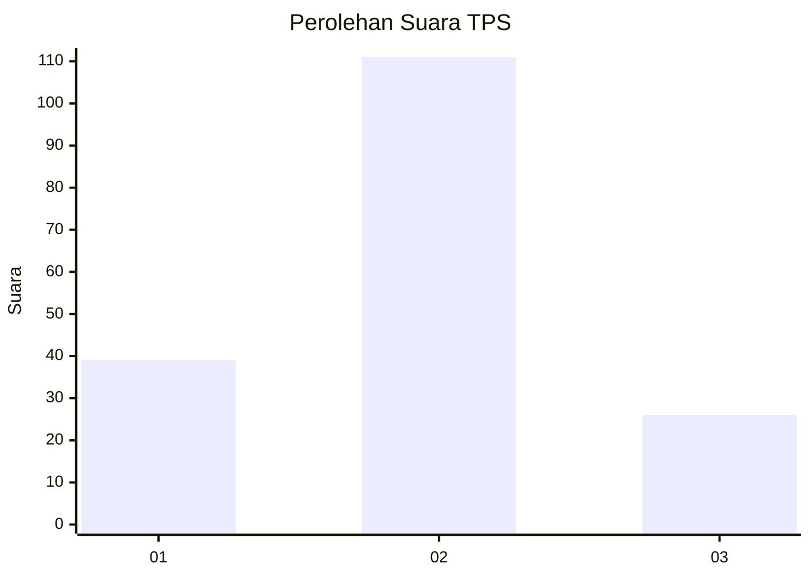
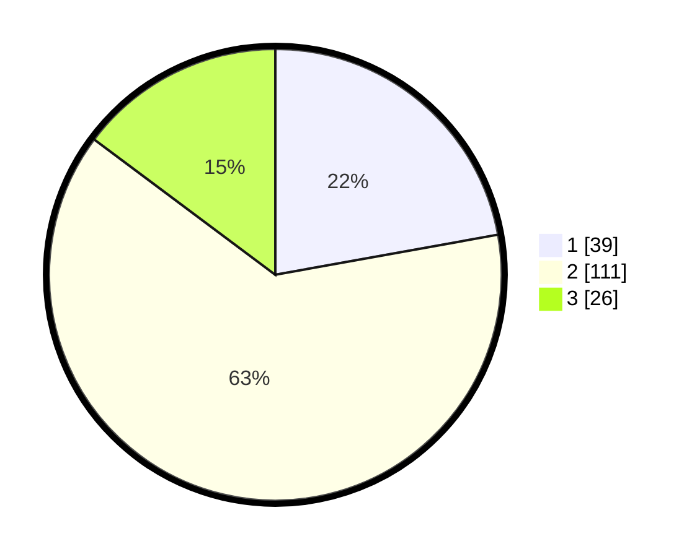

# Hasil

## Grafik

## Tabel

| No. | Nama Paslon    | Suara | Suara (raw) | Persentase |
|:--- |:-------------- | -----:| -----------:| ----------:|
| 1   | ANIES MUHAIMIN | 39    | [39][p-1]   | 22,16      |
| 2   | PRABOWO GIBRAN | 111   | [111][p-2]  | 63,07      |
| 3   | GANJAR MAHFUD  | 26    | [26][p-3]   | 14,77      |

[p-1]: https://github.com/gigit-pemilu/pemilu-2024/blob/main/pilpres/hitung-suara/sub/35-jawa-timur/sub/09-jember/sub/11-wuluhan/sub/2003-tamansari/sub/036-tps/sub/paslon-1.txt
[p-2]: https://github.com/gigit-pemilu/pemilu-2024/blob/main/pilpres/hitung-suara/sub/35-jawa-timur/sub/09-jember/sub/11-wuluhan/sub/2003-tamansari/sub/036-tps/sub/paslon-2.txt
[p-3]: https://github.com/gigit-pemilu/pemilu-2024/blob/main/pilpres/hitung-suara/sub/35-jawa-timur/sub/09-jember/sub/11-wuluhan/sub/2003-tamansari/sub/036-tps/sub/paslon-3.txt

## Foto C Plano

https://sirekap-obj-formc.kpu.go.id/eee0/pemilu/ppwp/35/09/11/20/03/3509112003036-20240214-220302--9948df03-0764-4abb-8255-1c5c23046e44.jpg

https://sirekap-obj-formc.kpu.go.id/eee0/pemilu/ppwp/35/09/11/20/03/3509112003036-20240214-220326--f2e0271f-5fd2-4ed1-97b0-a824ce5de8d8.jpg

https://sirekap-obj-formc.kpu.go.id/eee0/pemilu/ppwp/35/09/11/20/03/3509112003036-20240214-220347--8ccdfb6f-18c8-4bf6-9e0c-edbf92b658a8.jpg

## Metadata

| Key        | Value               |
| ---------- | ------------------- |
| Time Stamp | 2024-02-25 17:00:00 |

