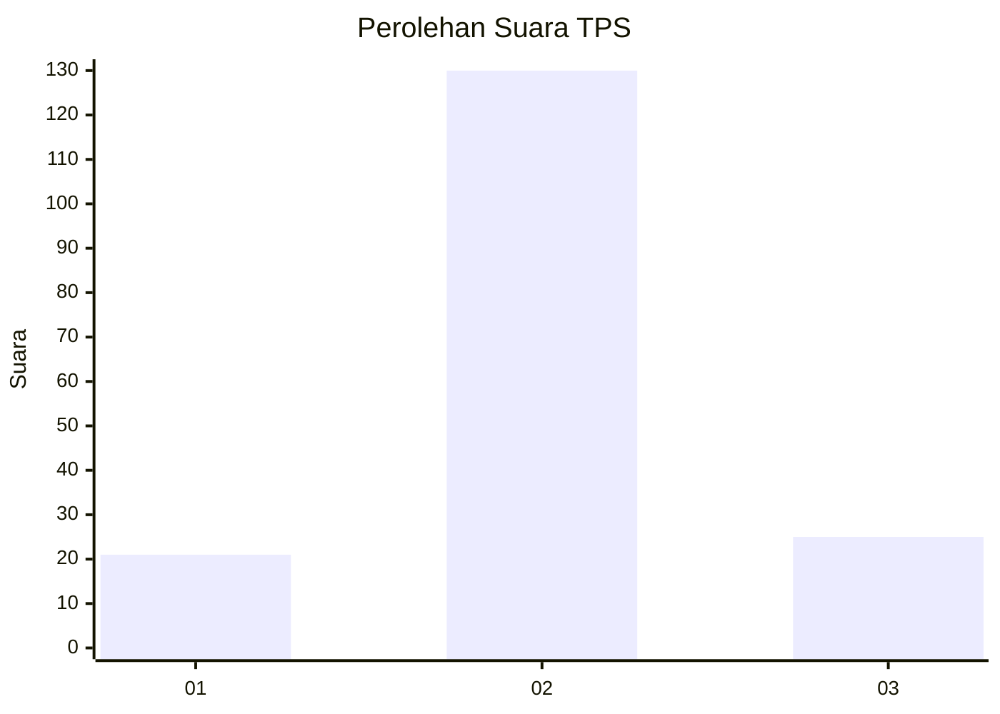
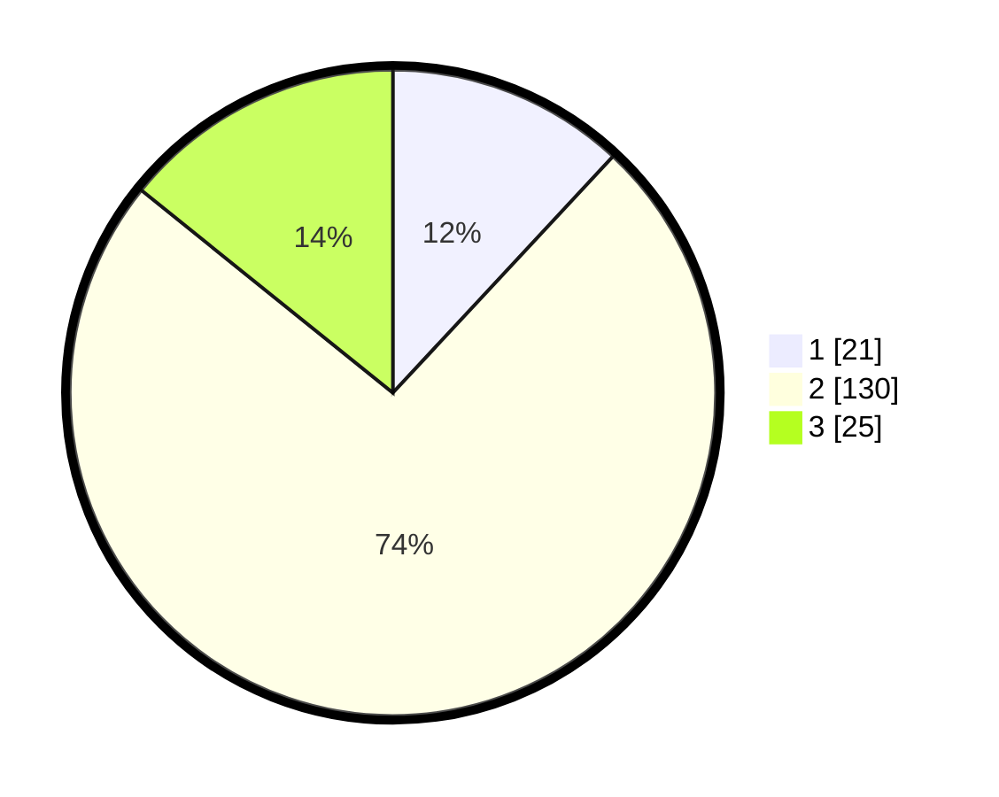

# Hasil

## Grafik

## Tabel

| No. | Nama Paslon    | Suara | Suara (raw) | Persentase |
|:--- |:-------------- | -----:| -----------:| ----------:|
| 1   | ANIES MUHAIMIN | 21    | [21][p-1]   | 11,93      |
| 2   | PRABOWO GIBRAN | 130   | [130][p-2]  | 73,86      |
| 3   | GANJAR MAHFUD  | 25    | [25][p-3]   | 14,20      |

[p-1]: https://github.com/gigit-pemilu/pemilu-2024/blob/main/pilpres/hitung-suara/sub/35-jawa-timur/sub/09-jember/sub/11-wuluhan/sub/2003-tamansari/sub/037-tps/sub/paslon-1.txt
[p-2]: https://github.com/gigit-pemilu/pemilu-2024/blob/main/pilpres/hitung-suara/sub/35-jawa-timur/sub/09-jember/sub/11-wuluhan/sub/2003-tamansari/sub/037-tps/sub/paslon-2.txt
[p-3]: https://github.com/gigit-pemilu/pemilu-2024/blob/main/pilpres/hitung-suara/sub/35-jawa-timur/sub/09-jember/sub/11-wuluhan/sub/2003-tamansari/sub/037-tps/sub/paslon-3.txt

## Foto C Plano

https://sirekap-obj-formc.kpu.go.id/01ec/pemilu/ppwp/35/09/11/20/03/3509112003037-20240215-015442--657614a3-ca28-4613-be26-90297cbe641c.jpg

https://sirekap-obj-formc.kpu.go.id/01ec/pemilu/ppwp/35/09/11/20/03/3509112003037-20240214-195113--c19819bc-5b78-4f5f-8794-bb149ca5b696.jpg

https://sirekap-obj-formc.kpu.go.id/01ec/pemilu/ppwp/35/09/11/20/03/3509112003037-20240214-195215--6301b5d0-b874-459a-9f0f-625561bdcad2.jpg

## Metadata

| Key        | Value               |
| ---------- | ------------------- |
| Time Stamp | 2024-02-24 22:31:28 |

