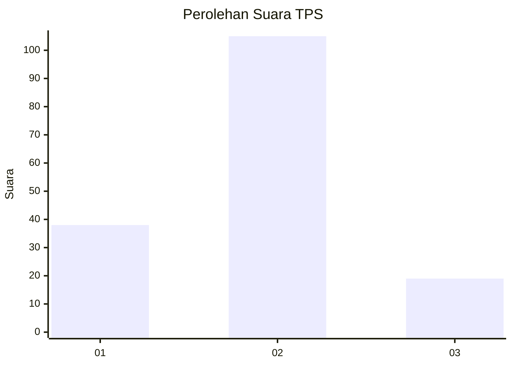
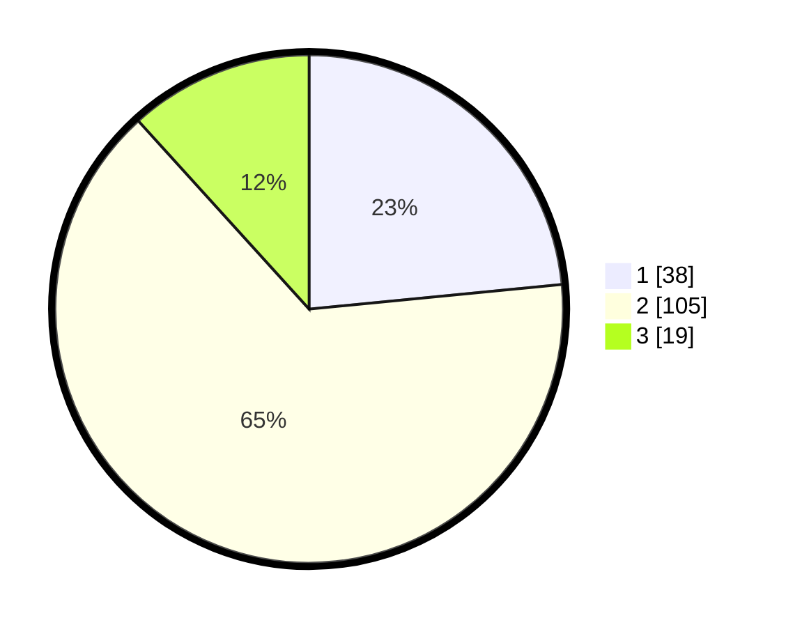

# Hasil

## Grafik

## Tabel

| No. | Nama Paslon    | Suara | Suara (raw) | Persentase |
|:--- |:-------------- | -----:| -----------:| ----------:|
| 1   | ANIES MUHAIMIN | 38    | [38][p-1]   | 23,46      |
| 2   | PRABOWO GIBRAN | 105   | [105][p-2]  | 64,81      |
| 3   | GANJAR MAHFUD  | 19    | [19][p-3]   | 11,73      |

[p-1]: https://github.com/gigit-pemilu/pemilu-2024/blob/main/pilpres/hitung-suara/sub/35-jawa-timur/sub/09-jember/sub/11-wuluhan/sub/2004-dukuhdempok/sub/035-tps/sub/paslon-1.txt
[p-2]: https://github.com/gigit-pemilu/pemilu-2024/blob/main/pilpres/hitung-suara/sub/35-jawa-timur/sub/09-jember/sub/11-wuluhan/sub/2004-dukuhdempok/sub/035-tps/sub/paslon-2.txt
[p-3]: https://github.com/gigit-pemilu/pemilu-2024/blob/main/pilpres/hitung-suara/sub/35-jawa-timur/sub/09-jember/sub/11-wuluhan/sub/2004-dukuhdempok/sub/035-tps/sub/paslon-3.txt

## Foto C Plano

https://sirekap-obj-formc.kpu.go.id/9d0c/pemilu/ppwp/35/09/11/20/04/3509112004035-20240215-002331--709038ac-4ac6-4c7f-89d2-f818042ebb66.jpg

https://sirekap-obj-formc.kpu.go.id/9d0c/pemilu/ppwp/35/09/11/20/04/3509112004035-20240215-002423--aee35bfd-bcde-44d9-9ca6-c98f2a9c2d01.jpg

https://sirekap-obj-formc.kpu.go.id/9d0c/pemilu/ppwp/35/09/11/20/04/3509112004035-20240215-002430--9f745fd7-7fa0-4397-bf84-2691084f336b.jpg

## Metadata

| Key        | Value               |
| ---------- | ------------------- |
| Time Stamp | 2024-02-24 22:31:28 |

