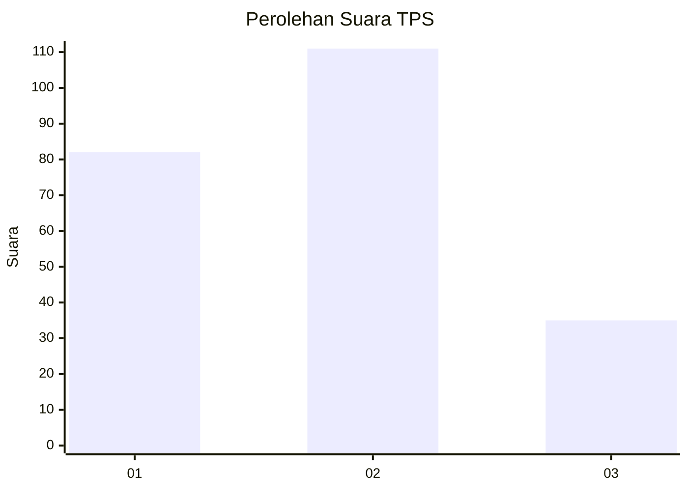
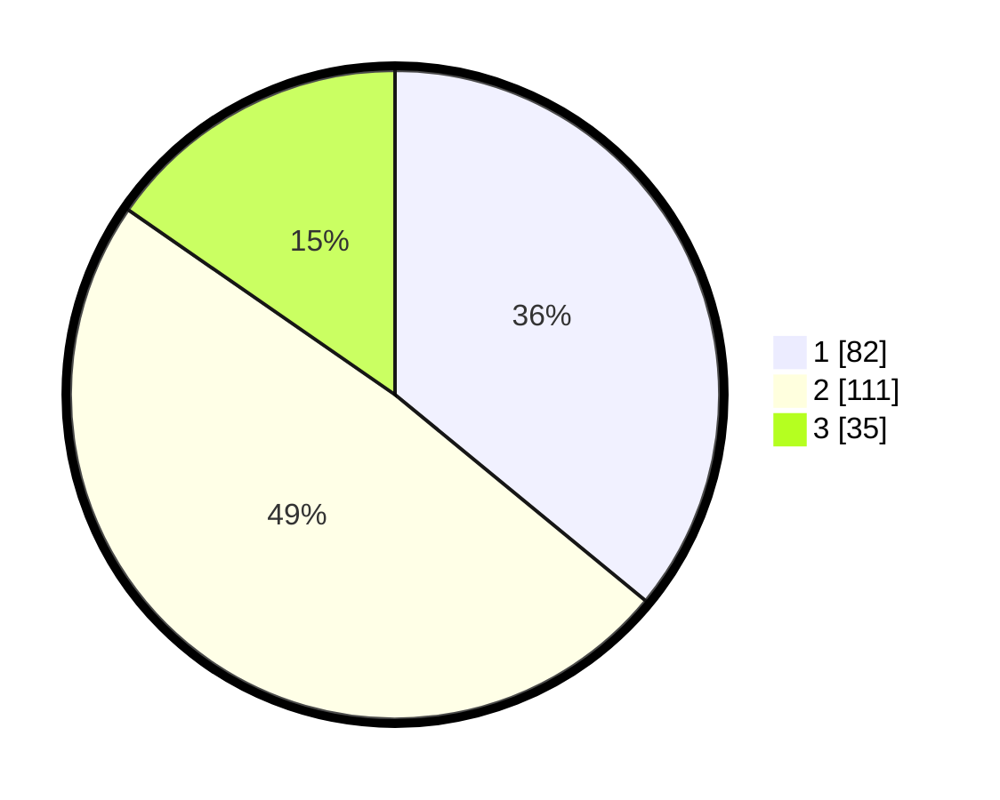

# Hasil

## Grafik

## Tabel

| No. | Nama Paslon    | Suara | Suara (raw) | Persentase |
|:--- |:-------------- | -----:| -----------:| ----------:|
| 1   | ANIES MUHAIMIN | 82    | [82][p-1]   | 35,96      |
| 2   | PRABOWO GIBRAN | 111   | [111][p-2]  | 48,68      |
| 3   | GANJAR MAHFUD  | 35    | [35][p-3]   | 15,35      |

[p-1]: https://github.com/gigit-pemilu/pemilu-2024-35-jawa-timur/blob/main/pilpres/hitung-suara/sub/35-jawa-timur/sub/09-jember/sub/11-wuluhan/sub/2004-dukuhdempok/sub/043-tps/sub/paslon-1.txt
[p-2]: https://github.com/gigit-pemilu/pemilu-2024-35-jawa-timur/blob/main/pilpres/hitung-suara/sub/35-jawa-timur/sub/09-jember/sub/11-wuluhan/sub/2004-dukuhdempok/sub/043-tps/sub/paslon-2.txt
[p-3]: https://github.com/gigit-pemilu/pemilu-2024-35-jawa-timur/blob/main/pilpres/hitung-suara/sub/35-jawa-timur/sub/09-jember/sub/11-wuluhan/sub/2004-dukuhdempok/sub/043-tps/sub/paslon-3.txt

## Foto C Plano

https://sirekap-obj-formc.kpu.go.id/bb87/pemilu/ppwp/35/09/11/20/04/3509112004043-20240214-201512--65f2f54a-a4e3-4b9e-827e-d7fec1db56ad.jpg

https://sirekap-obj-formc.kpu.go.id/bb87/pemilu/ppwp/35/09/11/20/04/3509112004043-20240214-201807--1fea30bb-4934-44ca-ada4-c018381df6a3.jpg

https://sirekap-obj-formc.kpu.go.id/bb87/pemilu/ppwp/35/09/11/20/04/3509112004043-20240214-201926--e258d53d-3ea8-4414-8ca1-fa90018bc537.jpg

## Metadata

| Key        | Value               |
| ---------- | ------------------- |
| Time Stamp | 2024-02-24 23:00:00 |

