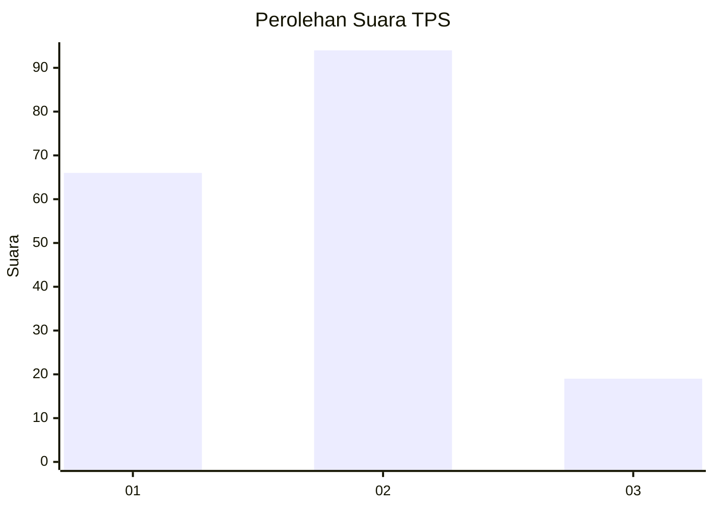
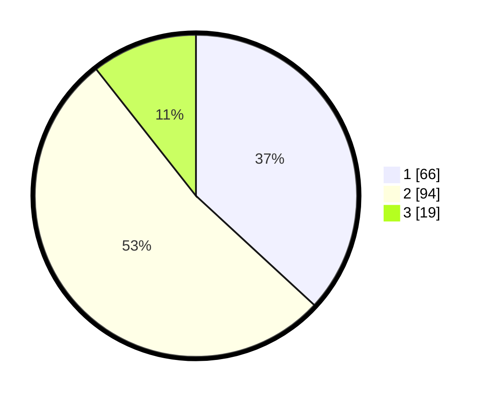

# Hasil

## Grafik

## Tabel

| No. | Nama Paslon    | Suara | Suara (raw) | Persentase |
|:--- |:-------------- | -----:| -----------:| ----------:|
| 1   | ANIES MUHAIMIN | 66    | [66][p-1]   | 36,87      |
| 2   | PRABOWO GIBRAN | 94    | [94][p-2]   | 52,51      |
| 3   | GANJAR MAHFUD  | 19    | [19][p-3]   | 10,61      |

[p-1]: https://github.com/gigit-pemilu/pemilu-2024-35-jawa-timur/blob/main/pilpres/hitung-suara/sub/35-jawa-timur/sub/09-jember/sub/11-wuluhan/sub/2004-dukuhdempok/sub/049-tps/sub/paslon-1.txt
[p-2]: https://github.com/gigit-pemilu/pemilu-2024-35-jawa-timur/blob/main/pilpres/hitung-suara/sub/35-jawa-timur/sub/09-jember/sub/11-wuluhan/sub/2004-dukuhdempok/sub/049-tps/sub/paslon-2.txt
[p-3]: https://github.com/gigit-pemilu/pemilu-2024-35-jawa-timur/blob/main/pilpres/hitung-suara/sub/35-jawa-timur/sub/09-jember/sub/11-wuluhan/sub/2004-dukuhdempok/sub/049-tps/sub/paslon-3.txt

## Foto C Plano

https://sirekap-obj-formc.kpu.go.id/9831/pemilu/ppwp/35/09/11/20/04/3509112004049-20240215-020047--87f2a568-7775-4fc4-92f3-d49e9a547f6a.jpg

https://sirekap-obj-formc.kpu.go.id/9831/pemilu/ppwp/35/09/11/20/04/3509112004049-20240215-020120--ed0acadb-9c70-4ad0-9368-931c558cad7b.jpg

https://sirekap-obj-formc.kpu.go.id/9831/pemilu/ppwp/35/09/11/20/04/3509112004049-20240215-020141--e6ea1132-0eab-4951-a423-4bd33bba1784.jpg

## Metadata

| Key        | Value               |
| ---------- | ------------------- |
| Time Stamp | 2024-02-15 15:00:29 |

