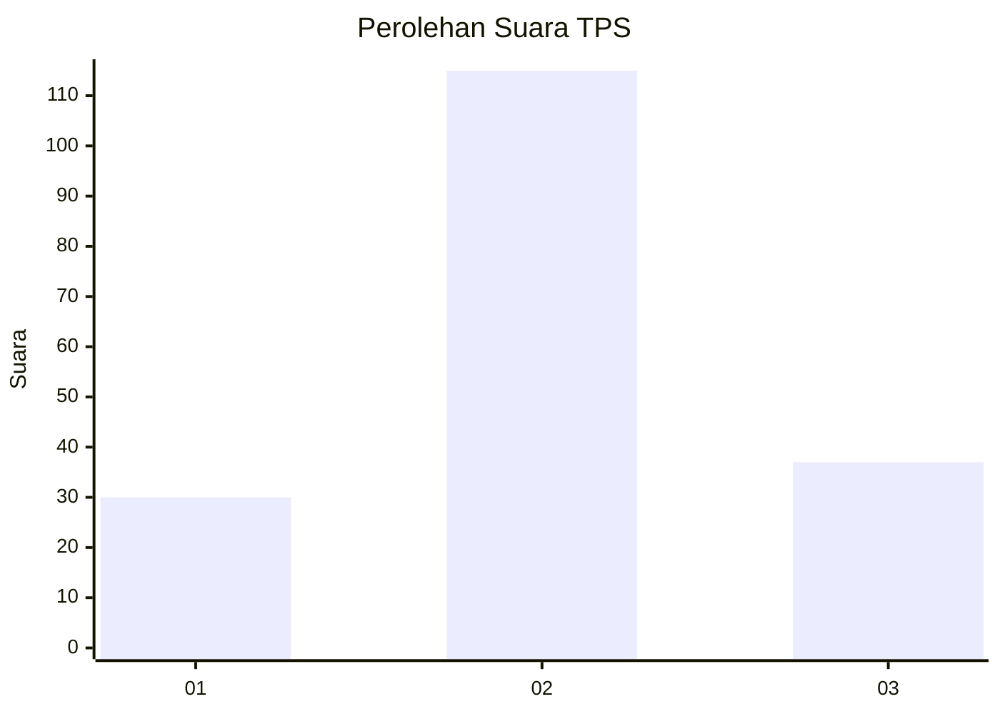
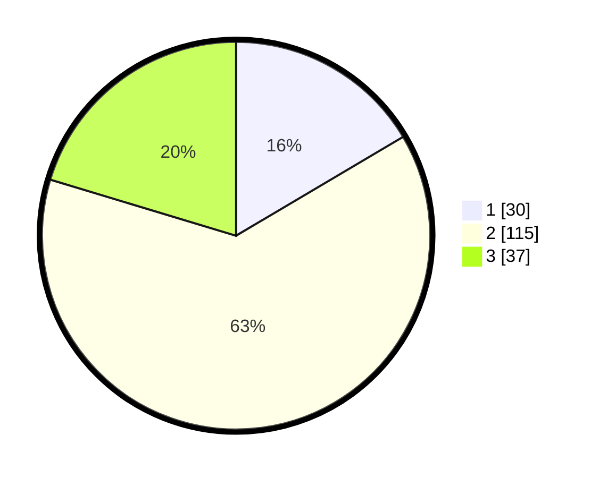

# Hasil

## Grafik

## Tabel

| No. | Nama Paslon    | Suara | Suara (raw) | Persentase |
|:--- |:-------------- | -----:| -----------:| ----------:|
| 1   | ANIES MUHAIMIN | 30    | [30][p-1]   | 16,48      |
| 2   | PRABOWO GIBRAN | 115   | [115][p-2]  | 63,19      |
| 3   | GANJAR MAHFUD  | 37    | [37][p-3]   | 20,33      |

[p-1]: https://github.com/gigit-pemilu/pemilu-2024-35-jawa-timur/blob/main/pilpres/hitung-suara/sub/35-jawa-timur/sub/09-jember/sub/11-wuluhan/sub/2005-glundengan/sub/006-tps/sub/paslon-1.txt
[p-2]: https://github.com/gigit-pemilu/pemilu-2024-35-jawa-timur/blob/main/pilpres/hitung-suara/sub/35-jawa-timur/sub/09-jember/sub/11-wuluhan/sub/2005-glundengan/sub/006-tps/sub/paslon-2.txt
[p-3]: https://github.com/gigit-pemilu/pemilu-2024-35-jawa-timur/blob/main/pilpres/hitung-suara/sub/35-jawa-timur/sub/09-jember/sub/11-wuluhan/sub/2005-glundengan/sub/006-tps/sub/paslon-3.txt

## Foto C Plano

https://sirekap-obj-formc.kpu.go.id/98f4/pemilu/ppwp/35/09/11/20/05/3509112005006-20240214-220846--808e4d32-1f28-4e1a-8230-01e719dd8105.jpg

https://sirekap-obj-formc.kpu.go.id/98f4/pemilu/ppwp/35/09/11/20/05/3509112005006-20240214-222545--ada3cedc-d732-4ee8-b1fd-df26eb8c6792.jpg

https://sirekap-obj-formc.kpu.go.id/98f4/pemilu/ppwp/35/09/11/20/05/3509112005006-20240214-222802--c2af7a9a-1f13-4652-a603-a952f84bec4d.jpg

## Metadata

| Key        | Value               |
| ---------- | ------------------- |
| Time Stamp | 2024-02-15 15:00:29 |

