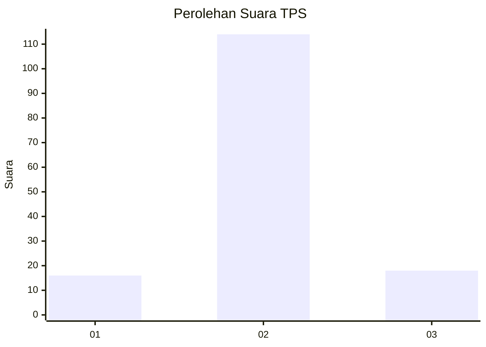
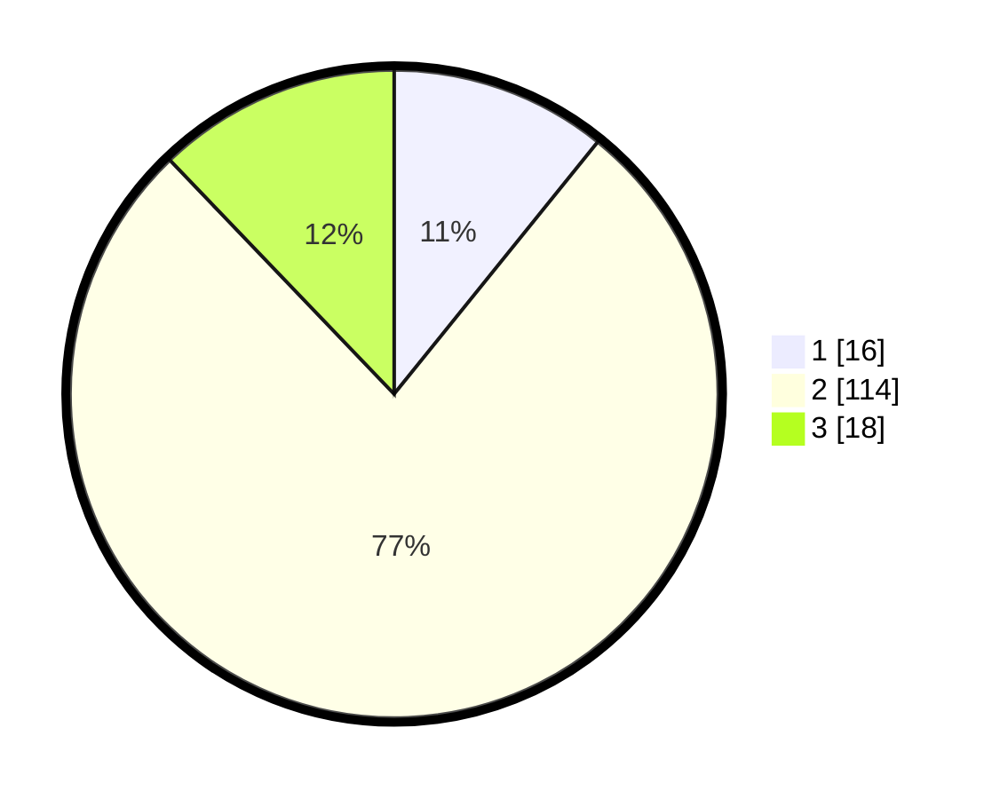

# Hasil

## Grafik

## Tabel

| No. | Nama Paslon    | Suara | Suara (raw) | Persentase |
|:--- |:-------------- | -----:| -----------:| ----------:|
| 1   | ANIES MUHAIMIN | 16    | [16][p-1]   | 10,81      |
| 2   | PRABOWO GIBRAN | 114   | [114][p-2]  | 77,03      |
| 3   | GANJAR MAHFUD  | 18    | [18][p-3]   | 12,16      |

[p-1]: https://github.com/gigit-pemilu/pemilu-2024/blob/main/pilpres/hitung-suara/sub/35-jawa-timur/sub/09-jember/sub/11-wuluhan/sub/2005-glundengan/sub/008-tps/sub/paslon-1.txt
[p-2]: https://github.com/gigit-pemilu/pemilu-2024/blob/main/pilpres/hitung-suara/sub/35-jawa-timur/sub/09-jember/sub/11-wuluhan/sub/2005-glundengan/sub/008-tps/sub/paslon-2.txt
[p-3]: https://github.com/gigit-pemilu/pemilu-2024/blob/main/pilpres/hitung-suara/sub/35-jawa-timur/sub/09-jember/sub/11-wuluhan/sub/2005-glundengan/sub/008-tps/sub/paslon-3.txt

## Foto C Plano

https://sirekap-obj-formc.kpu.go.id/e043/pemilu/ppwp/35/09/11/20/05/3509112005008-20240215-100835--15b32f10-839c-44a3-8987-f784869a4176.jpg

https://sirekap-obj-formc.kpu.go.id/e043/pemilu/ppwp/35/09/11/20/05/3509112005008-20240215-101137--53bd87d8-a12f-411a-af8f-94bb53677834.jpg

https://sirekap-obj-formc.kpu.go.id/e043/pemilu/ppwp/35/09/11/20/05/3509112005008-20240215-101637--47baa043-e44c-4c83-8066-18a2a4d7d270.jpg

## Metadata

| Key        | Value               |
| ---------- | ------------------- |
| Time Stamp | 2024-02-25 16:00:00 |

