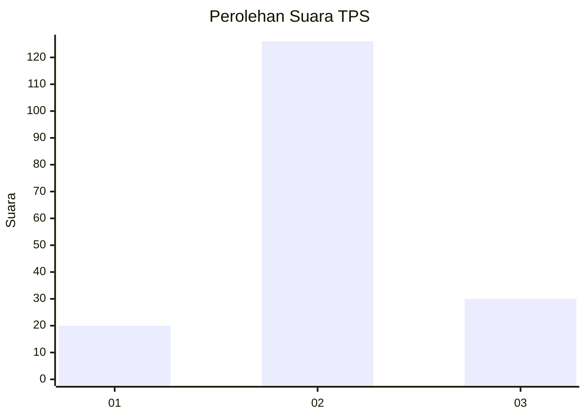
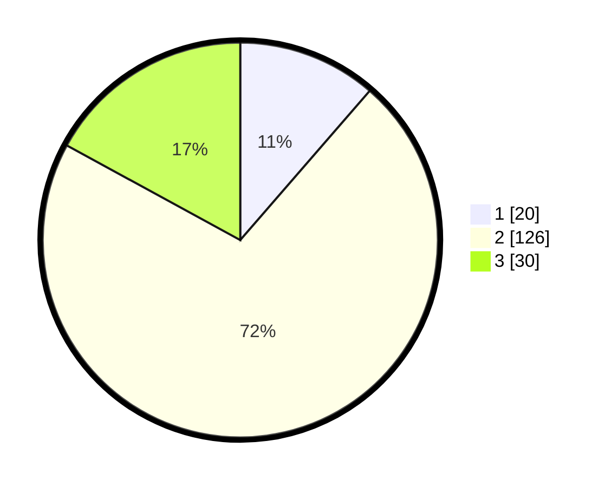

# Hasil

## Grafik

## Tabel

| No. | Nama Paslon    | Suara | Suara (raw) | Persentase |
|:--- |:-------------- | -----:| -----------:| ----------:|
| 1   | ANIES MUHAIMIN | 20    | [20][p-1]   | 11,36      |
| 2   | PRABOWO GIBRAN | 126   | [126][p-2]  | 71,59      |
| 3   | GANJAR MAHFUD  | 30    | [30][p-3]   | 17,05      |

[p-1]: https://github.com/gigit-pemilu/pemilu-2024/blob/main/pilpres/hitung-suara/sub/35-jawa-timur/sub/09-jember/sub/11-wuluhan/sub/2005-glundengan/sub/023-tps/sub/paslon-1.txt
[p-2]: https://github.com/gigit-pemilu/pemilu-2024/blob/main/pilpres/hitung-suara/sub/35-jawa-timur/sub/09-jember/sub/11-wuluhan/sub/2005-glundengan/sub/023-tps/sub/paslon-2.txt
[p-3]: https://github.com/gigit-pemilu/pemilu-2024/blob/main/pilpres/hitung-suara/sub/35-jawa-timur/sub/09-jember/sub/11-wuluhan/sub/2005-glundengan/sub/023-tps/sub/paslon-3.txt

## Foto C Plano

https://sirekap-obj-formc.kpu.go.id/79a8/pemilu/ppwp/35/09/11/20/05/3509112005023-20240221-204348--e16ffaf0-c49a-4d1e-8601-85fa608fe3c1.jpg

https://sirekap-obj-formc.kpu.go.id/79a8/pemilu/ppwp/35/09/11/20/05/3509112005023-20240215-080034--fe66fc73-819f-443c-a44c-89f7ff7827af.jpg

https://sirekap-obj-formc.kpu.go.id/79a8/pemilu/ppwp/35/09/11/20/05/3509112005023-20240215-080101--c4b349cf-5b23-41ba-ad0b-548c81eed8f5.jpg

## Metadata

| Key        | Value               |
| ---------- | ------------------- |
| Time Stamp | 2024-02-25 12:00:00 |

