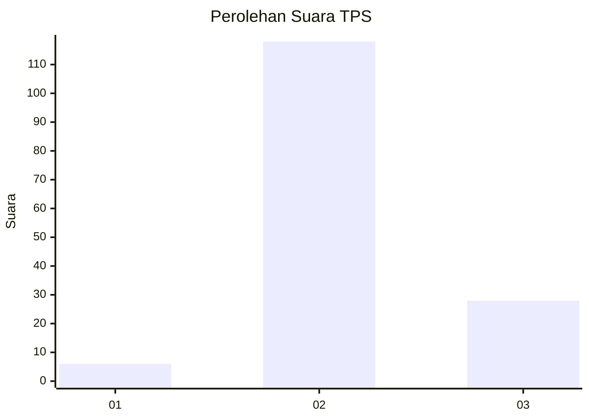
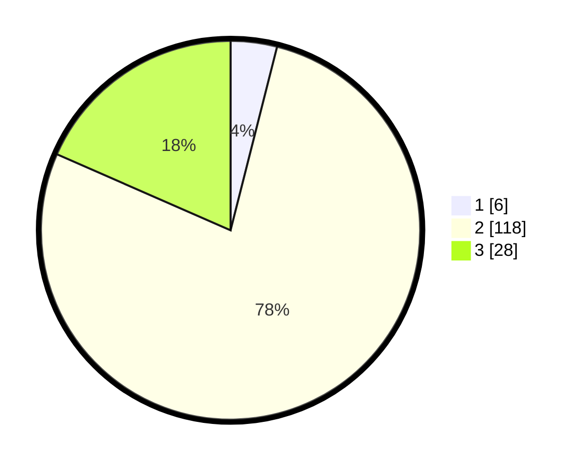

# Hasil

## Grafik

## Tabel

| No. | Nama Paslon    | Suara | Suara (raw) | Persentase |
|:--- |:-------------- | -----:| -----------:| ----------:|
| 1   | ANIES MUHAIMIN | 6     | [6][p-1]    | 3,95       |
| 2   | PRABOWO GIBRAN | 118   | [118][p-2]  | 77,63      |
| 3   | GANJAR MAHFUD  | 28    | [28][p-3]   | 18,42      |

[p-1]: https://github.com/gigit-pemilu/pemilu-2024-35-jawa-timur/blob/main/pilpres/hitung-suara/sub/35-jawa-timur/sub/09-jember/sub/11-wuluhan/sub/2005-glundengan/sub/026-tps/sub/paslon-1.txt
[p-2]: https://github.com/gigit-pemilu/pemilu-2024-35-jawa-timur/blob/main/pilpres/hitung-suara/sub/35-jawa-timur/sub/09-jember/sub/11-wuluhan/sub/2005-glundengan/sub/026-tps/sub/paslon-2.txt
[p-3]: https://github.com/gigit-pemilu/pemilu-2024-35-jawa-timur/blob/main/pilpres/hitung-suara/sub/35-jawa-timur/sub/09-jember/sub/11-wuluhan/sub/2005-glundengan/sub/026-tps/sub/paslon-3.txt

## Foto C Plano

https://sirekap-obj-formc.kpu.go.id/a978/pemilu/ppwp/35/09/11/20/05/3509112005026-20240215-014708--fed280f3-d158-4eac-b07e-94e561e883f7.jpg

https://sirekap-obj-formc.kpu.go.id/a978/pemilu/ppwp/35/09/11/20/05/3509112005026-20240215-014755--5779dbeb-bd6c-4029-9a7a-5779eadc8442.jpg

https://sirekap-obj-formc.kpu.go.id/a978/pemilu/ppwp/35/09/11/20/05/3509112005026-20240215-014842--53a2ec7a-8d6c-4230-8308-752bd16325d3.jpg

## Metadata

| Key        | Value               |
| ---------- | ------------------- |
| Time Stamp | 2024-02-24 22:31:28 |

