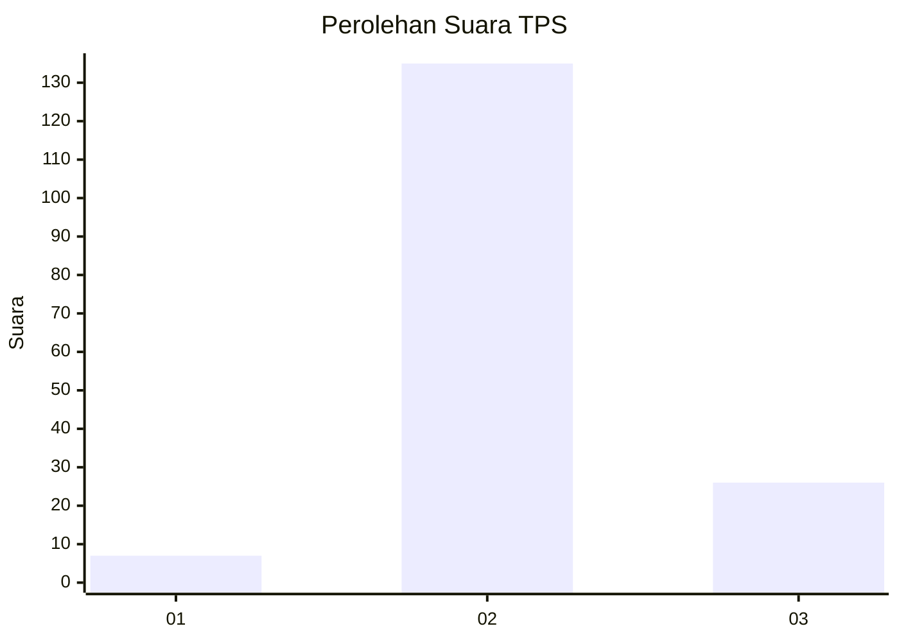
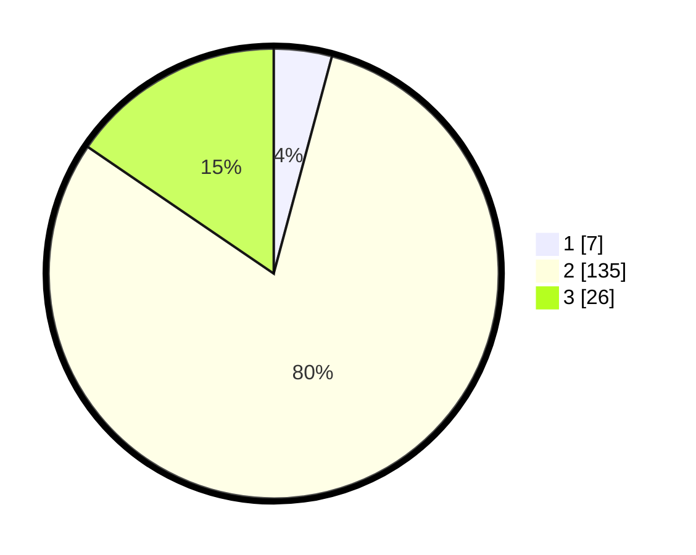

# Hasil

## Grafik

## Tabel

| No. | Nama Paslon    | Suara | Suara (raw) | Persentase |
|:--- |:-------------- | -----:| -----------:| ----------:|
| 1   | ANIES MUHAIMIN | 7     | [7][p-1]    | 4,17       |
| 2   | PRABOWO GIBRAN | 135   | [135][p-2]  | 80,36      |
| 3   | GANJAR MAHFUD  | 26    | [26][p-3]   | 15,48      |

[p-1]: https://github.com/gigit-pemilu/pemilu-2024/blob/main/pilpres/hitung-suara/sub/35-jawa-timur/sub/09-jember/sub/11-wuluhan/sub/2005-glundengan/sub/027-tps/sub/paslon-1.txt
[p-2]: https://github.com/gigit-pemilu/pemilu-2024/blob/main/pilpres/hitung-suara/sub/35-jawa-timur/sub/09-jember/sub/11-wuluhan/sub/2005-glundengan/sub/027-tps/sub/paslon-2.txt
[p-3]: https://github.com/gigit-pemilu/pemilu-2024/blob/main/pilpres/hitung-suara/sub/35-jawa-timur/sub/09-jember/sub/11-wuluhan/sub/2005-glundengan/sub/027-tps/sub/paslon-3.txt

## Foto C Plano

https://sirekap-obj-formc.kpu.go.id/dc63/pemilu/ppwp/35/09/11/20/05/3509112005027-20240214-214906--32ed55d5-d772-4fdd-a88f-62ddec8b6d2a.jpg

https://sirekap-obj-formc.kpu.go.id/dc63/pemilu/ppwp/35/09/11/20/05/3509112005027-20240214-215106--7aaedb6f-d44d-4210-8c32-e368c3a175b5.jpg

https://sirekap-obj-formc.kpu.go.id/dc63/pemilu/ppwp/35/09/11/20/05/3509112005027-20240214-215313--3987ad16-20fe-43e8-b857-3ac01d5e02b2.jpg

## Metadata

| Key        | Value               |
| ---------- | ------------------- |
| Time Stamp | 2024-02-15 15:30:25 |

