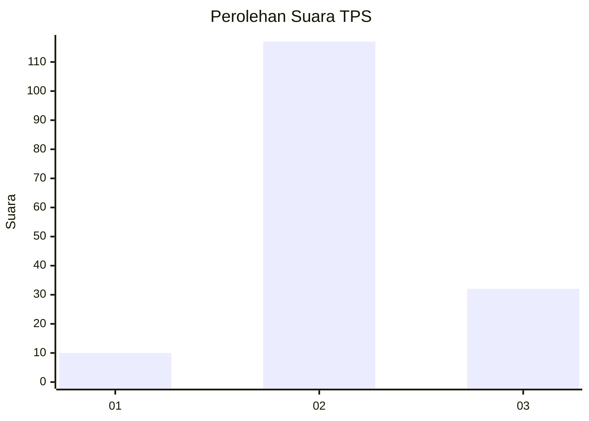

# Hasil

## Grafik

## Tabel

| No. | Nama Paslon    | Suara | Suara (raw) | Persentase |
|:--- |:-------------- | -----:| -----------:| ----------:|
| 1   | ANIES MUHAIMIN | 10    | [10][p-1]   | 6,29       |
| 2   | PRABOWO GIBRAN | 117   | [117][p-2]  | 73,58      |
| 3   | GANJAR MAHFUD  | 32    | [32][p-3]   | 20,13      |

[p-1]: https://github.com/gigit-pemilu/pemilu-2024-35-jawa-timur/blob/main/pilpres/hitung-suara/sub/35-jawa-timur/sub/09-jember/sub/11-wuluhan/sub/2006-tanjungrejo/sub/002-tps/sub/paslon-1.txt
[p-2]: https://github.com/gigit-pemilu/pemilu-2024-35-jawa-timur/blob/main/pilpres/hitung-suara/sub/35-jawa-timur/sub/09-jember/sub/11-wuluhan/sub/2006-tanjungrejo/sub/002-tps/sub/paslon-2.txt
[p-3]: https://github.com/gigit-pemilu/pemilu-2024-35-jawa-timur/blob/main/pilpres/hitung-suara/sub/35-jawa-timur/sub/09-jember/sub/11-wuluhan/sub/2006-tanjungrejo/sub/002-tps/sub/paslon-3.txt

## Foto C Plano

https://sirekap-obj-formc.kpu.go.id/24ab/pemilu/ppwp/35/09/11/20/06/3509112006002-20240214-210827--6766a522-6f8c-4f19-992d-dd709e3987b5.jpg

https://sirekap-obj-formc.kpu.go.id/24ab/pemilu/ppwp/35/09/11/20/06/3509112006002-20240214-210940--ba6bfcb3-38c5-47e8-bb77-e67ba67e481e.jpg

https://sirekap-obj-formc.kpu.go.id/24ab/pemilu/ppwp/35/09/11/20/06/3509112006002-20240214-211013--2de29b4c-e8a7-499a-9471-a94f33a9506b.jpg

## Metadata

| Key        | Value               |
| ---------- | ------------------- |
| Time Stamp | 2024-02-15 15:30:25 |

