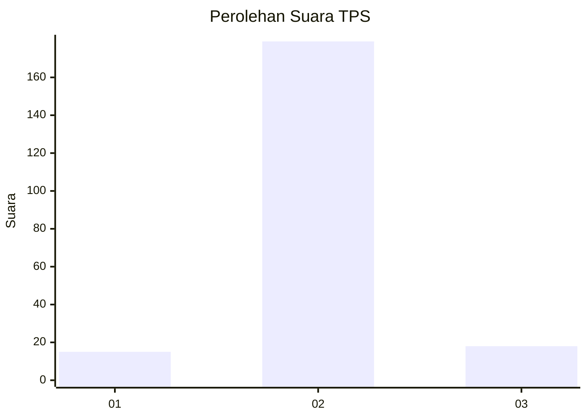
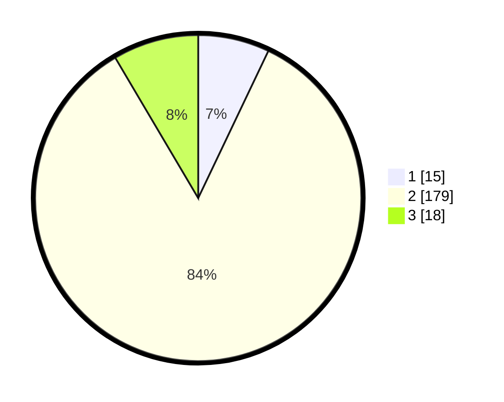

# Hasil

## Grafik

## Tabel

| No. | Nama Paslon    | Suara | Suara (raw) | Persentase |
|:--- |:-------------- | -----:| -----------:| ----------:|
| 1   | ANIES MUHAIMIN | 15    | [15][p-1]   | 7,08       |
| 2   | PRABOWO GIBRAN | 179   | [179][p-2]  | 84,43      |
| 3   | GANJAR MAHFUD  | 18    | [18][p-3]   | 8,49       |

[p-1]: https://github.com/gigit-pemilu/pemilu-2024/blob/main/pilpres/hitung-suara/sub/35-jawa-timur/sub/09-jember/sub/11-wuluhan/sub/2006-tanjungrejo/sub/005-tps/sub/paslon-1.txt
[p-2]: https://github.com/gigit-pemilu/pemilu-2024/blob/main/pilpres/hitung-suara/sub/35-jawa-timur/sub/09-jember/sub/11-wuluhan/sub/2006-tanjungrejo/sub/005-tps/sub/paslon-2.txt
[p-3]: https://github.com/gigit-pemilu/pemilu-2024/blob/main/pilpres/hitung-suara/sub/35-jawa-timur/sub/09-jember/sub/11-wuluhan/sub/2006-tanjungrejo/sub/005-tps/sub/paslon-3.txt

## Foto C Plano

https://sirekap-obj-formc.kpu.go.id/4ccd/pemilu/ppwp/35/09/11/20/06/3509112006005-20240216-172212--6acaf6dc-ae6d-4bce-8b99-d554092d3380.jpg

https://sirekap-obj-formc.kpu.go.id/4ccd/pemilu/ppwp/35/09/11/20/06/3509112006005-20240216-172416--5c4e6f7a-0c18-4751-87b6-5f76a5ee3ac0.jpg

https://sirekap-obj-formc.kpu.go.id/4ccd/pemilu/ppwp/35/09/11/20/06/3509112006005-20240216-172642--fd63e7e7-2d87-4f1a-9fed-2cacd7c827cd.jpg

## Metadata

| Key        | Value               |
| ---------- | ------------------- |
| Time Stamp | 2024-02-25 13:00:00 |

