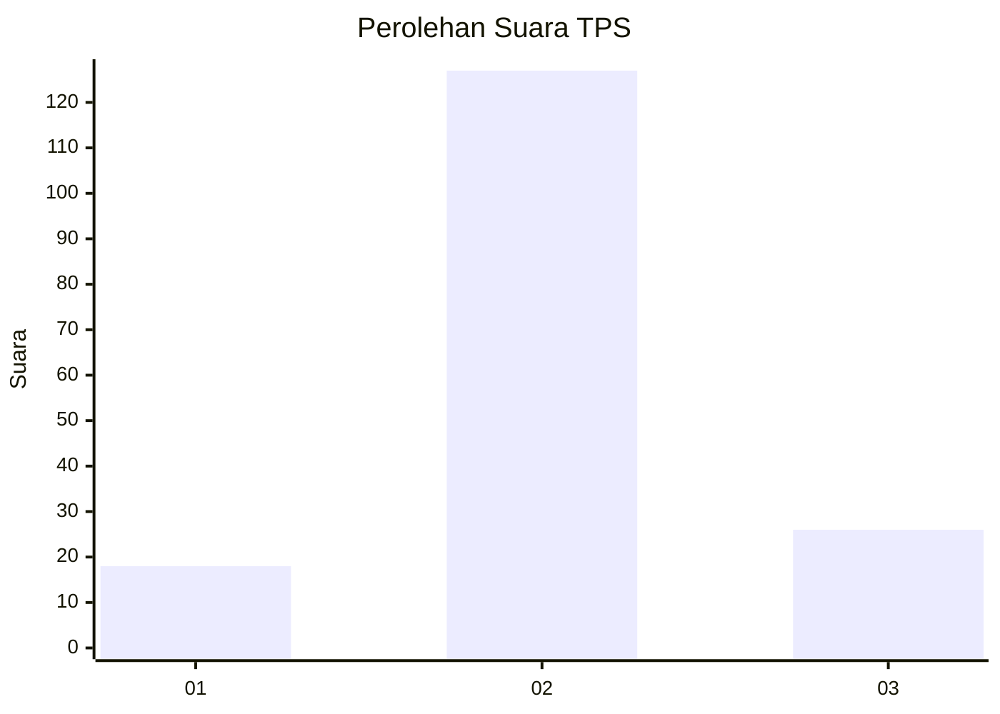
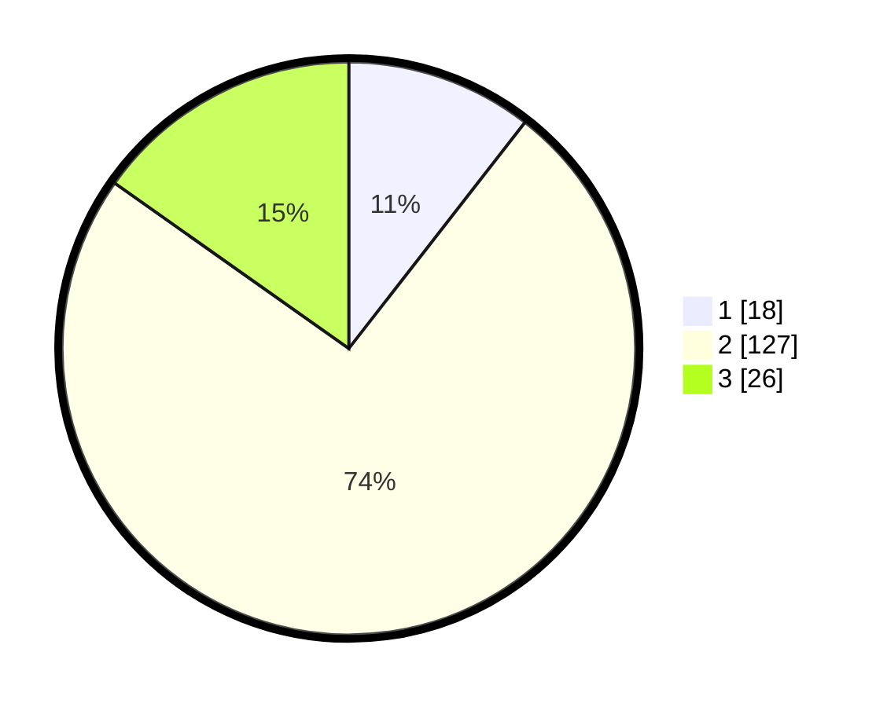

# Hasil

## Grafik

## Tabel

| No. | Nama Paslon    | Suara | Suara (raw) | Persentase |
|:--- |:-------------- | -----:| -----------:| ----------:|
| 1   | ANIES MUHAIMIN | 18    | [18][p-1]   | 10,53      |
| 2   | PRABOWO GIBRAN | 127   | [127][p-2]  | 74,27      |
| 3   | GANJAR MAHFUD  | 26    | [26][p-3]   | 15,20      |

[p-1]: https://github.com/gigit-pemilu/pemilu-2024/blob/main/pilpres/hitung-suara/sub/35-jawa-timur/sub/09-jember/sub/11-wuluhan/sub/2006-tanjungrejo/sub/028-tps/sub/paslon-1.txt
[p-2]: https://github.com/gigit-pemilu/pemilu-2024/blob/main/pilpres/hitung-suara/sub/35-jawa-timur/sub/09-jember/sub/11-wuluhan/sub/2006-tanjungrejo/sub/028-tps/sub/paslon-2.txt
[p-3]: https://github.com/gigit-pemilu/pemilu-2024/blob/main/pilpres/hitung-suara/sub/35-jawa-timur/sub/09-jember/sub/11-wuluhan/sub/2006-tanjungrejo/sub/028-tps/sub/paslon-3.txt

## Foto C Plano

https://sirekap-obj-formc.kpu.go.id/e563/pemilu/ppwp/35/09/11/20/06/3509112006028-20240214-225219--5223971a-29ca-4c18-9dda-def2826602dd.jpg

https://sirekap-obj-formc.kpu.go.id/e563/pemilu/ppwp/35/09/11/20/06/3509112006028-20240214-225324--0c16517f-3d19-4e0b-8c12-baf44f0f8ac7.jpg

https://sirekap-obj-formc.kpu.go.id/e563/pemilu/ppwp/35/09/11/20/06/3509112006028-20240214-225405--2814ecbc-e124-4a2a-8106-2e52940390e6.jpg

## Metadata

| Key        | Value               |
| ---------- | ------------------- |
| Time Stamp | 2024-02-15 15:30:25 |

