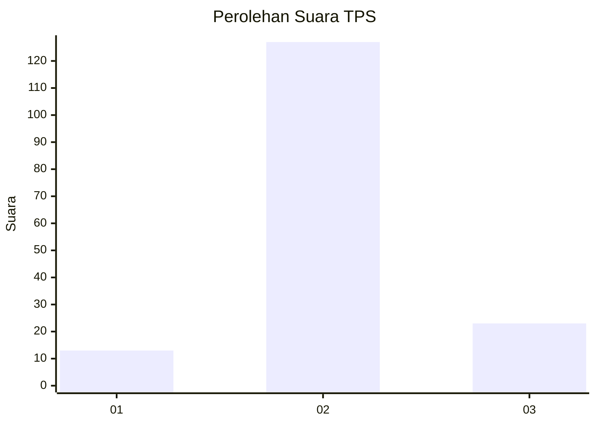

# Hasil

## Grafik

## Tabel

| No. | Nama Paslon    | Suara | Suara (raw) | Persentase |
|:--- |:-------------- | -----:| -----------:| ----------:|
| 1   | ANIES MUHAIMIN | 13    | [13][p-1]   | 7,98       |
| 2   | PRABOWO GIBRAN | 127   | [127][p-2]  | 77,91      |
| 3   | GANJAR MAHFUD  | 23    | [23][p-3]   | 14,11      |

[p-1]: https://github.com/gigit-pemilu/pemilu-2024/blob/main/pilpres/hitung-suara/sub/35-jawa-timur/sub/09-jember/sub/12-ambulu/sub/2001-tegalsari/sub/021-tps/sub/paslon-1.txt
[p-2]: https://github.com/gigit-pemilu/pemilu-2024/blob/main/pilpres/hitung-suara/sub/35-jawa-timur/sub/09-jember/sub/12-ambulu/sub/2001-tegalsari/sub/021-tps/sub/paslon-2.txt
[p-3]: https://github.com/gigit-pemilu/pemilu-2024/blob/main/pilpres/hitung-suara/sub/35-jawa-timur/sub/09-jember/sub/12-ambulu/sub/2001-tegalsari/sub/021-tps/sub/paslon-3.txt

## Foto C Plano

https://sirekap-obj-formc.kpu.go.id/70e2/pemilu/ppwp/35/09/12/20/01/3509122001021-20240217-073303--e817946c-9cbb-4364-a3ba-2ee9b24ba2ae.jpg

https://sirekap-obj-formc.kpu.go.id/70e2/pemilu/ppwp/35/09/12/20/01/3509122001021-20240217-073426--c58dbff0-8e34-4269-917d-54c5c7b27dbe.jpg

https://sirekap-obj-formc.kpu.go.id/70e2/pemilu/ppwp/35/09/12/20/01/3509122001021-20240217-073612--0d5a39c3-db21-44ab-bb29-a45b6d218a2b.jpg

## Metadata

| Key        | Value               |
| ---------- | ------------------- |
| Time Stamp | 2024-02-24 22:31:28 |

