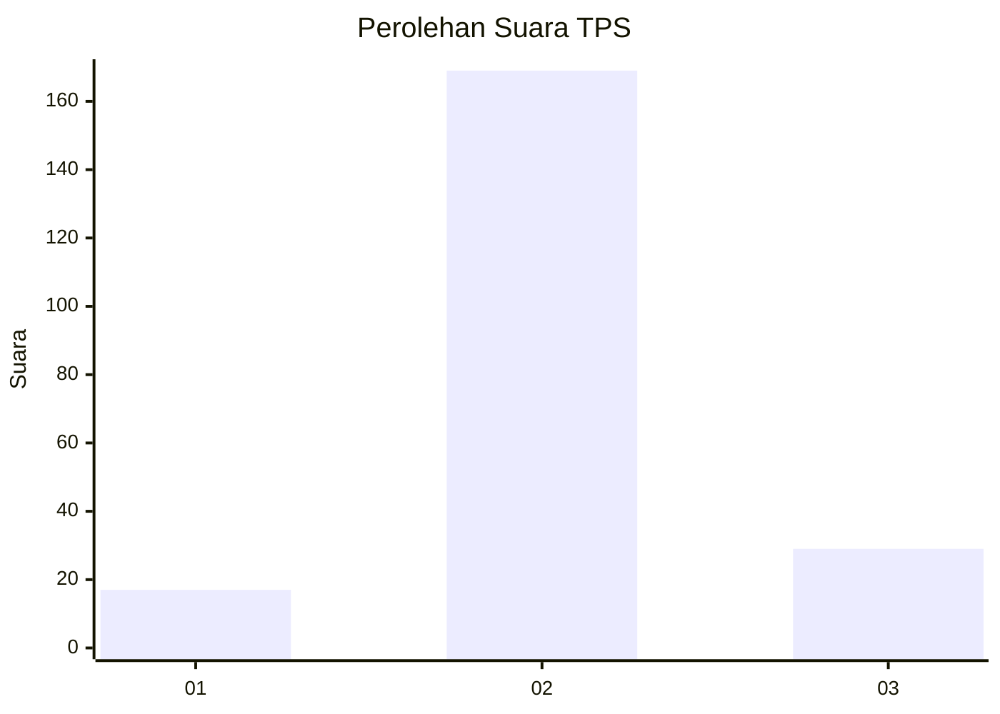
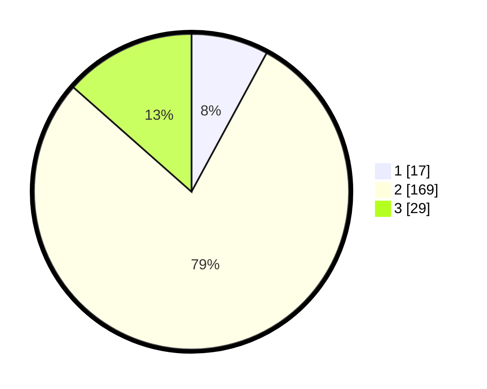

# Hasil

## Grafik

## Tabel

| No. | Nama Paslon    | Suara | Suara (raw) | Persentase |
|:--- |:-------------- | -----:| -----------:| ----------:|
| 1   | ANIES MUHAIMIN | 17    | [17][p-1]   | 7,91       |
| 2   | PRABOWO GIBRAN | 169   | [169][p-2]  | 78,60      |
| 3   | GANJAR MAHFUD  | 29    | [29][p-3]   | 13,49      |

[p-1]: https://github.com/gigit-pemilu/pemilu-2024/blob/main/pilpres/hitung-suara/sub/35-jawa-timur/sub/09-jember/sub/12-ambulu/sub/2002-sabrang/sub/004-tps/sub/paslon-1.txt
[p-2]: https://github.com/gigit-pemilu/pemilu-2024/blob/main/pilpres/hitung-suara/sub/35-jawa-timur/sub/09-jember/sub/12-ambulu/sub/2002-sabrang/sub/004-tps/sub/paslon-2.txt
[p-3]: https://github.com/gigit-pemilu/pemilu-2024/blob/main/pilpres/hitung-suara/sub/35-jawa-timur/sub/09-jember/sub/12-ambulu/sub/2002-sabrang/sub/004-tps/sub/paslon-3.txt

## Foto C Plano

https://sirekap-obj-formc.kpu.go.id/313c/pemilu/ppwp/35/09/12/20/02/3509122002004-20240214-233704--e3d93f90-c6a3-4dde-b904-8815e9534396.jpg

https://sirekap-obj-formc.kpu.go.id/313c/pemilu/ppwp/35/09/12/20/02/3509122002004-20240214-234004--73c5b79e-6abd-4ded-8515-e575d128bc24.jpg

https://sirekap-obj-formc.kpu.go.id/313c/pemilu/ppwp/35/09/12/20/02/3509122002004-20240219-202534--f549f598-9db0-49bb-a4aa-a3f1265dc3d7.jpg

## Metadata

| Key        | Value               |
| ---------- | ------------------- |
| Time Stamp | 2024-02-19 21:00:00 |

