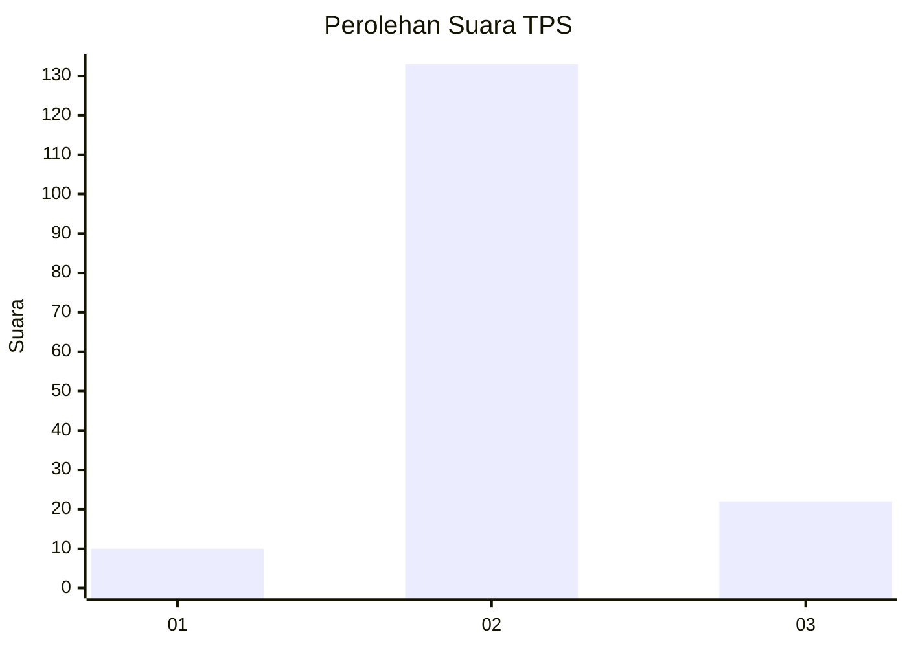
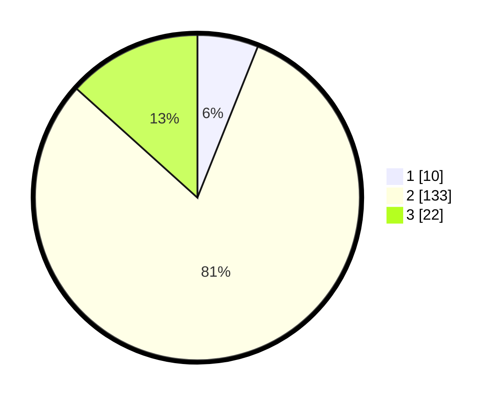

# Hasil

## Grafik

## Tabel

| No. | Nama Paslon    | Suara | Suara (raw) | Persentase |
|:--- |:-------------- | -----:| -----------:| ----------:|
| 1   | ANIES MUHAIMIN | 10    | [10][p-1]   | 6,06       |
| 2   | PRABOWO GIBRAN | 133   | [133][p-2]  | 80,61      |
| 3   | GANJAR MAHFUD  | 22    | [22][p-3]   | 13,33      |

[p-1]: https://github.com/gigit-pemilu/pemilu-2024-35-jawa-timur/blob/main/pilpres/hitung-suara/sub/35-jawa-timur/sub/09-jember/sub/12-ambulu/sub/2003-sumberejo/sub/063-tps/sub/paslon-1.txt
[p-2]: https://github.com/gigit-pemilu/pemilu-2024-35-jawa-timur/blob/main/pilpres/hitung-suara/sub/35-jawa-timur/sub/09-jember/sub/12-ambulu/sub/2003-sumberejo/sub/063-tps/sub/paslon-2.txt
[p-3]: https://github.com/gigit-pemilu/pemilu-2024-35-jawa-timur/blob/main/pilpres/hitung-suara/sub/35-jawa-timur/sub/09-jember/sub/12-ambulu/sub/2003-sumberejo/sub/063-tps/sub/paslon-3.txt

## Foto C Plano

https://sirekap-obj-formc.kpu.go.id/69f3/pemilu/ppwp/35/09/12/20/03/3509122003063-20240215-012247--e42e6163-bf0a-40f2-a094-e535a955f31d.jpg

https://sirekap-obj-formc.kpu.go.id/69f3/pemilu/ppwp/35/09/12/20/03/3509122003063-20240216-144636--607be069-8045-443e-afa2-45ee62c2b14f.jpg

https://sirekap-obj-formc.kpu.go.id/69f3/pemilu/ppwp/35/09/12/20/03/3509122003063-20240216-144635--8172b99f-7537-457c-a8ab-98131f65f5a4.jpg

## Metadata

| Key        | Value               |
| ---------- | ------------------- |
| Time Stamp | 2024-02-19 06:16:00 |

