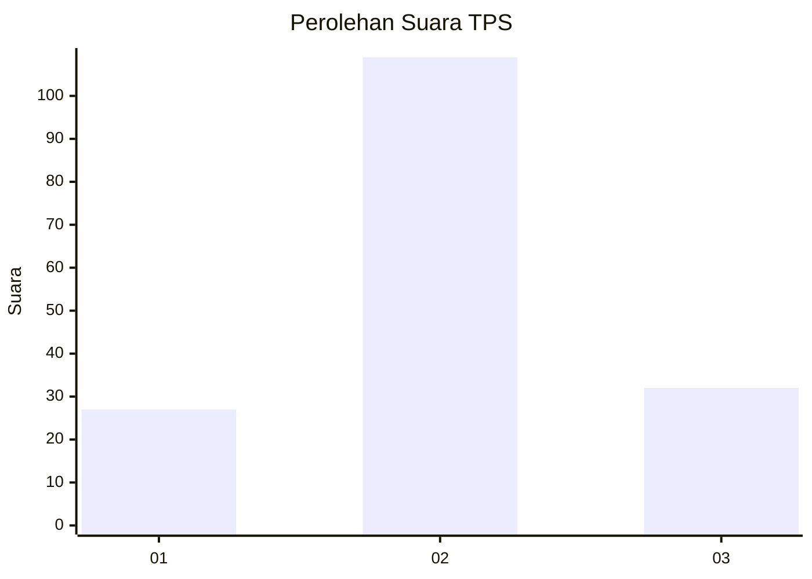
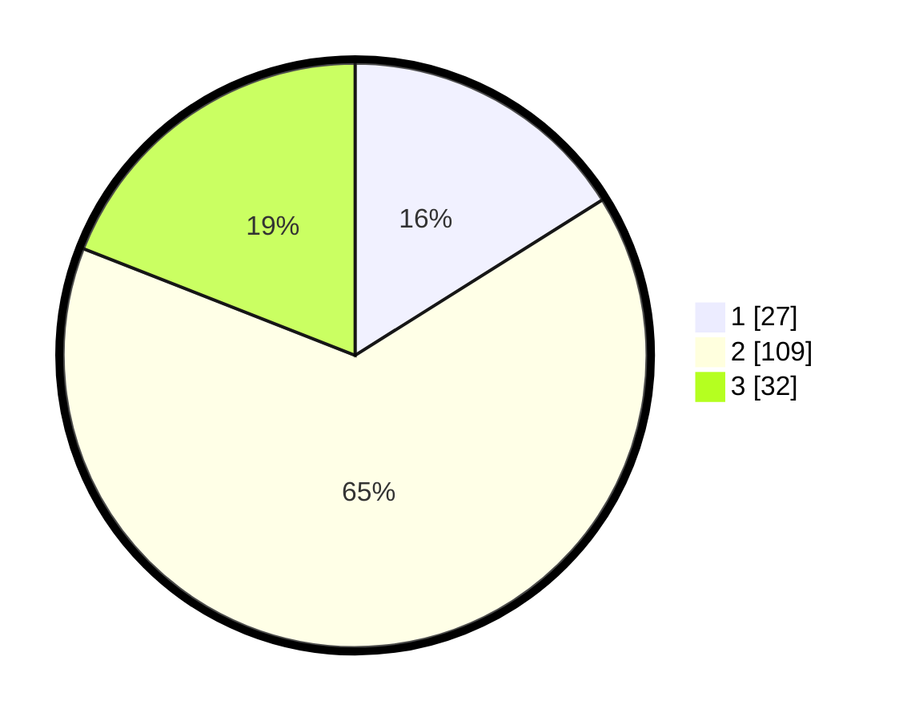

# Hasil

## Grafik

## Tabel

| No. | Nama Paslon    | Suara | Suara (raw) | Persentase |
|:--- |:-------------- | -----:| -----------:| ----------:|
| 1   | ANIES MUHAIMIN | 27    | [27][p-1]   | 16,07      |
| 2   | PRABOWO GIBRAN | 109   | [109][p-2]  | 64,88      |
| 3   | GANJAR MAHFUD  | 32    | [32][p-3]   | 19,05      |

[p-1]: https://github.com/gigit-pemilu/pemilu-2024/blob/main/pilpres/hitung-suara/sub/35-jawa-timur/sub/09-jember/sub/12-ambulu/sub/2004-ambulu/sub/003-tps/sub/paslon-1.txt
[p-2]: https://github.com/gigit-pemilu/pemilu-2024/blob/main/pilpres/hitung-suara/sub/35-jawa-timur/sub/09-jember/sub/12-ambulu/sub/2004-ambulu/sub/003-tps/sub/paslon-2.txt
[p-3]: https://github.com/gigit-pemilu/pemilu-2024/blob/main/pilpres/hitung-suara/sub/35-jawa-timur/sub/09-jember/sub/12-ambulu/sub/2004-ambulu/sub/003-tps/sub/paslon-3.txt

## Foto C Plano

https://sirekap-obj-formc.kpu.go.id/008b/pemilu/ppwp/35/09/12/20/04/3509122004003-20240214-225104--cf4bda38-f152-4f7e-9447-1c7666f41ab9.jpg

https://sirekap-obj-formc.kpu.go.id/008b/pemilu/ppwp/35/09/12/20/04/3509122004003-20240215-180540--05203df2-3ace-4d65-ab59-52bb4580c988.jpg

https://sirekap-obj-formc.kpu.go.id/008b/pemilu/ppwp/35/09/12/20/04/3509122004003-20240215-180755--035876e7-7480-4ef7-aaec-d255dfbc9cfd.jpg

## Metadata

| Key        | Value               |
| ---------- | ------------------- |
| Time Stamp | 2024-02-24 22:31:28 |

