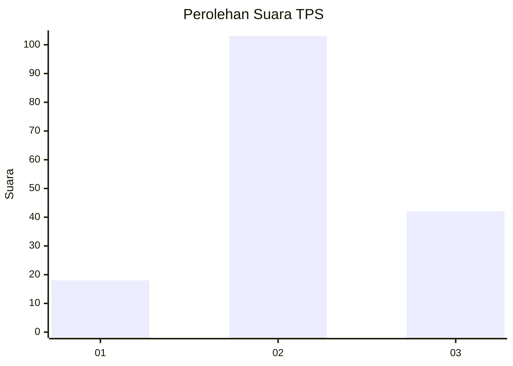
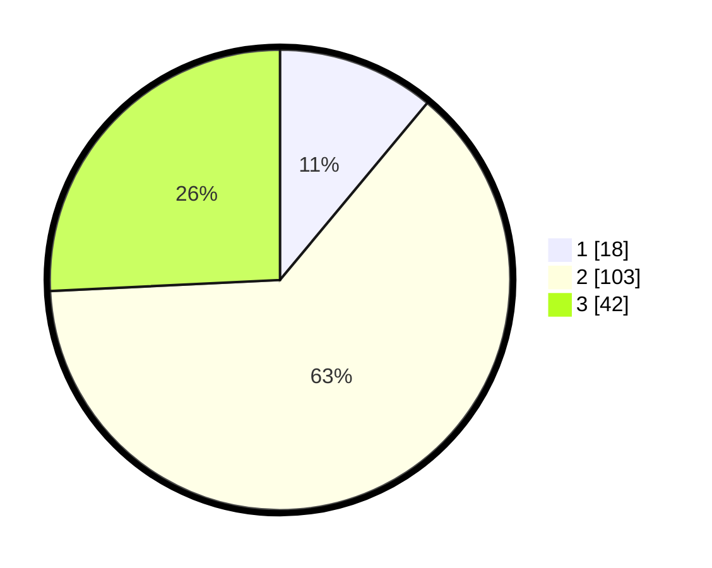

# Hasil

## Grafik

## Tabel

| No. | Nama Paslon    | Suara | Suara (raw) | Persentase |
|:--- |:-------------- | -----:| -----------:| ----------:|
| 1   | ANIES MUHAIMIN | 18    | [18][p-1]   | 11,04      |
| 2   | PRABOWO GIBRAN | 103   | [103][p-2]  | 63,19      |
| 3   | GANJAR MAHFUD  | 42    | [42][p-3]   | 25,77      |

[p-1]: https://github.com/gigit-pemilu/pemilu-2024/blob/main/pilpres/hitung-suara/sub/35-jawa-timur/sub/09-jember/sub/12-ambulu/sub/2004-ambulu/sub/005-tps/sub/paslon-1.txt
[p-2]: https://github.com/gigit-pemilu/pemilu-2024/blob/main/pilpres/hitung-suara/sub/35-jawa-timur/sub/09-jember/sub/12-ambulu/sub/2004-ambulu/sub/005-tps/sub/paslon-2.txt
[p-3]: https://github.com/gigit-pemilu/pemilu-2024/blob/main/pilpres/hitung-suara/sub/35-jawa-timur/sub/09-jember/sub/12-ambulu/sub/2004-ambulu/sub/005-tps/sub/paslon-3.txt

## Foto C Plano

https://sirekap-obj-formc.kpu.go.id/75cd/pemilu/ppwp/35/09/12/20/04/3509122004005-20240214-230153--0cb0c09c-ff43-4dc0-b079-154f37a38cd3.jpg

https://sirekap-obj-formc.kpu.go.id/75cd/pemilu/ppwp/35/09/12/20/04/3509122004005-20240214-231237--7c9abc24-1d45-4e2d-ab51-acee78059c92.jpg

https://sirekap-obj-formc.kpu.go.id/75cd/pemilu/ppwp/35/09/12/20/04/3509122004005-20240214-231755--570d592e-bc37-41e8-a934-40464a1bd024.jpg

## Metadata

| Key        | Value               |
| ---------- | ------------------- |
| Time Stamp | 2024-02-15 20:00:44 |

