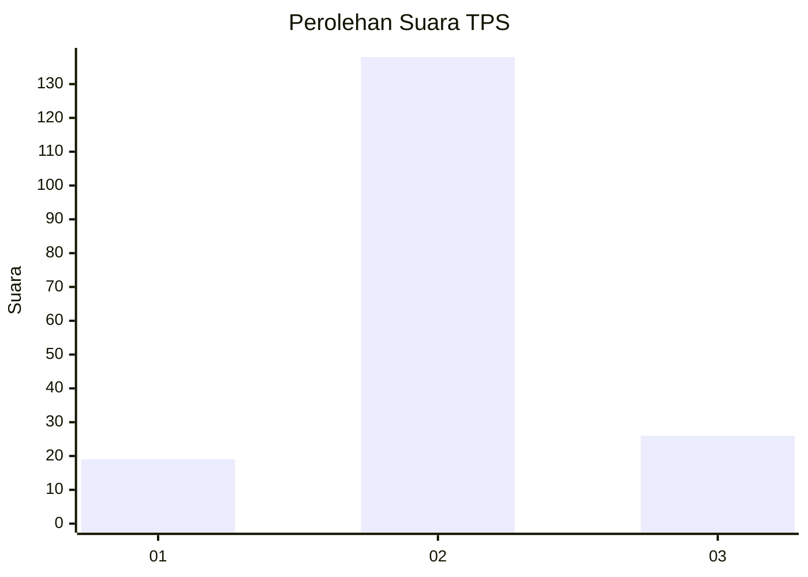
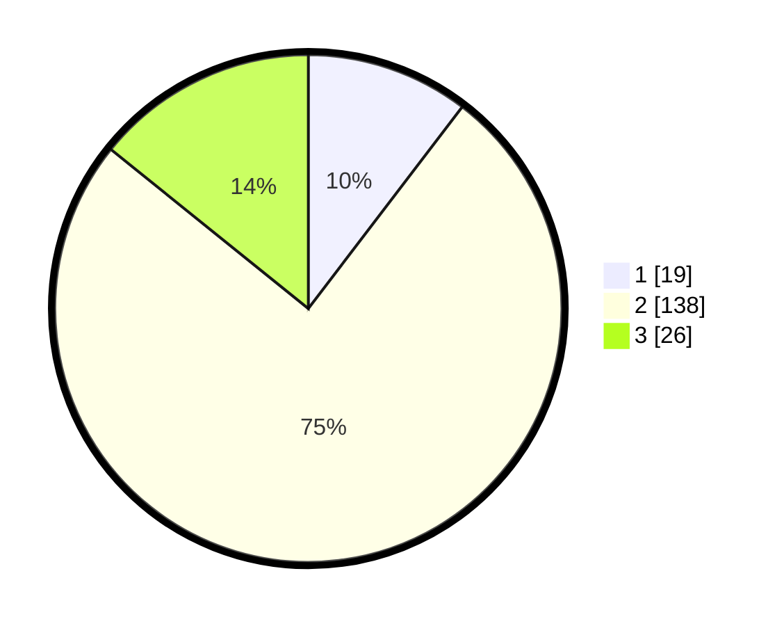

# Hasil

## Grafik

## Tabel

| No. | Nama Paslon    | Suara | Suara (raw) | Persentase |
|:--- |:-------------- | -----:| -----------:| ----------:|
| 1   | ANIES MUHAIMIN | 19    | [19][p-1]   | 10,38      |
| 2   | PRABOWO GIBRAN | 138   | [138][p-2]  | 75,41      |
| 3   | GANJAR MAHFUD  | 26    | [26][p-3]   | 14,21      |

[p-1]: https://github.com/gigit-pemilu/pemilu-2024/blob/main/pilpres/hitung-suara/sub/35-jawa-timur/sub/09-jember/sub/12-ambulu/sub/2005-karanganyar/sub/020-tps/sub/paslon-1.txt
[p-2]: https://github.com/gigit-pemilu/pemilu-2024/blob/main/pilpres/hitung-suara/sub/35-jawa-timur/sub/09-jember/sub/12-ambulu/sub/2005-karanganyar/sub/020-tps/sub/paslon-2.txt
[p-3]: https://github.com/gigit-pemilu/pemilu-2024/blob/main/pilpres/hitung-suara/sub/35-jawa-timur/sub/09-jember/sub/12-ambulu/sub/2005-karanganyar/sub/020-tps/sub/paslon-3.txt

## Foto C Plano

https://sirekap-obj-formc.kpu.go.id/0e4c/pemilu/ppwp/35/09/12/20/05/3509122005020-20240215-014723--061ed49d-2461-49a3-bb85-8853a77aec7c.jpg

https://sirekap-obj-formc.kpu.go.id/0e4c/pemilu/ppwp/35/09/12/20/05/3509122005020-20240215-014842--5331d589-d065-494c-bb92-9f39254caeb1.jpg

https://sirekap-obj-formc.kpu.go.id/0e4c/pemilu/ppwp/35/09/12/20/05/3509122005020-20240215-015013--44056fe4-0da3-4221-a4b9-1bf70979c33c.jpg

## Metadata

| Key        | Value               |
| ---------- | ------------------- |
| Time Stamp | 2024-02-15 17:00:25 |

