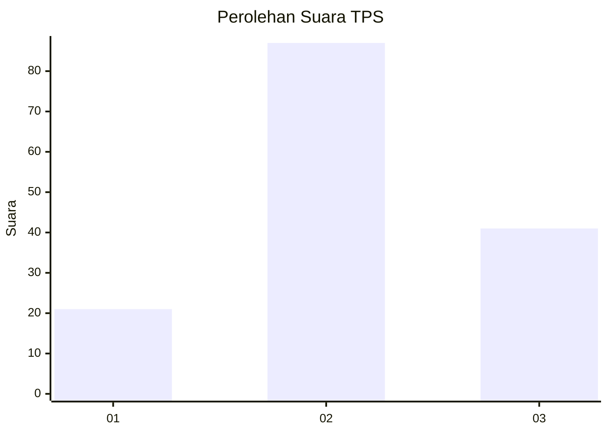
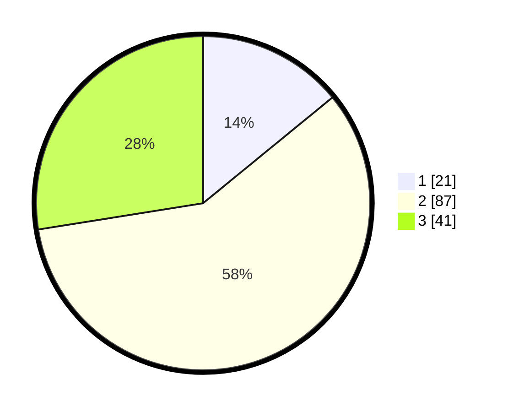

# Hasil

## Grafik

## Tabel

| No. | Nama Paslon    | Suara | Suara (raw) | Persentase |
|:--- |:-------------- | -----:| -----------:| ----------:|
| 1   | ANIES MUHAIMIN | 21    | [21][p-1]   | 14,09      |
| 2   | PRABOWO GIBRAN | 87    | [87][p-2]   | 58,39      |
| 3   | GANJAR MAHFUD  | 41    | [41][p-3]   | 27,52      |

[p-1]: https://github.com/gigit-pemilu/pemilu-2024-35-jawa-timur/blob/main/pilpres/hitung-suara/sub/35-jawa-timur/sub/09-jember/sub/12-ambulu/sub/2005-karanganyar/sub/045-tps/sub/paslon-1.txt
[p-2]: https://github.com/gigit-pemilu/pemilu-2024-35-jawa-timur/blob/main/pilpres/hitung-suara/sub/35-jawa-timur/sub/09-jember/sub/12-ambulu/sub/2005-karanganyar/sub/045-tps/sub/paslon-2.txt
[p-3]: https://github.com/gigit-pemilu/pemilu-2024-35-jawa-timur/blob/main/pilpres/hitung-suara/sub/35-jawa-timur/sub/09-jember/sub/12-ambulu/sub/2005-karanganyar/sub/045-tps/sub/paslon-3.txt

## Foto C Plano

https://sirekap-obj-formc.kpu.go.id/7de5/pemilu/ppwp/35/09/12/20/05/3509122005045-20240214-222402--71c09502-99c9-4a1c-8871-795101ca5e34.jpg

https://sirekap-obj-formc.kpu.go.id/7de5/pemilu/ppwp/35/09/12/20/05/3509122005045-20240214-222605--072dcb69-91b2-475d-974f-e9e66e9b01c6.jpg

https://sirekap-obj-formc.kpu.go.id/7de5/pemilu/ppwp/35/09/12/20/05/3509122005045-20240214-222901--e024dae7-2087-4920-a500-be4fc4e57e34.jpg

## Metadata

| Key        | Value               |
| ---------- | ------------------- |
| Time Stamp | 2024-02-15 17:00:25 |

