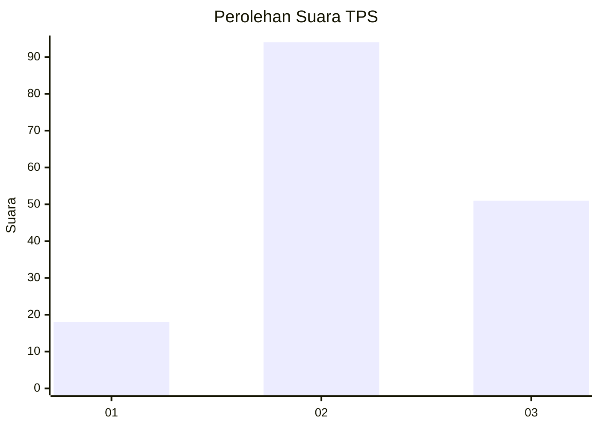
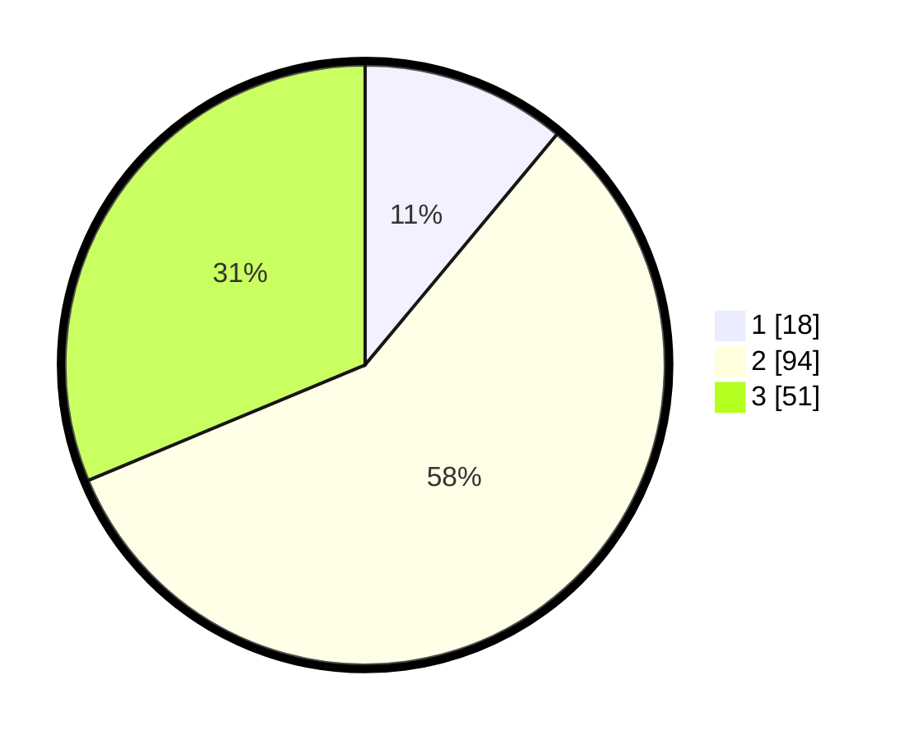

# Hasil

## Grafik

## Tabel

| No. | Nama Paslon    | Suara | Suara (raw) | Persentase |
|:--- |:-------------- | -----:| -----------:| ----------:|
| 1   | ANIES MUHAIMIN | 18    | [18][p-1]   | 11,04      |
| 2   | PRABOWO GIBRAN | 94    | [94][p-2]   | 57,67      |
| 3   | GANJAR MAHFUD  | 51    | [51][p-3]   | 31,29      |

[p-1]: https://github.com/gigit-pemilu/pemilu-2024-35-jawa-timur/blob/main/pilpres/hitung-suara/sub/35-jawa-timur/sub/09-jember/sub/12-ambulu/sub/2005-karanganyar/sub/047-tps/sub/paslon-1.txt
[p-2]: https://github.com/gigit-pemilu/pemilu-2024-35-jawa-timur/blob/main/pilpres/hitung-suara/sub/35-jawa-timur/sub/09-jember/sub/12-ambulu/sub/2005-karanganyar/sub/047-tps/sub/paslon-2.txt
[p-3]: https://github.com/gigit-pemilu/pemilu-2024-35-jawa-timur/blob/main/pilpres/hitung-suara/sub/35-jawa-timur/sub/09-jember/sub/12-ambulu/sub/2005-karanganyar/sub/047-tps/sub/paslon-3.txt

## Foto C Plano

https://sirekap-obj-formc.kpu.go.id/0fa3/pemilu/ppwp/35/09/12/20/05/3509122005047-20240215-111024--f6b32c45-3a5a-4f1e-846c-5e081d04b4e8.jpg

https://sirekap-obj-formc.kpu.go.id/0fa3/pemilu/ppwp/35/09/12/20/05/3509122005047-20240214-232857--52997a9b-5cf4-4cb0-823f-e7401391724c.jpg

https://sirekap-obj-formc.kpu.go.id/0fa3/pemilu/ppwp/35/09/12/20/05/3509122005047-20240214-233053--75785a8b-327e-4cbe-8aa6-6db628a61be6.jpg

## Metadata

| Key        | Value               |
| ---------- | ------------------- |
| Time Stamp | 2024-02-15 19:30:26 |

