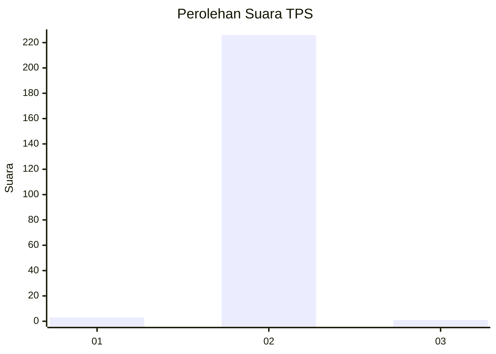
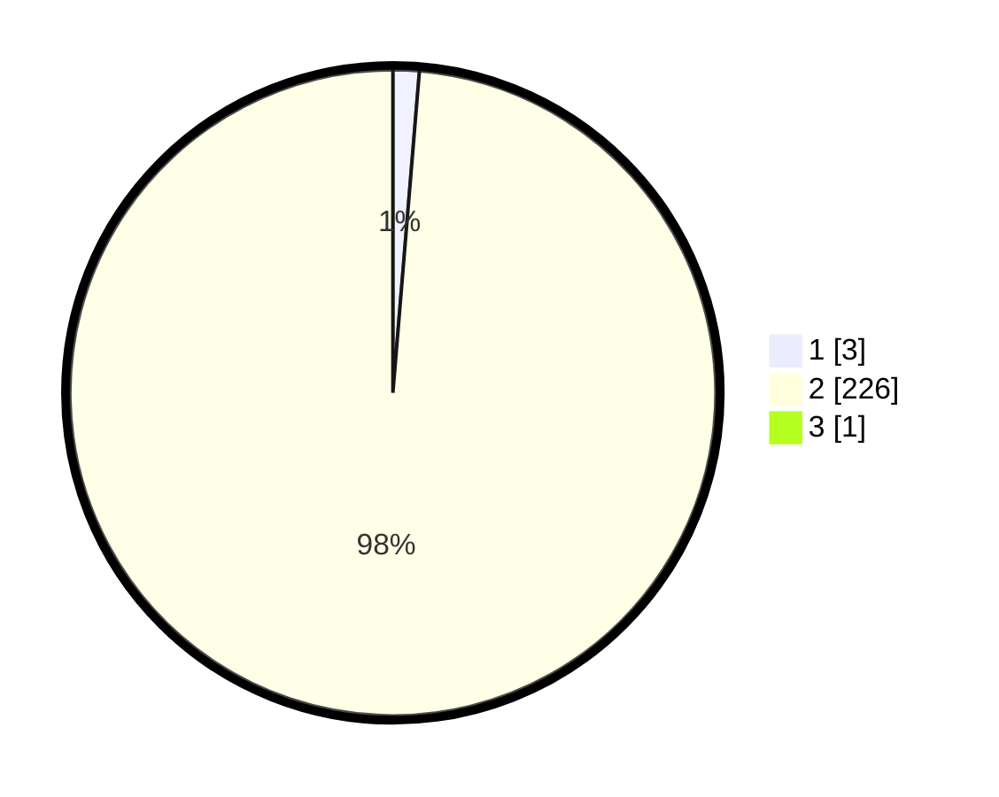

# Hasil

## Grafik

## Tabel

| No. | Nama Paslon    | Suara | Suara (raw) | Persentase |
|:--- |:-------------- | -----:| -----------:| ----------:|
| 1   | ANIES MUHAIMIN | 3     | [3][p-1]    | 1,30       |
| 2   | PRABOWO GIBRAN | 226   | [226][p-2]  | 98,26      |
| 3   | GANJAR MAHFUD  | 1     | [1][p-3]    | 0,43       |

[p-1]: https://github.com/gigit-pemilu/pemilu-2024/blob/main/pilpres/hitung-suara/sub/35-jawa-timur/sub/09-jember/sub/12-ambulu/sub/2005-karanganyar/sub/050-tps/sub/paslon-1.txt
[p-2]: https://github.com/gigit-pemilu/pemilu-2024/blob/main/pilpres/hitung-suara/sub/35-jawa-timur/sub/09-jember/sub/12-ambulu/sub/2005-karanganyar/sub/050-tps/sub/paslon-2.txt
[p-3]: https://github.com/gigit-pemilu/pemilu-2024/blob/main/pilpres/hitung-suara/sub/35-jawa-timur/sub/09-jember/sub/12-ambulu/sub/2005-karanganyar/sub/050-tps/sub/paslon-3.txt

## Foto C Plano

https://sirekap-obj-formc.kpu.go.id/e430/pemilu/ppwp/35/09/12/20/05/3509122005050-20240214-220930--ea5dc1dd-2166-4c4e-8f1b-0215639395a1.jpg

https://sirekap-obj-formc.kpu.go.id/e430/pemilu/ppwp/35/09/12/20/05/3509122005050-20240214-221050--175f4100-57c9-4551-88c1-4a9fe1c1f35c.jpg

https://sirekap-obj-formc.kpu.go.id/e430/pemilu/ppwp/35/09/12/20/05/3509122005050-20240214-221151--104a57b2-88e9-4c69-83e2-910e1c24e856.jpg

## Metadata

| Key        | Value               |
| ---------- | ------------------- |
| Time Stamp | 2024-02-15 15:00:29 |

