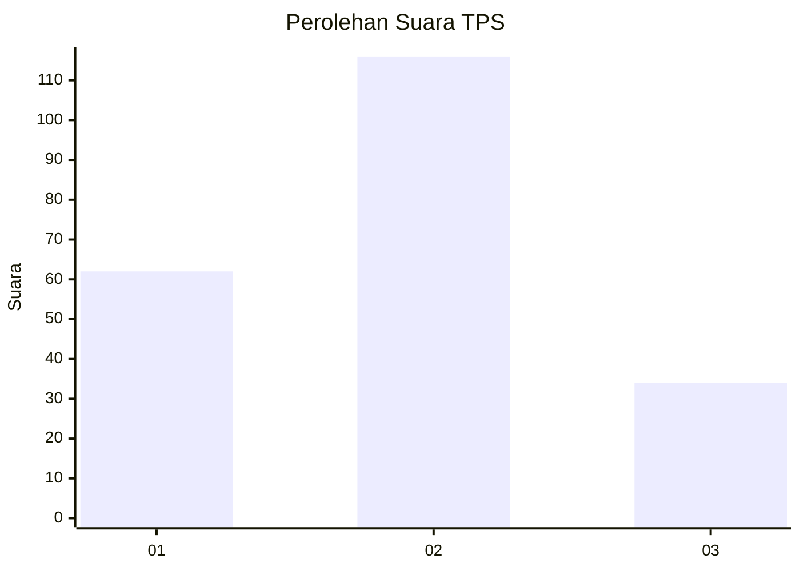
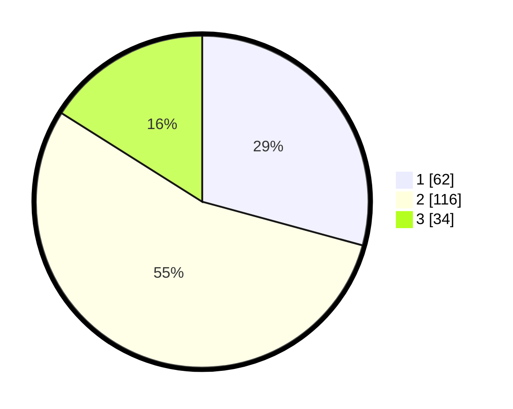

# Hasil

## Grafik

## Tabel

| No. | Nama Paslon    | Suara | Suara (raw) | Persentase |
|:--- |:-------------- | -----:| -----------:| ----------:|
| 1   | ANIES MUHAIMIN | 62    | [62][p-1]   | 29,25      |
| 2   | PRABOWO GIBRAN | 116   | [116][p-2]  | 54,72      |
| 3   | GANJAR MAHFUD  | 34    | [34][p-3]   | 16,04      |

[p-1]: https://github.com/gigit-pemilu/pemilu-2024-35-jawa-timur/blob/main/pilpres/hitung-suara/sub/35-jawa-timur/sub/09-jember/sub/12-ambulu/sub/2006-andongsari/sub/002-tps/sub/paslon-1.txt
[p-2]: https://github.com/gigit-pemilu/pemilu-2024-35-jawa-timur/blob/main/pilpres/hitung-suara/sub/35-jawa-timur/sub/09-jember/sub/12-ambulu/sub/2006-andongsari/sub/002-tps/sub/paslon-2.txt
[p-3]: https://github.com/gigit-pemilu/pemilu-2024-35-jawa-timur/blob/main/pilpres/hitung-suara/sub/35-jawa-timur/sub/09-jember/sub/12-ambulu/sub/2006-andongsari/sub/002-tps/sub/paslon-3.txt

## Foto C Plano

https://sirekap-obj-formc.kpu.go.id/22f4/pemilu/ppwp/35/09/12/20/06/3509122006002-20240215-012342--3b518436-ff68-41e4-9c5a-3abd4eba22df.jpg

https://sirekap-obj-formc.kpu.go.id/22f4/pemilu/ppwp/35/09/12/20/06/3509122006002-20240215-012917--a16ae8a9-015f-4b3a-a5b7-511115f864ec.jpg

https://sirekap-obj-formc.kpu.go.id/22f4/pemilu/ppwp/35/09/12/20/06/3509122006002-20240215-013139--4bfb0a6a-edc3-442f-95d1-f91d5adddff0.jpg

## Metadata

| Key        | Value               |
| ---------- | ------------------- |
| Time Stamp | 2024-02-15 15:00:29 |

