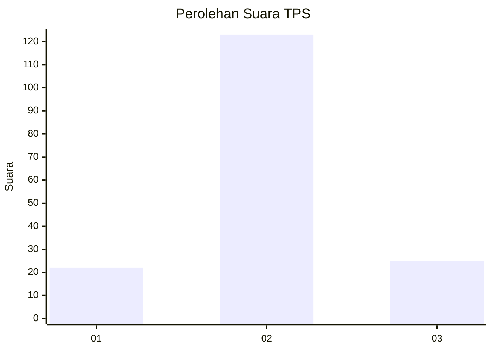
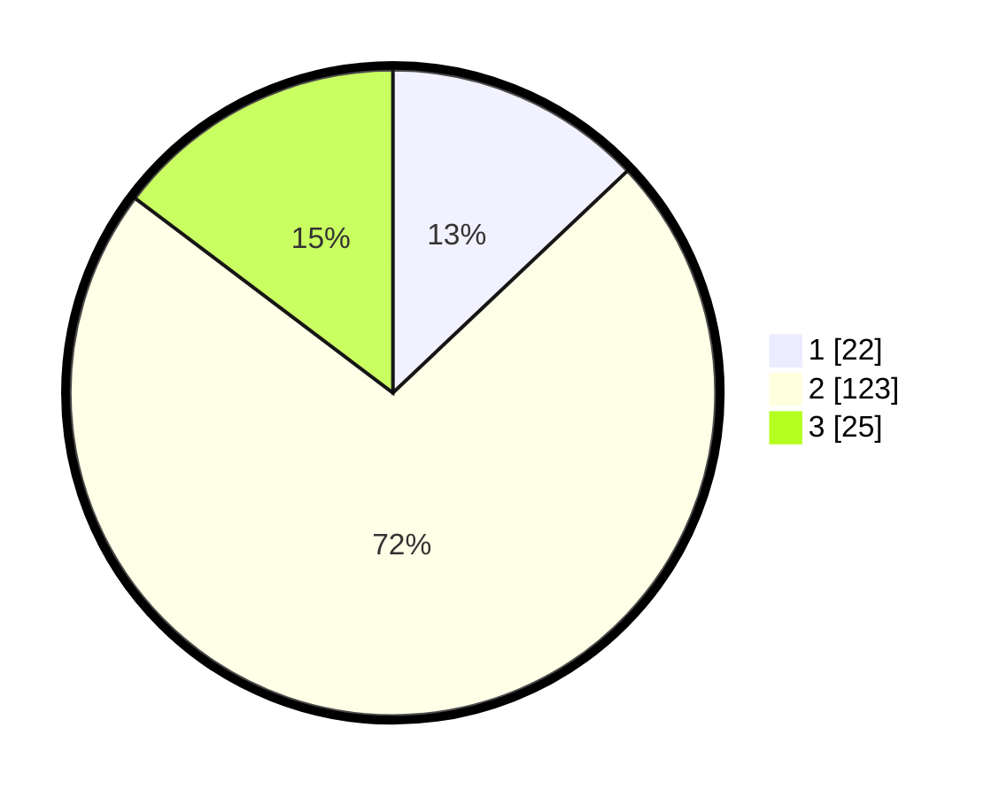

# Hasil

## Grafik

## Tabel

| No. | Nama Paslon    | Suara | Suara (raw) | Persentase |
|:--- |:-------------- | -----:| -----------:| ----------:|
| 1   | ANIES MUHAIMIN | 22    | [22][p-1]   | 12,94      |
| 2   | PRABOWO GIBRAN | 123   | [123][p-2]  | 72,35      |
| 3   | GANJAR MAHFUD  | 25    | [25][p-3]   | 14,71      |

[p-1]: https://github.com/gigit-pemilu/pemilu-2024/blob/main/pilpres/hitung-suara/sub/35-jawa-timur/sub/09-jember/sub/12-ambulu/sub/2006-andongsari/sub/012-tps/sub/paslon-1.txt
[p-2]: https://github.com/gigit-pemilu/pemilu-2024/blob/main/pilpres/hitung-suara/sub/35-jawa-timur/sub/09-jember/sub/12-ambulu/sub/2006-andongsari/sub/012-tps/sub/paslon-2.txt
[p-3]: https://github.com/gigit-pemilu/pemilu-2024/blob/main/pilpres/hitung-suara/sub/35-jawa-timur/sub/09-jember/sub/12-ambulu/sub/2006-andongsari/sub/012-tps/sub/paslon-3.txt

## Foto C Plano

https://sirekap-obj-formc.kpu.go.id/57f6/pemilu/ppwp/35/09/12/20/06/3509122006012-20240214-223216--ada05321-4b23-41d1-aff3-b6630107f447.jpg

https://sirekap-obj-formc.kpu.go.id/57f6/pemilu/ppwp/35/09/12/20/06/3509122006012-20240214-223426--94ea7e49-cfad-4086-a49d-5179cfe55bb1.jpg

https://sirekap-obj-formc.kpu.go.id/57f6/pemilu/ppwp/35/09/12/20/06/3509122006012-20240214-223609--535e8ea8-9927-40ce-8d94-61ee95531e80.jpg

## Metadata

| Key        | Value               |
| ---------- | ------------------- |
| Time Stamp | 2024-02-15 15:00:29 |

