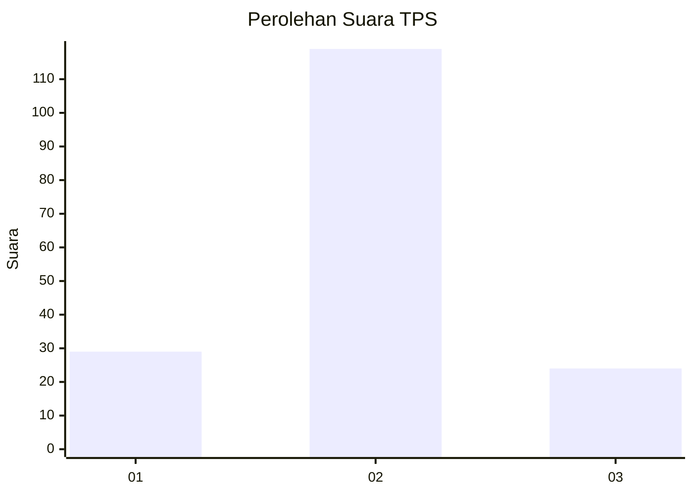
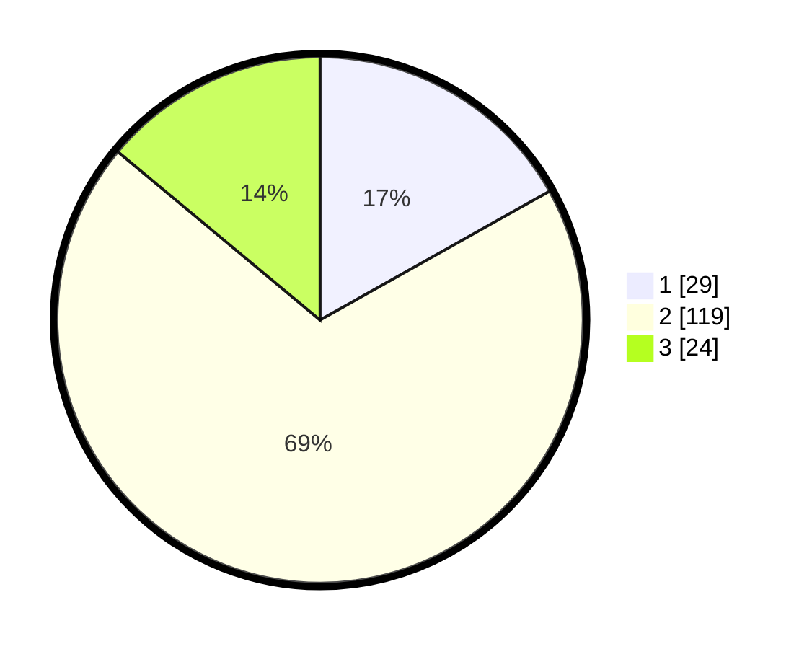

# Hasil

## Grafik

## Tabel

| No. | Nama Paslon    | Suara | Suara (raw) | Persentase |
|:--- |:-------------- | -----:| -----------:| ----------:|
| 1   | ANIES MUHAIMIN | 29    | [29][p-1]   | 16,86      |
| 2   | PRABOWO GIBRAN | 119   | [119][p-2]  | 69,19      |
| 3   | GANJAR MAHFUD  | 24    | [24][p-3]   | 13,95      |

[p-1]: https://github.com/gigit-pemilu/pemilu-2024/blob/main/pilpres/hitung-suara/sub/35-jawa-timur/sub/09-jember/sub/13-rambipuji/sub/2001-nogosari/sub/002-tps/sub/paslon-1.txt
[p-2]: https://github.com/gigit-pemilu/pemilu-2024/blob/main/pilpres/hitung-suara/sub/35-jawa-timur/sub/09-jember/sub/13-rambipuji/sub/2001-nogosari/sub/002-tps/sub/paslon-2.txt
[p-3]: https://github.com/gigit-pemilu/pemilu-2024/blob/main/pilpres/hitung-suara/sub/35-jawa-timur/sub/09-jember/sub/13-rambipuji/sub/2001-nogosari/sub/002-tps/sub/paslon-3.txt

## Foto C Plano

https://sirekap-obj-formc.kpu.go.id/ab4d/pemilu/ppwp/35/09/13/20/01/3509132001002-20240218-105820--37fa2b48-b5f0-495a-9af7-1c982faf3b91.jpg

https://sirekap-obj-formc.kpu.go.id/ab4d/pemilu/ppwp/35/09/13/20/01/3509132001002-20240218-110020--4cbd87ff-f22a-47d4-b502-647f57418f05.jpg

https://sirekap-obj-formc.kpu.go.id/ab4d/pemilu/ppwp/35/09/13/20/01/3509132001002-20240218-110135--fc34b6f4-3f90-404b-ae83-9e42b033475f.jpg

## Metadata

| Key        | Value               |
| ---------- | ------------------- |
| Time Stamp | 2024-02-25 21:00:00 |

