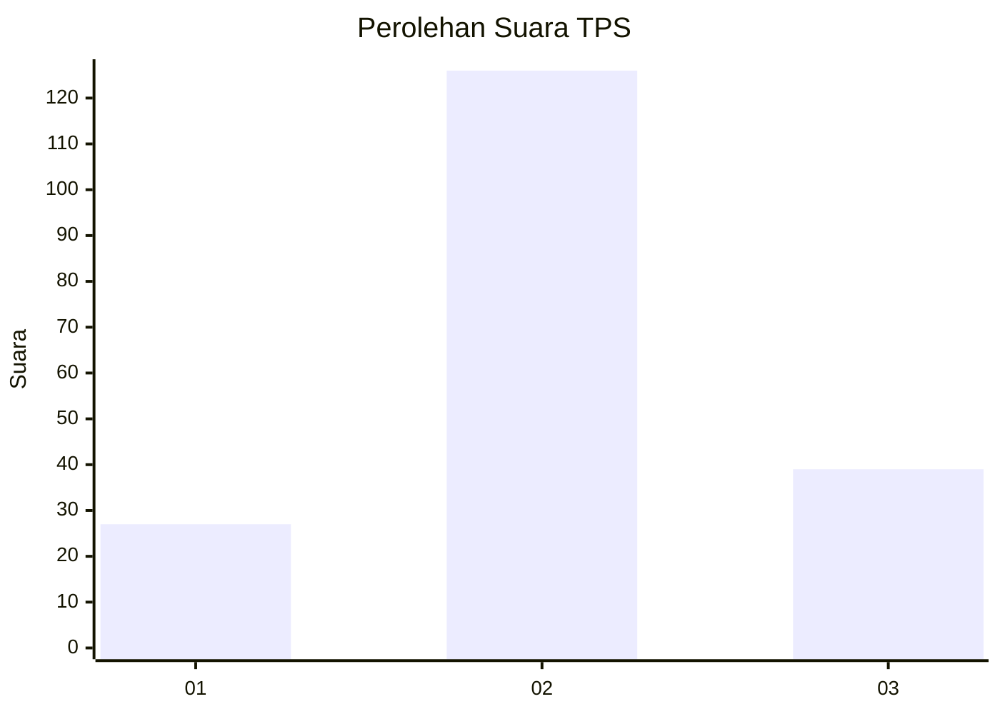
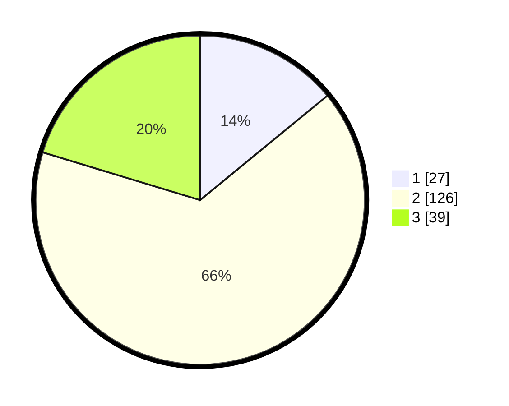

# Hasil

## Grafik

## Tabel

| No. | Nama Paslon    | Suara | Suara (raw) | Persentase |
|:--- |:-------------- | -----:| -----------:| ----------:|
| 1   | ANIES MUHAIMIN | 27    | [27][p-1]   | 14,06      |
| 2   | PRABOWO GIBRAN | 126   | [126][p-2]  | 65,63      |
| 3   | GANJAR MAHFUD  | 39    | [39][p-3]   | 20,31      |

[p-1]: https://github.com/gigit-pemilu/pemilu-2024/blob/main/pilpres/hitung-suara/sub/35-jawa-timur/sub/09-jember/sub/13-rambipuji/sub/2001-nogosari/sub/003-tps/sub/paslon-1.txt
[p-2]: https://github.com/gigit-pemilu/pemilu-2024/blob/main/pilpres/hitung-suara/sub/35-jawa-timur/sub/09-jember/sub/13-rambipuji/sub/2001-nogosari/sub/003-tps/sub/paslon-2.txt
[p-3]: https://github.com/gigit-pemilu/pemilu-2024/blob/main/pilpres/hitung-suara/sub/35-jawa-timur/sub/09-jember/sub/13-rambipuji/sub/2001-nogosari/sub/003-tps/sub/paslon-3.txt

## Foto C Plano

https://sirekap-obj-formc.kpu.go.id/f05b/pemilu/ppwp/35/09/13/20/01/3509132001003-20240214-193709--e6e4b9ec-67d1-440e-b64a-124ca2a69422.jpg

https://sirekap-obj-formc.kpu.go.id/f05b/pemilu/ppwp/35/09/13/20/01/3509132001003-20240214-193105--e5f4474f-999e-4dc9-950a-8ed6f922f8a1.jpg

https://sirekap-obj-formc.kpu.go.id/f05b/pemilu/ppwp/35/09/13/20/01/3509132001003-20240214-194159--b74a16a3-be00-4b3c-b373-baca5ad3a93b.jpg

## Metadata

| Key        | Value               |
| ---------- | ------------------- |
| Time Stamp | 2024-02-25 20:00:00 |

