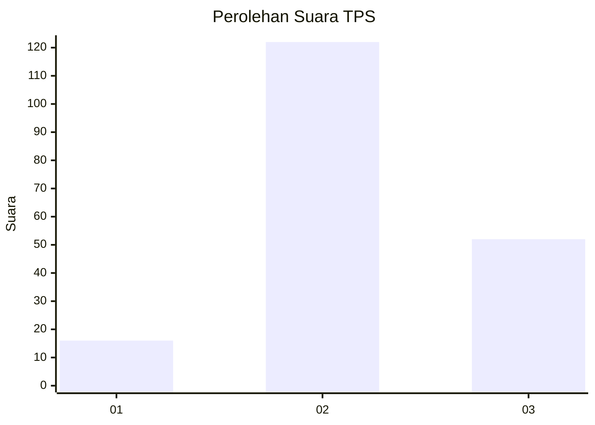

# Hasil

## Grafik

## Tabel

| No. | Nama Paslon    | Suara | Suara (raw) | Persentase |
|:--- |:-------------- | -----:| -----------:| ----------:|
| 1   | ANIES MUHAIMIN | 16    | [16][p-1]   | 8,42       |
| 2   | PRABOWO GIBRAN | 122   | [122][p-2]  | 64,21      |
| 3   | GANJAR MAHFUD  | 52    | [52][p-3]   | 27,37      |

[p-1]: https://github.com/gigit-pemilu/pemilu-2024/blob/main/pilpres/hitung-suara/sub/35-jawa-timur/sub/09-jember/sub/13-rambipuji/sub/2001-nogosari/sub/006-tps/sub/paslon-1.txt
[p-2]: https://github.com/gigit-pemilu/pemilu-2024/blob/main/pilpres/hitung-suara/sub/35-jawa-timur/sub/09-jember/sub/13-rambipuji/sub/2001-nogosari/sub/006-tps/sub/paslon-2.txt
[p-3]: https://github.com/gigit-pemilu/pemilu-2024/blob/main/pilpres/hitung-suara/sub/35-jawa-timur/sub/09-jember/sub/13-rambipuji/sub/2001-nogosari/sub/006-tps/sub/paslon-3.txt

## Foto C Plano

https://sirekap-obj-formc.kpu.go.id/fa85/pemilu/ppwp/35/09/13/20/01/3509132001006-20240218-114357--799fa97f-875f-4a69-b3fd-9f9beec70aee.jpg

https://sirekap-obj-formc.kpu.go.id/fa85/pemilu/ppwp/35/09/13/20/01/3509132001006-20240218-114540--a4734582-8ce6-4126-88f1-9e0394ec8bb9.jpg

https://sirekap-obj-formc.kpu.go.id/fa85/pemilu/ppwp/35/09/13/20/01/3509132001006-20240218-114716--f4f232c2-d810-4fc2-a2b0-a0fafecb7bde.jpg

## Metadata

| Key        | Value               |
| ---------- | ------------------- |
| Time Stamp | 2024-02-25 11:00:00 |

