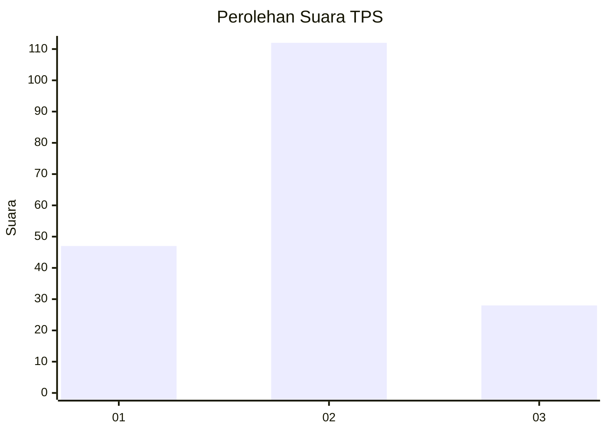
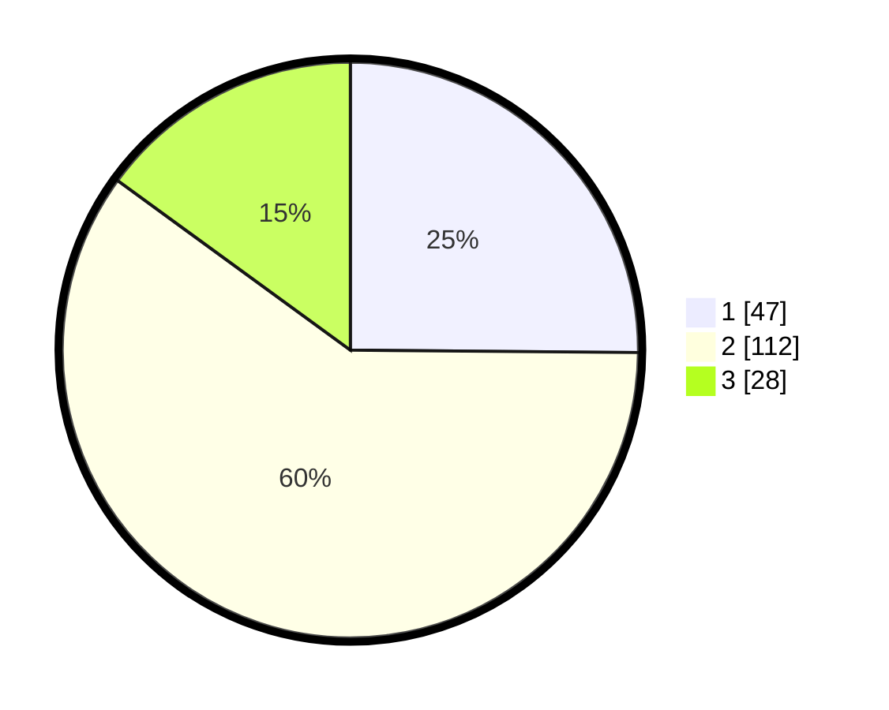

# Hasil

## Grafik

## Tabel

| No. | Nama Paslon    | Suara | Suara (raw) | Persentase |
|:--- |:-------------- | -----:| -----------:| ----------:|
| 1   | ANIES MUHAIMIN | 47    | [47][p-1]   | 25,13      |
| 2   | PRABOWO GIBRAN | 112   | [112][p-2]  | 59,89      |
| 3   | GANJAR MAHFUD  | 28    | [28][p-3]   | 14,97      |

[p-1]: https://github.com/gigit-pemilu/pemilu-2024/blob/main/pilpres/hitung-suara/sub/35-jawa-timur/sub/09-jember/sub/13-rambipuji/sub/2001-nogosari/sub/019-tps/sub/paslon-1.txt
[p-2]: https://github.com/gigit-pemilu/pemilu-2024/blob/main/pilpres/hitung-suara/sub/35-jawa-timur/sub/09-jember/sub/13-rambipuji/sub/2001-nogosari/sub/019-tps/sub/paslon-2.txt
[p-3]: https://github.com/gigit-pemilu/pemilu-2024/blob/main/pilpres/hitung-suara/sub/35-jawa-timur/sub/09-jember/sub/13-rambipuji/sub/2001-nogosari/sub/019-tps/sub/paslon-3.txt

## Foto C Plano

https://sirekap-obj-formc.kpu.go.id/8721/pemilu/ppwp/35/09/13/20/01/3509132001019-20240214-230426--16d7b97c-5d20-4870-ab6a-05236350c166.jpg

https://sirekap-obj-formc.kpu.go.id/8721/pemilu/ppwp/35/09/13/20/01/3509132001019-20240214-230749--b64d0cee-41de-4b4f-be0f-c994cdd181e3.jpg

https://sirekap-obj-formc.kpu.go.id/8721/pemilu/ppwp/35/09/13/20/01/3509132001019-20240214-230945--1d68b7d0-ff1e-4f24-8063-5a3ca9a9980c.jpg

## Metadata

| Key        | Value               |
| ---------- | ------------------- |
| Time Stamp | 2024-02-25 14:00:00 |

