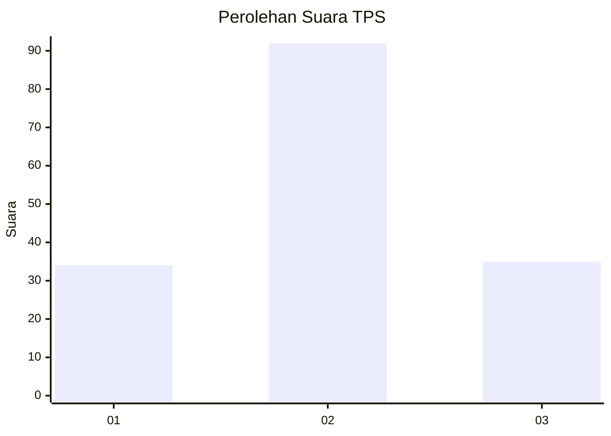
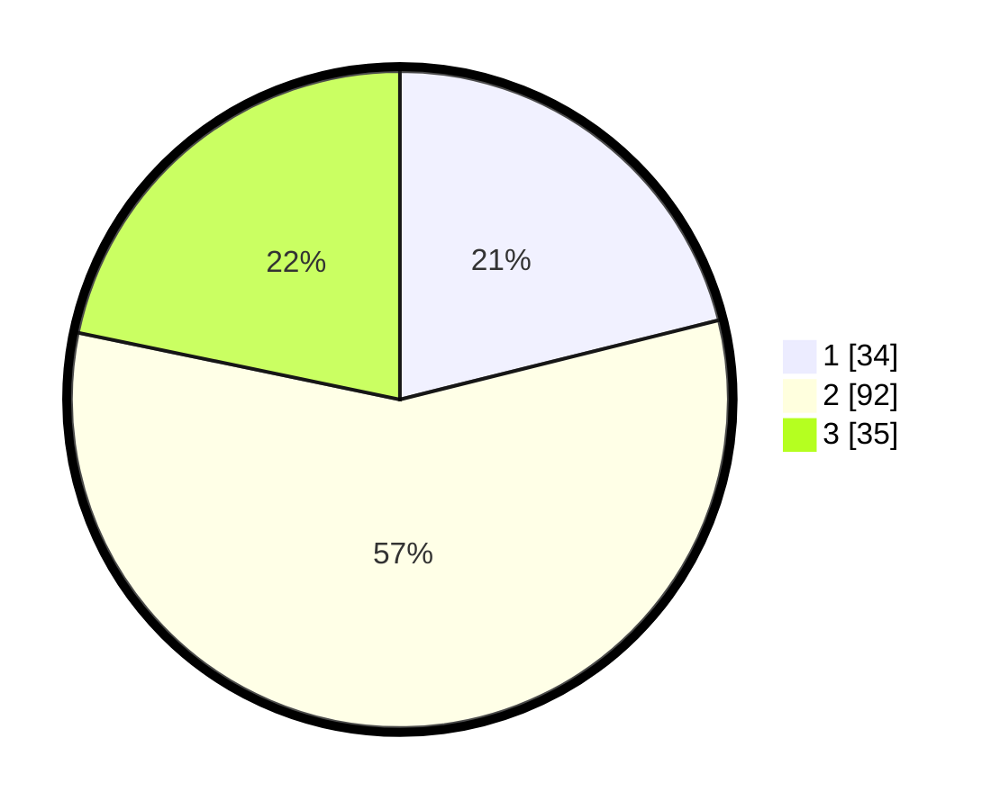

# Hasil

## Grafik

## Tabel

| No. | Nama Paslon    | Suara | Suara (raw) | Persentase |
|:--- |:-------------- | -----:| -----------:| ----------:|
| 1   | ANIES MUHAIMIN | 34    | [34][p-1]   | 21,12      |
| 2   | PRABOWO GIBRAN | 92    | [92][p-2]   | 57,14      |
| 3   | GANJAR MAHFUD  | 35    | [35][p-3]   | 21,74      |

[p-1]: https://github.com/gigit-pemilu/pemilu-2024/blob/main/pilpres/hitung-suara/sub/35-jawa-timur/sub/09-jember/sub/13-rambipuji/sub/2001-nogosari/sub/022-tps/sub/paslon-1.txt
[p-2]: https://github.com/gigit-pemilu/pemilu-2024/blob/main/pilpres/hitung-suara/sub/35-jawa-timur/sub/09-jember/sub/13-rambipuji/sub/2001-nogosari/sub/022-tps/sub/paslon-2.txt
[p-3]: https://github.com/gigit-pemilu/pemilu-2024/blob/main/pilpres/hitung-suara/sub/35-jawa-timur/sub/09-jember/sub/13-rambipuji/sub/2001-nogosari/sub/022-tps/sub/paslon-3.txt

## Foto C Plano

https://sirekap-obj-formc.kpu.go.id/0796/pemilu/ppwp/35/09/13/20/01/3509132001022-20240214-201802--125472d6-68cc-4083-b81b-16c6dc654cda.jpg

https://sirekap-obj-formc.kpu.go.id/0796/pemilu/ppwp/35/09/13/20/01/3509132001022-20240214-202123--66d0d836-b02f-49b0-8ddd-a0b0b5dcbacd.jpg

https://sirekap-obj-formc.kpu.go.id/0796/pemilu/ppwp/35/09/13/20/01/3509132001022-20240214-202345--5a4bda61-3607-4f72-bace-1ca89b61bea0.jpg

## Metadata

| Key        | Value               |
| ---------- | ------------------- |
| Time Stamp | 2024-02-15 12:00:28 |

