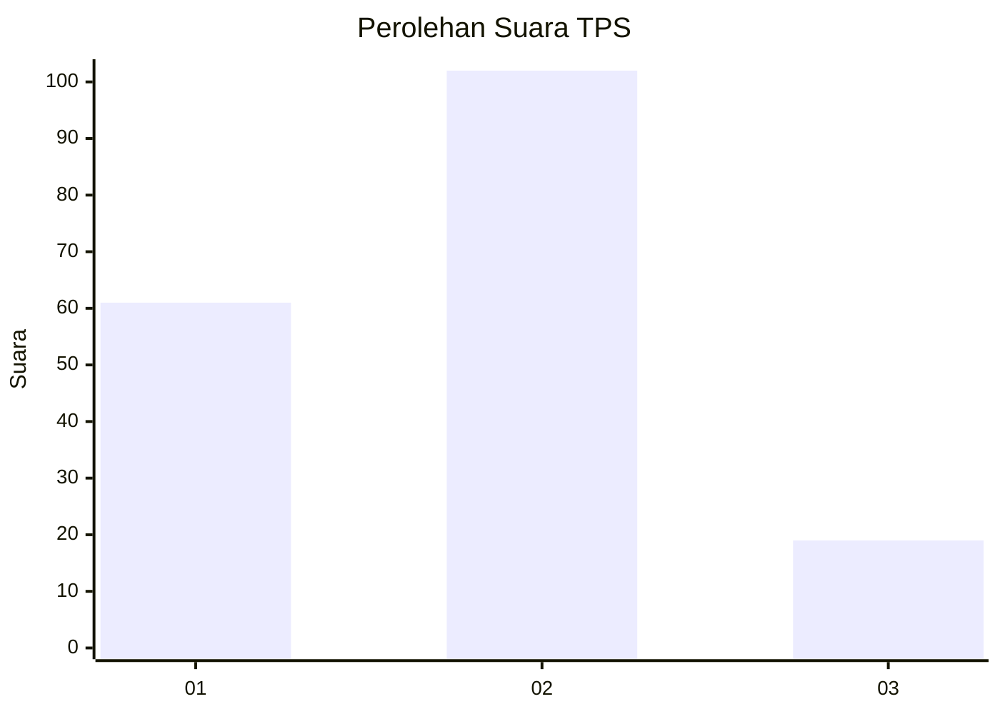
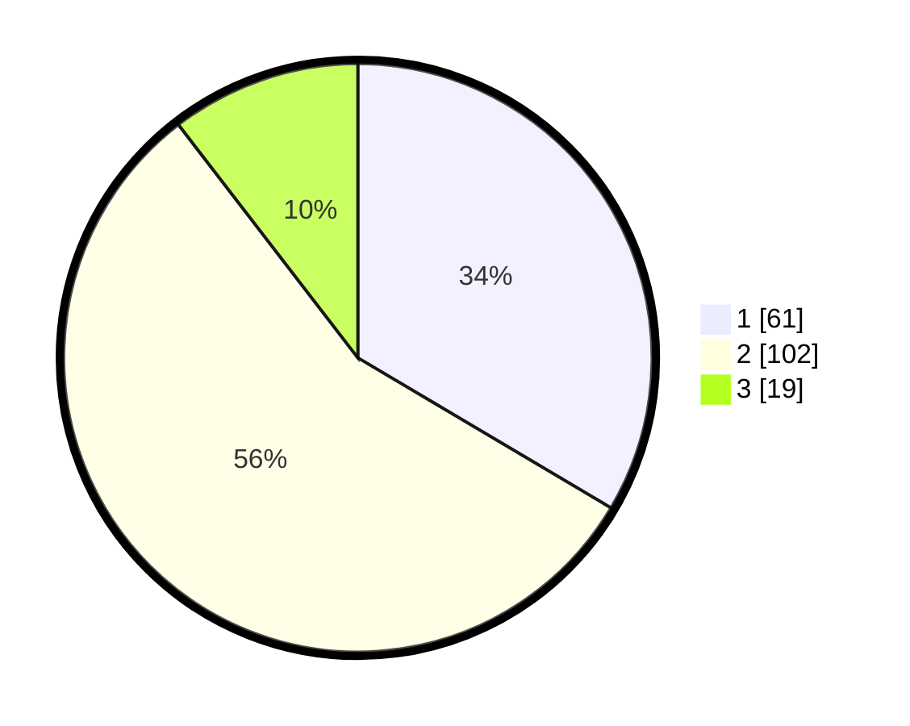

# Hasil

## Grafik

## Tabel

| No. | Nama Paslon    | Suara | Suara (raw) | Persentase |
|:--- |:-------------- | -----:| -----------:| ----------:|
| 1   | ANIES MUHAIMIN | 61    | [61][p-1]   | 33,52      |
| 2   | PRABOWO GIBRAN | 102   | [102][p-2]  | 56,04      |
| 3   | GANJAR MAHFUD  | 19    | [19][p-3]   | 10,44      |

[p-1]: https://github.com/gigit-pemilu/pemilu-2024/blob/main/pilpres/hitung-suara/sub/35-jawa-timur/sub/09-jember/sub/13-rambipuji/sub/2001-nogosari/sub/031-tps/sub/paslon-1.txt
[p-2]: https://github.com/gigit-pemilu/pemilu-2024/blob/main/pilpres/hitung-suara/sub/35-jawa-timur/sub/09-jember/sub/13-rambipuji/sub/2001-nogosari/sub/031-tps/sub/paslon-2.txt
[p-3]: https://github.com/gigit-pemilu/pemilu-2024/blob/main/pilpres/hitung-suara/sub/35-jawa-timur/sub/09-jember/sub/13-rambipuji/sub/2001-nogosari/sub/031-tps/sub/paslon-3.txt

## Foto C Plano

https://sirekap-obj-formc.kpu.go.id/2962/pemilu/ppwp/35/09/13/20/01/3509132001031-20240214-235326--d7a688f5-7f3f-4faa-a5ef-f7abfb3648e2.jpg

https://sirekap-obj-formc.kpu.go.id/2962/pemilu/ppwp/35/09/13/20/01/3509132001031-20240214-235524--2ca4defa-7eae-41a0-9a88-13d98e37d089.jpg

https://sirekap-obj-formc.kpu.go.id/2962/pemilu/ppwp/35/09/13/20/01/3509132001031-20240214-235800--a7698f7b-fa64-490a-997f-a597cd0fc387.jpg

## Metadata

| Key        | Value               |
| ---------- | ------------------- |
| Time Stamp | 2024-02-15 12:00:28 |

