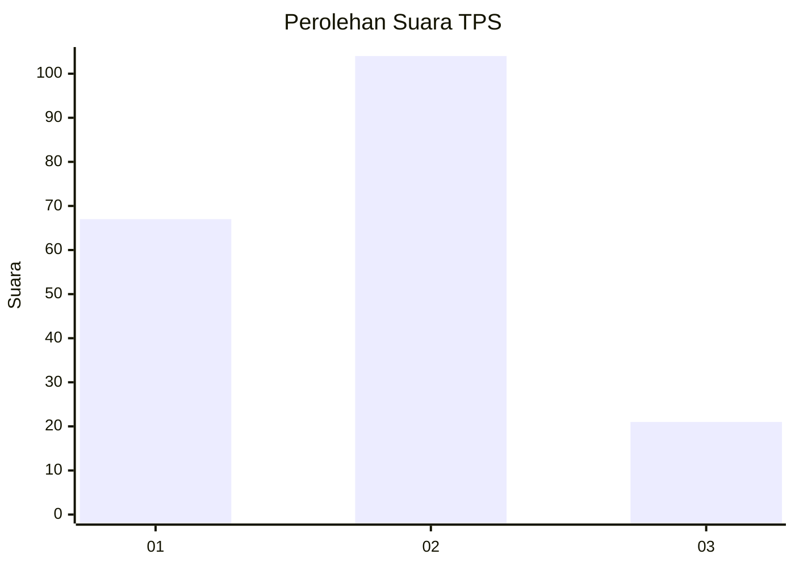
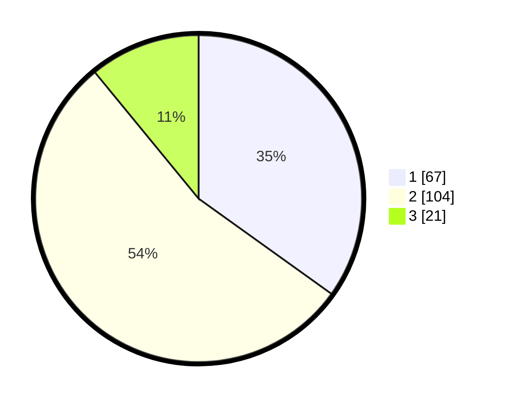

# Hasil

## Grafik

## Tabel

| No. | Nama Paslon    | Suara | Suara (raw) | Persentase |
|:--- |:-------------- | -----:| -----------:| ----------:|
| 1   | ANIES MUHAIMIN | 67    | [67][p-1]   | 34,90      |
| 2   | PRABOWO GIBRAN | 104   | [104][p-2]  | 54,17      |
| 3   | GANJAR MAHFUD  | 21    | [21][p-3]   | 10,94      |

[p-1]: https://github.com/gigit-pemilu/pemilu-2024/blob/main/pilpres/hitung-suara/sub/35-jawa-timur/sub/09-jember/sub/13-rambipuji/sub/2001-nogosari/sub/032-tps/sub/paslon-1.txt
[p-2]: https://github.com/gigit-pemilu/pemilu-2024/blob/main/pilpres/hitung-suara/sub/35-jawa-timur/sub/09-jember/sub/13-rambipuji/sub/2001-nogosari/sub/032-tps/sub/paslon-2.txt
[p-3]: https://github.com/gigit-pemilu/pemilu-2024/blob/main/pilpres/hitung-suara/sub/35-jawa-timur/sub/09-jember/sub/13-rambipuji/sub/2001-nogosari/sub/032-tps/sub/paslon-3.txt

## Foto C Plano

https://sirekap-obj-formc.kpu.go.id/e38e/pemilu/ppwp/35/09/13/20/01/3509132001032-20240218-155405--410bb109-080d-4d23-82a3-7c1c7b7cbdae.jpg

https://sirekap-obj-formc.kpu.go.id/e38e/pemilu/ppwp/35/09/13/20/01/3509132001032-20240218-155540--2f93120d-1d2f-48c8-af51-16e80048b6fd.jpg

https://sirekap-obj-formc.kpu.go.id/e38e/pemilu/ppwp/35/09/13/20/01/3509132001032-20240218-155659--f7177223-82d4-4902-83c1-92c2121b4b74.jpg

## Metadata

| Key        | Value               |
| ---------- | ------------------- |
| Time Stamp | 2024-02-24 22:31:28 |

