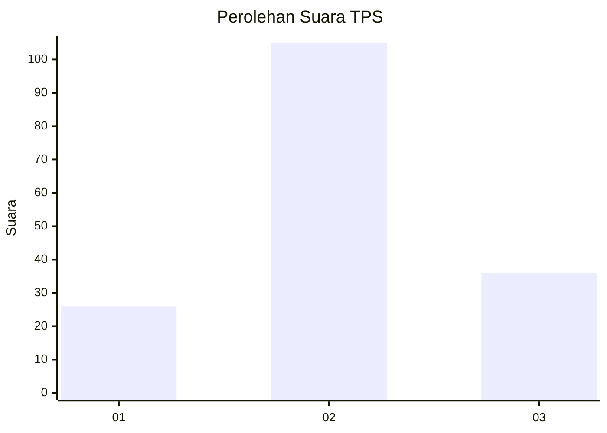
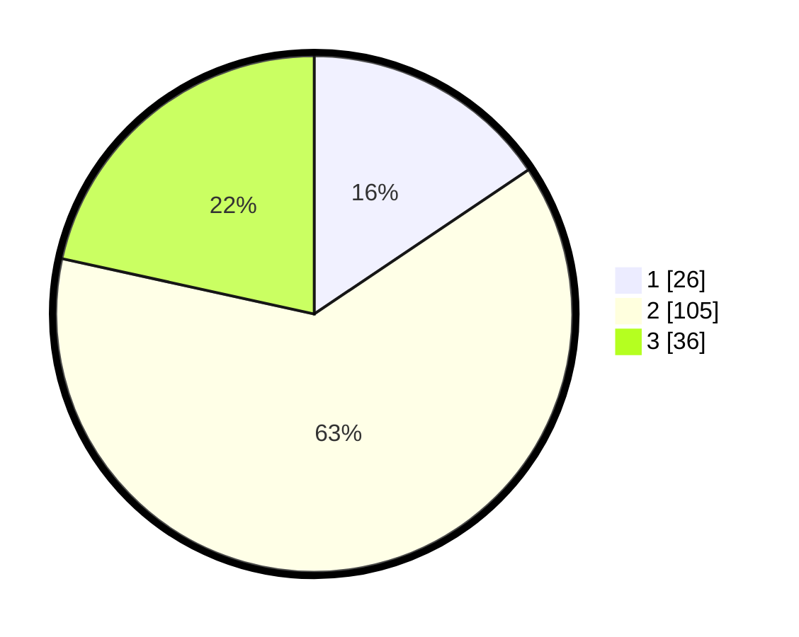

# Hasil

## Grafik

## Tabel

| No. | Nama Paslon    | Suara | Suara (raw) | Persentase |
|:--- |:-------------- | -----:| -----------:| ----------:|
| 1   | ANIES MUHAIMIN | 26    | [26][p-1]   | 15,57      |
| 2   | PRABOWO GIBRAN | 105   | [105][p-2]  | 62,87      |
| 3   | GANJAR MAHFUD  | 36    | [36][p-3]   | 21,56      |

[p-1]: https://github.com/gigit-pemilu/pemilu-2024-35-jawa-timur/blob/main/pilpres/hitung-suara/sub/35-jawa-timur/sub/09-jember/sub/13-rambipuji/sub/2001-nogosari/sub/037-tps/sub/paslon-1.txt
[p-2]: https://github.com/gigit-pemilu/pemilu-2024-35-jawa-timur/blob/main/pilpres/hitung-suara/sub/35-jawa-timur/sub/09-jember/sub/13-rambipuji/sub/2001-nogosari/sub/037-tps/sub/paslon-2.txt
[p-3]: https://github.com/gigit-pemilu/pemilu-2024-35-jawa-timur/blob/main/pilpres/hitung-suara/sub/35-jawa-timur/sub/09-jember/sub/13-rambipuji/sub/2001-nogosari/sub/037-tps/sub/paslon-3.txt

## Foto C Plano

https://sirekap-obj-formc.kpu.go.id/1bac/pemilu/ppwp/35/09/13/20/01/3509132001037-20240218-161442--33862058-6b3b-4fcf-bf6e-851a246390dd.jpg

https://sirekap-obj-formc.kpu.go.id/1bac/pemilu/ppwp/35/09/13/20/01/3509132001037-20240218-161623--ade5b4d5-2832-4ec0-8a0d-5e081f91377d.jpg

https://sirekap-obj-formc.kpu.go.id/1bac/pemilu/ppwp/35/09/13/20/01/3509132001037-20240218-161749--c1743a7a-9eb8-48d4-b5d2-daff0f6ac849.jpg

## Metadata

| Key        | Value               |
| ---------- | ------------------- |
| Time Stamp | 2024-02-25 21:00:00 |

