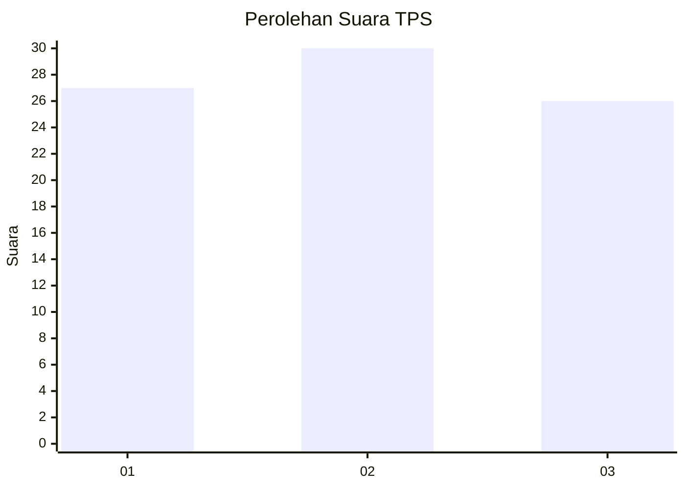
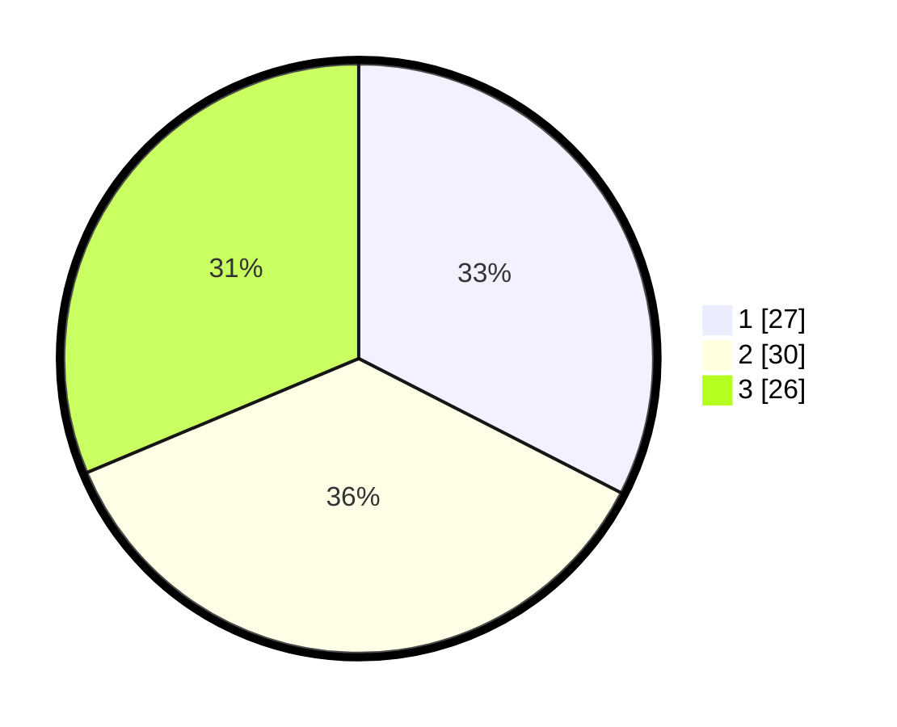

# Hasil

## Grafik

## Tabel

| No. | Nama Paslon    | Suara | Suara (raw) | Persentase |
|:--- |:-------------- | -----:| -----------:| ----------:|
| 1   | ANIES MUHAIMIN | 27    | [27][p-1]   | 32,53      |
| 2   | PRABOWO GIBRAN | 30    | [30][p-2]   | 36,14      |
| 3   | GANJAR MAHFUD  | 26    | [26][p-3]   | 31,33      |

[p-1]: https://github.com/gigit-pemilu/pemilu-2024/blob/main/pilpres/hitung-suara/sub/35-jawa-timur/sub/09-jember/sub/13-rambipuji/sub/2001-nogosari/sub/041-tps/sub/paslon-1.txt
[p-2]: https://github.com/gigit-pemilu/pemilu-2024/blob/main/pilpres/hitung-suara/sub/35-jawa-timur/sub/09-jember/sub/13-rambipuji/sub/2001-nogosari/sub/041-tps/sub/paslon-2.txt
[p-3]: https://github.com/gigit-pemilu/pemilu-2024/blob/main/pilpres/hitung-suara/sub/35-jawa-timur/sub/09-jember/sub/13-rambipuji/sub/2001-nogosari/sub/041-tps/sub/paslon-3.txt

## Foto C Plano

https://sirekap-obj-formc.kpu.go.id/dbad/pemilu/ppwp/35/09/13/20/01/3509132001041-20240215-002120--fe734f0a-08ac-4e83-a09f-cdd8fef38d59.jpg

https://sirekap-obj-formc.kpu.go.id/dbad/pemilu/ppwp/35/09/13/20/01/3509132001041-20240215-002151--87d8d0e4-b53e-4959-af64-fafe5dcc944b.jpg

https://sirekap-obj-formc.kpu.go.id/dbad/pemilu/ppwp/35/09/13/20/01/3509132001041-20240215-002222--e1ec9ee4-28b7-4f1b-8c93-ce3d5e6725dc.jpg

## Metadata

| Key        | Value               |
| ---------- | ------------------- |
| Time Stamp | 2024-02-24 22:31:28 |

## DATA PEMILIH TETAP

Jumlah pemilih dalam DPT: **282**.
 * L: **132**.
 * P: **150**.

## DATA PENGGUNA HAK PILIH

Jumlah pengguna hak pilih dalam DPT: **190**.
 * L: **80**.
 * P: **110**.

Jumlah pengguna hak pilih dalam DPTb: **0**.
 * L: **222**.
 * P: **0**.

Jumlah pengguna hak pilih dalam DPK: **552**.
 * L: **206**.
 * P: **662**.

Jumlah pengguna hak pilih: **412**.
 * L: **80**.
 * P: **111**.

## JUMLAH SUARA SAH DAN TIDAK SAH

JUMLAH SELURUH SUARA SAH: **183**.

JUMLAH SUARA TIDAK SAH: **8**.

JUMLAH SELURUH SUARA SAH DAN SUARA TIDAK SAH: **191**.

