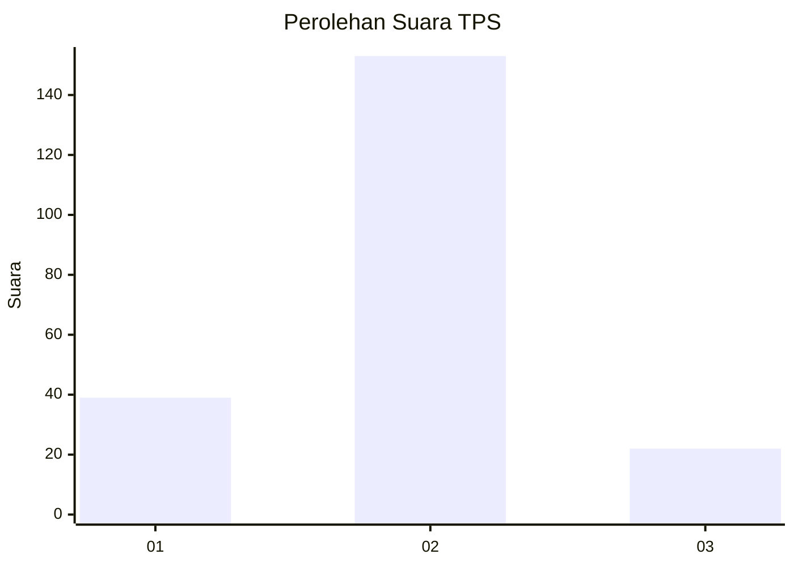
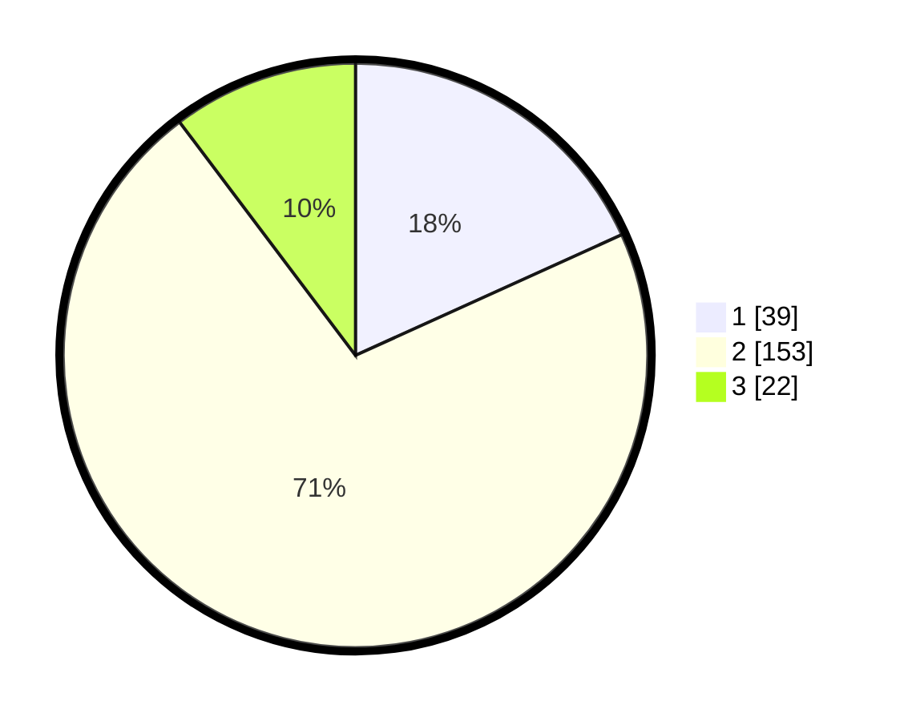

# Hasil

## Grafik

## Tabel

| No. | Nama Paslon    | Suara | Suara (raw) | Persentase |
|:--- |:-------------- | -----:| -----------:| ----------:|
| 1   | ANIES MUHAIMIN | 39    | [39][p-1]   | 18,22      |
| 2   | PRABOWO GIBRAN | 153   | [153][p-2]  | 71,50      |
| 3   | GANJAR MAHFUD  | 22    | [22][p-3]   | 10,28      |

[p-1]: https://github.com/gigit-pemilu/pemilu-2024-35-jawa-timur/blob/main/pilpres/hitung-suara/sub/35-jawa-timur/sub/09-jember/sub/13-rambipuji/sub/2001-nogosari/sub/046-tps/sub/paslon-1.txt
[p-2]: https://github.com/gigit-pemilu/pemilu-2024-35-jawa-timur/blob/main/pilpres/hitung-suara/sub/35-jawa-timur/sub/09-jember/sub/13-rambipuji/sub/2001-nogosari/sub/046-tps/sub/paslon-2.txt
[p-3]: https://github.com/gigit-pemilu/pemilu-2024-35-jawa-timur/blob/main/pilpres/hitung-suara/sub/35-jawa-timur/sub/09-jember/sub/13-rambipuji/sub/2001-nogosari/sub/046-tps/sub/paslon-3.txt

## Foto C Plano

https://sirekap-obj-formc.kpu.go.id/ab85/pemilu/ppwp/35/09/13/20/01/3509132001046-20240214-233530--e3408b36-6b1a-4810-ab73-e626b70f6a76.jpg

https://sirekap-obj-formc.kpu.go.id/ab85/pemilu/ppwp/35/09/13/20/01/3509132001046-20240214-230412--86141bb4-a234-4712-977c-92ec91dd676e.jpg

https://sirekap-obj-formc.kpu.go.id/ab85/pemilu/ppwp/35/09/13/20/01/3509132001046-20240214-230552--19748fca-059a-4094-ac22-a1945f88f30d.jpg

## Metadata

| Key        | Value               |
| ---------- | ------------------- |
| Time Stamp | 2024-02-25 16:00:00 |

