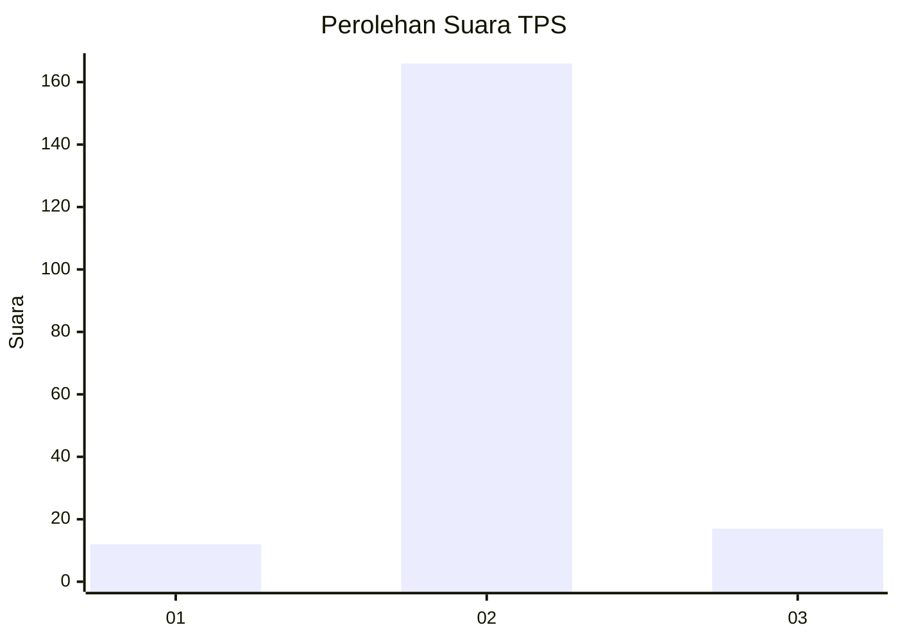
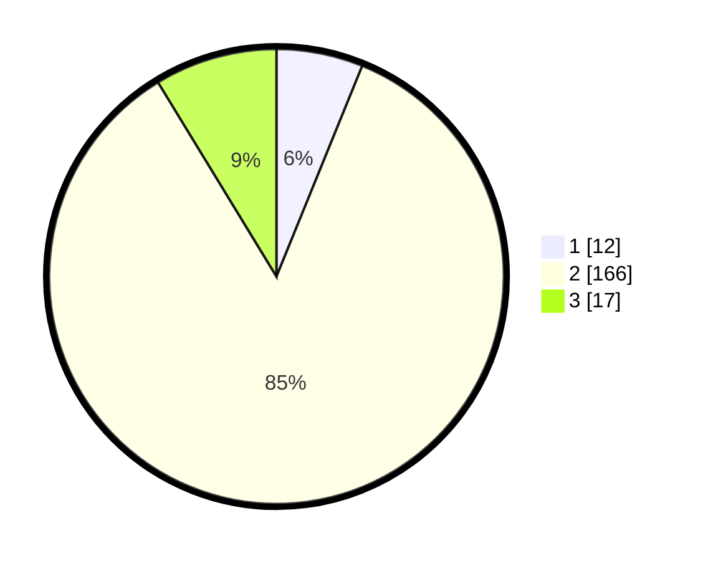

# Hasil

## Grafik

## Tabel

| No. | Nama Paslon    | Suara | Suara (raw) | Persentase |
|:--- |:-------------- | -----:| -----------:| ----------:|
| 1   | ANIES MUHAIMIN | 12    | [12][p-1]   | 6,15       |
| 2   | PRABOWO GIBRAN | 166   | [166][p-2]  | 85,13      |
| 3   | GANJAR MAHFUD  | 17    | [17][p-3]   | 8,72       |

[p-1]: https://github.com/gigit-pemilu/pemilu-2024-35-jawa-timur/blob/main/pilpres/hitung-suara/sub/35-jawa-timur/sub/09-jember/sub/13-rambipuji/sub/2001-nogosari/sub/059-tps/sub/paslon-1.txt
[p-2]: https://github.com/gigit-pemilu/pemilu-2024-35-jawa-timur/blob/main/pilpres/hitung-suara/sub/35-jawa-timur/sub/09-jember/sub/13-rambipuji/sub/2001-nogosari/sub/059-tps/sub/paslon-2.txt
[p-3]: https://github.com/gigit-pemilu/pemilu-2024-35-jawa-timur/blob/main/pilpres/hitung-suara/sub/35-jawa-timur/sub/09-jember/sub/13-rambipuji/sub/2001-nogosari/sub/059-tps/sub/paslon-3.txt

## Foto C Plano

https://sirekap-obj-formc.kpu.go.id/3dbf/pemilu/ppwp/35/09/13/20/01/3509132001059-20240218-194605--8b81cd2a-0685-45cf-83c4-2edb5f3d6de4.jpg

https://sirekap-obj-formc.kpu.go.id/3dbf/pemilu/ppwp/35/09/13/20/01/3509132001059-20240218-194733--cc456539-100d-4f02-b719-5c967edc8619.jpg

https://sirekap-obj-formc.kpu.go.id/3dbf/pemilu/ppwp/35/09/13/20/01/3509132001059-20240218-194842--c56884e9-4e4b-41fc-942f-26c374e9af99.jpg

## Metadata

| Key        | Value               |
| ---------- | ------------------- |
| Time Stamp | 2024-02-24 22:31:28 |

