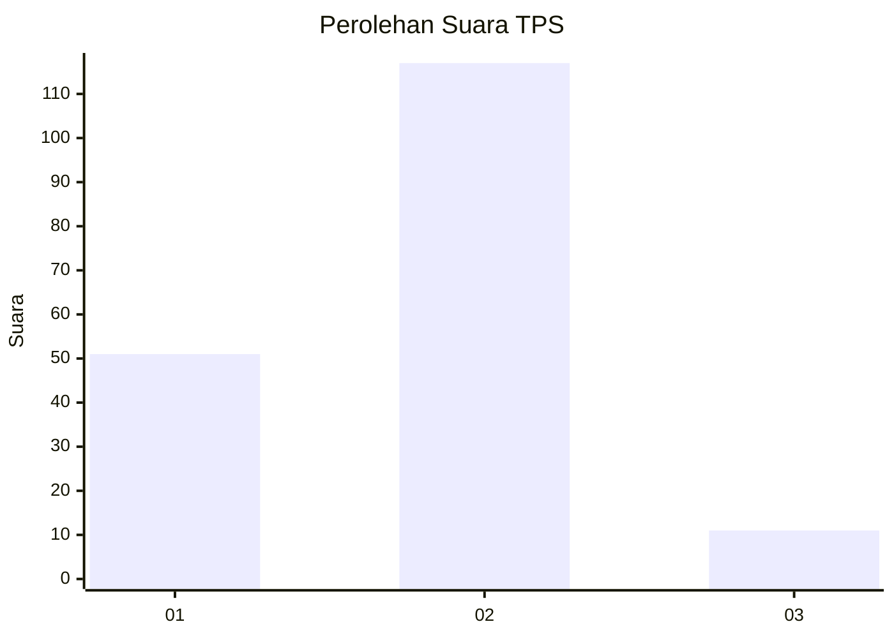
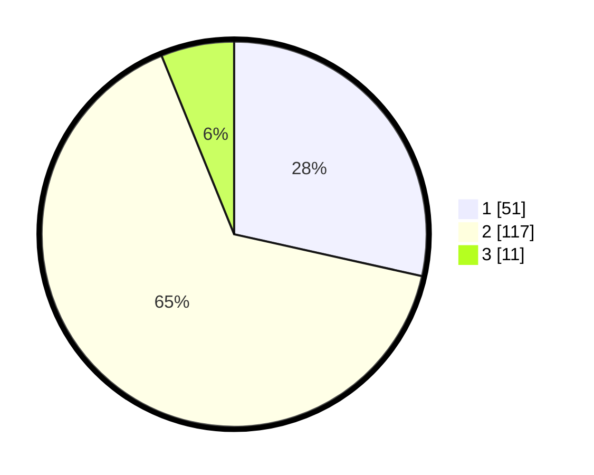

# Hasil

## Grafik

## Tabel

| No. | Nama Paslon    | Suara | Suara (raw) | Persentase |
|:--- |:-------------- | -----:| -----------:| ----------:|
| 1   | ANIES MUHAIMIN | 51    | [51][p-1]   | 28,49      |
| 2   | PRABOWO GIBRAN | 117   | [117][p-2]  | 65,36      |
| 3   | GANJAR MAHFUD  | 11    | [11][p-3]   | 6,15       |

[p-1]: https://github.com/gigit-pemilu/pemilu-2024/blob/main/pilpres/hitung-suara/sub/35-jawa-timur/sub/09-jember/sub/13-rambipuji/sub/2002-curahmalang/sub/001-tps/sub/paslon-1.txt
[p-2]: https://github.com/gigit-pemilu/pemilu-2024/blob/main/pilpres/hitung-suara/sub/35-jawa-timur/sub/09-jember/sub/13-rambipuji/sub/2002-curahmalang/sub/001-tps/sub/paslon-2.txt
[p-3]: https://github.com/gigit-pemilu/pemilu-2024/blob/main/pilpres/hitung-suara/sub/35-jawa-timur/sub/09-jember/sub/13-rambipuji/sub/2002-curahmalang/sub/001-tps/sub/paslon-3.txt

## Foto C Plano

https://sirekap-obj-formc.kpu.go.id/ab8c/pemilu/ppwp/35/09/13/20/02/3509132002001-20240216-231900--aef6a283-ffe6-405a-8698-cc45b493a396.jpg

https://sirekap-obj-formc.kpu.go.id/ab8c/pemilu/ppwp/35/09/13/20/02/3509132002001-20240217-002049--a4e3a416-21a8-4ca6-b7e0-dbd43f5d7730.jpg

https://sirekap-obj-formc.kpu.go.id/ab8c/pemilu/ppwp/35/09/13/20/02/3509132002001-20240217-002711--e4b3d186-8642-4ee3-a9fc-26b1a3c9de36.jpg

## Metadata

| Key        | Value               |
| ---------- | ------------------- |
| Time Stamp | 2024-02-17 00:28:35 |

