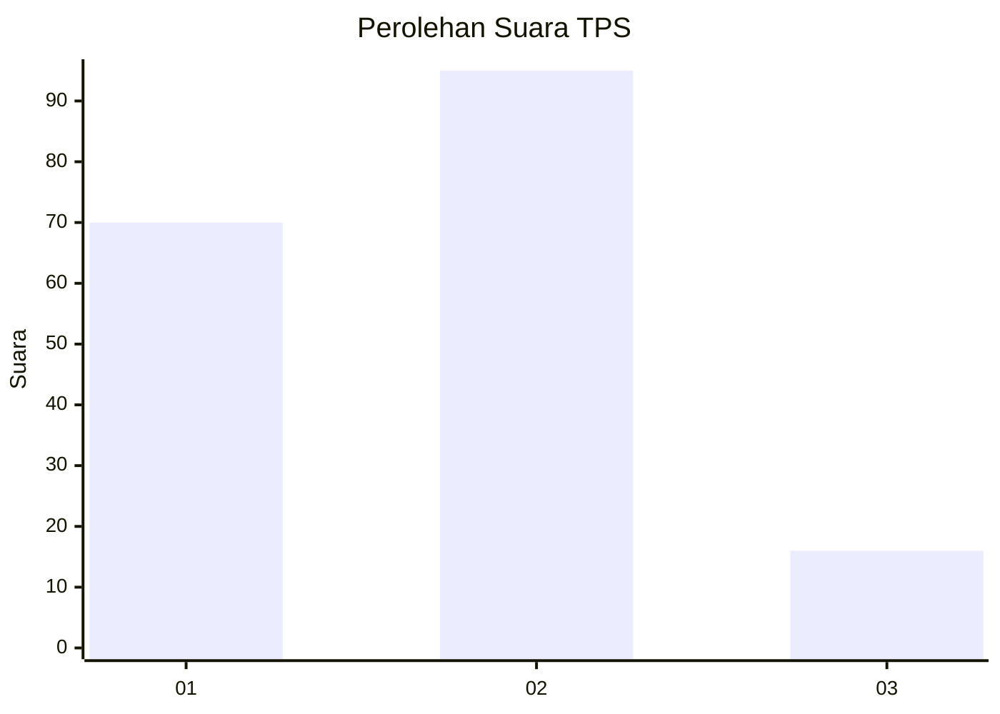

# Hasil

## Grafik

## Tabel

| No. | Nama Paslon    | Suara | Suara (raw) | Persentase |
|:--- |:-------------- | -----:| -----------:| ----------:|
| 1   | ANIES MUHAIMIN | 70    | [70][p-1]   | 38,67      |
| 2   | PRABOWO GIBRAN | 95    | [95][p-2]   | 52,49      |
| 3   | GANJAR MAHFUD  | 16    | [16][p-3]   | 8,84       |

[p-1]: https://github.com/gigit-pemilu/pemilu-2024/blob/main/pilpres/hitung-suara/sub/35-jawa-timur/sub/09-jember/sub/13-rambipuji/sub/2002-curahmalang/sub/002-tps/sub/paslon-1.txt
[p-2]: https://github.com/gigit-pemilu/pemilu-2024/blob/main/pilpres/hitung-suara/sub/35-jawa-timur/sub/09-jember/sub/13-rambipuji/sub/2002-curahmalang/sub/002-tps/sub/paslon-2.txt
[p-3]: https://github.com/gigit-pemilu/pemilu-2024/blob/main/pilpres/hitung-suara/sub/35-jawa-timur/sub/09-jember/sub/13-rambipuji/sub/2002-curahmalang/sub/002-tps/sub/paslon-3.txt

## Foto C Plano

https://sirekap-obj-formc.kpu.go.id/a3f2/pemilu/ppwp/35/09/13/20/02/3509132002002-20240216-224639--0298f2b6-ef09-4ef5-acd9-f801dcb5aec5.jpg

https://sirekap-obj-formc.kpu.go.id/a3f2/pemilu/ppwp/35/09/13/20/02/3509132002002-20240217-105223--a12a0932-4787-4a52-8881-936591228324.jpg

https://sirekap-obj-formc.kpu.go.id/a3f2/pemilu/ppwp/35/09/13/20/02/3509132002002-20240217-113411--7ee6e1f4-9197-4227-88ab-89b810da236c.jpg

## Metadata

| Key        | Value               |
| ---------- | ------------------- |
| Time Stamp | 2024-02-19 15:00:00 |

