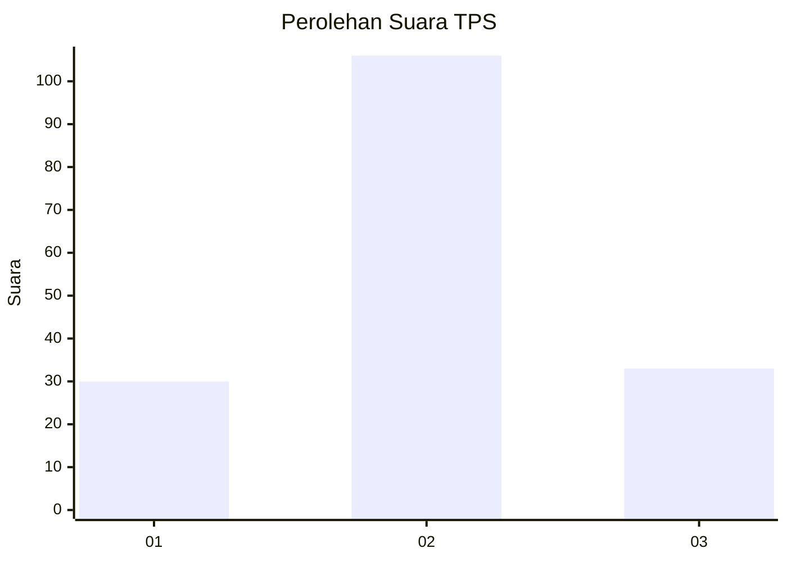
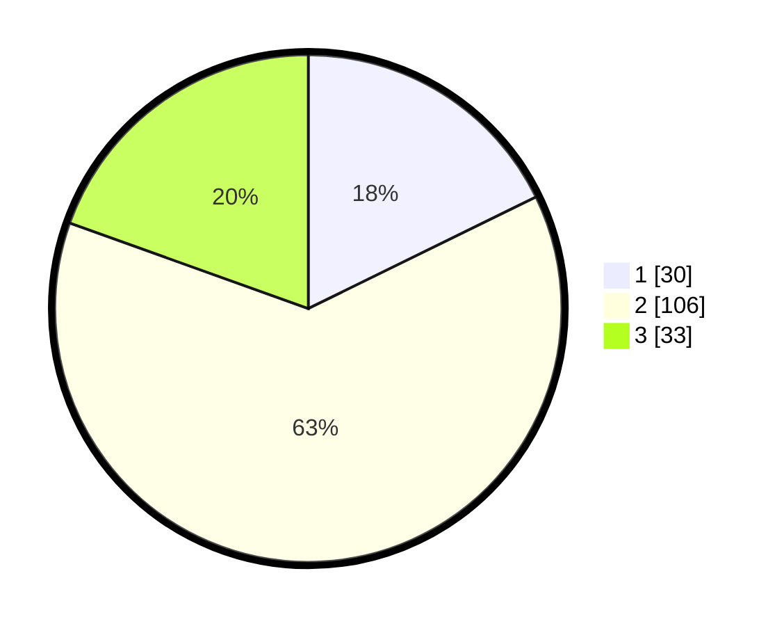

# Hasil

## Grafik

## Tabel

| No. | Nama Paslon    | Suara | Suara (raw) | Persentase |
|:--- |:-------------- | -----:| -----------:| ----------:|
| 1   | ANIES MUHAIMIN | 30    | [30][p-1]   | 17,75      |
| 2   | PRABOWO GIBRAN | 106   | [106][p-2]  | 62,72      |
| 3   | GANJAR MAHFUD  | 33    | [33][p-3]   | 19,53      |

[p-1]: https://github.com/gigit-pemilu/pemilu-2024-35-jawa-timur/blob/main/pilpres/hitung-suara/sub/35-jawa-timur/sub/09-jember/sub/13-rambipuji/sub/2002-curahmalang/sub/015-tps/sub/paslon-1.txt
[p-2]: https://github.com/gigit-pemilu/pemilu-2024-35-jawa-timur/blob/main/pilpres/hitung-suara/sub/35-jawa-timur/sub/09-jember/sub/13-rambipuji/sub/2002-curahmalang/sub/015-tps/sub/paslon-2.txt
[p-3]: https://github.com/gigit-pemilu/pemilu-2024-35-jawa-timur/blob/main/pilpres/hitung-suara/sub/35-jawa-timur/sub/09-jember/sub/13-rambipuji/sub/2002-curahmalang/sub/015-tps/sub/paslon-3.txt

## Foto C Plano

https://sirekap-obj-formc.kpu.go.id/758f/pemilu/ppwp/35/09/13/20/02/3509132002015-20240220-213844--2cb2d2fe-62f2-489b-b780-12c0a35a21e4.jpg

https://sirekap-obj-formc.kpu.go.id/758f/pemilu/ppwp/35/09/13/20/02/3509132002015-20240220-143236--5a1f8e87-c948-4248-af3d-3a5ef67ba519.jpg

https://sirekap-obj-formc.kpu.go.id/758f/pemilu/ppwp/35/09/13/20/02/3509132002015-20240220-143346--30b36c01-c722-430f-861c-81c6b1dfe0e9.jpg

## Metadata

| Key        | Value               |
| ---------- | ------------------- |
| Time Stamp | 2024-02-25 16:00:00 |

