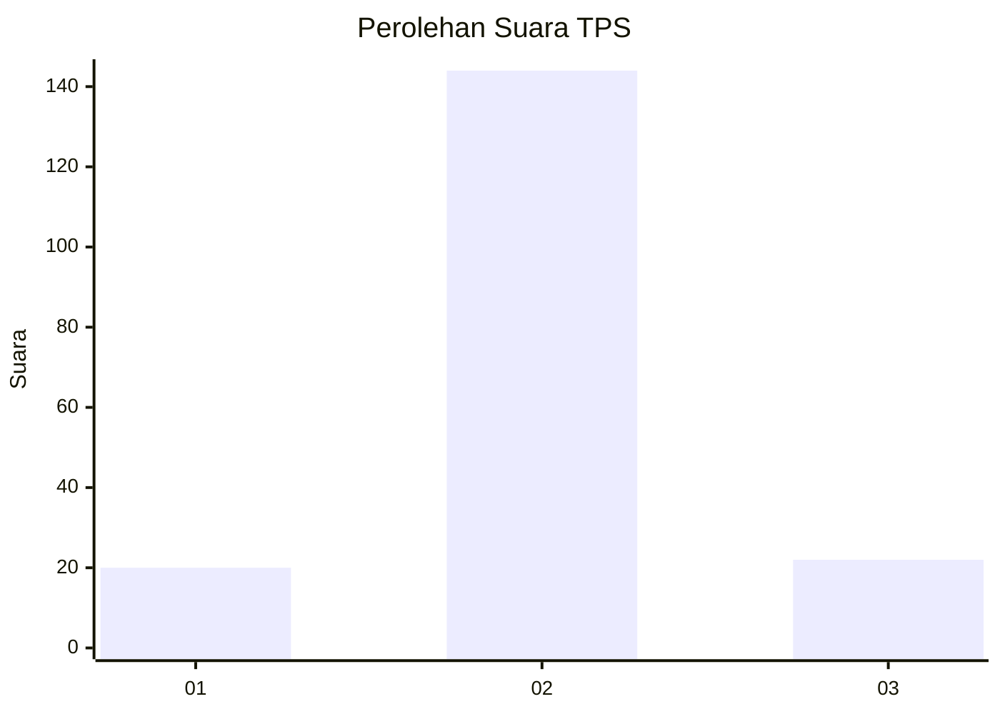
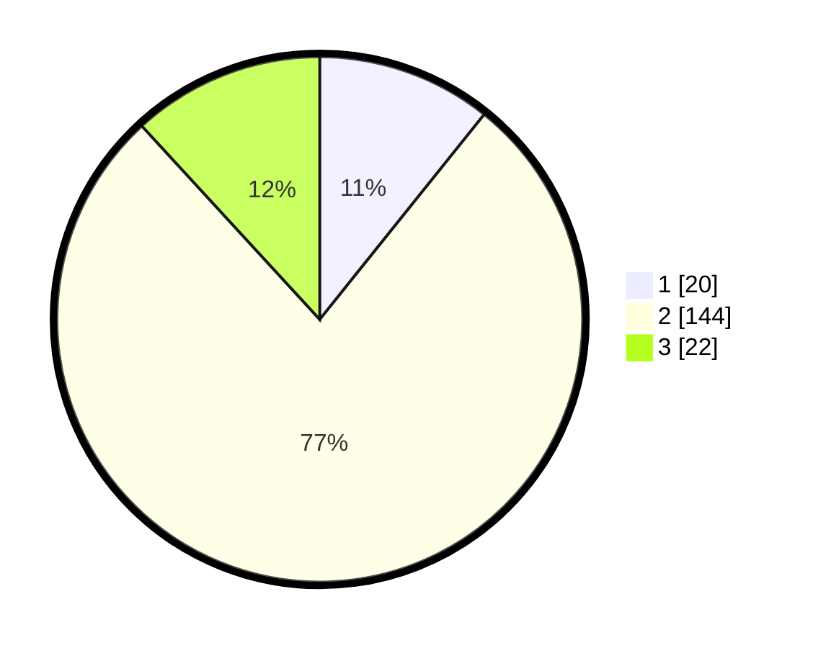

# Hasil

## Grafik

## Tabel

| No. | Nama Paslon    | Suara | Suara (raw) | Persentase |
|:--- |:-------------- | -----:| -----------:| ----------:|
| 1   | ANIES MUHAIMIN | 20    | [20][p-1]   | 10,75      |
| 2   | PRABOWO GIBRAN | 144   | [144][p-2]  | 77,42      |
| 3   | GANJAR MAHFUD  | 22    | [22][p-3]   | 11,83      |

[p-1]: https://github.com/gigit-pemilu/pemilu-2024/blob/main/pilpres/hitung-suara/sub/35-jawa-timur/sub/09-jember/sub/13-rambipuji/sub/2003-rowotamtu/sub/003-tps/sub/paslon-1.txt
[p-2]: https://github.com/gigit-pemilu/pemilu-2024/blob/main/pilpres/hitung-suara/sub/35-jawa-timur/sub/09-jember/sub/13-rambipuji/sub/2003-rowotamtu/sub/003-tps/sub/paslon-2.txt
[p-3]: https://github.com/gigit-pemilu/pemilu-2024/blob/main/pilpres/hitung-suara/sub/35-jawa-timur/sub/09-jember/sub/13-rambipuji/sub/2003-rowotamtu/sub/003-tps/sub/paslon-3.txt

## Foto C Plano

https://sirekap-obj-formc.kpu.go.id/aad3/pemilu/ppwp/35/09/13/20/03/3509132003003-20240215-061941--1f37ffd6-3eac-49e1-b271-13d39a0db7c8.jpg

https://sirekap-obj-formc.kpu.go.id/aad3/pemilu/ppwp/35/09/13/20/03/3509132003003-20240214-202148--170a4abe-9619-4de2-8e36-7560fb1c11c7.jpg

https://sirekap-obj-formc.kpu.go.id/aad3/pemilu/ppwp/35/09/13/20/03/3509132003003-20240214-202446--37a15ed7-abf8-4b3f-9ad9-7e8baced4d72.jpg

## Metadata

| Key        | Value               |
| ---------- | ------------------- |
| Time Stamp | 2024-02-15 15:00:29 |

