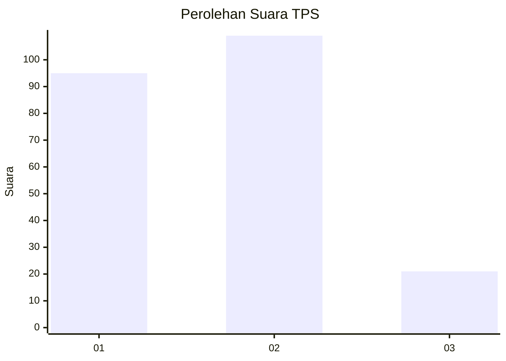
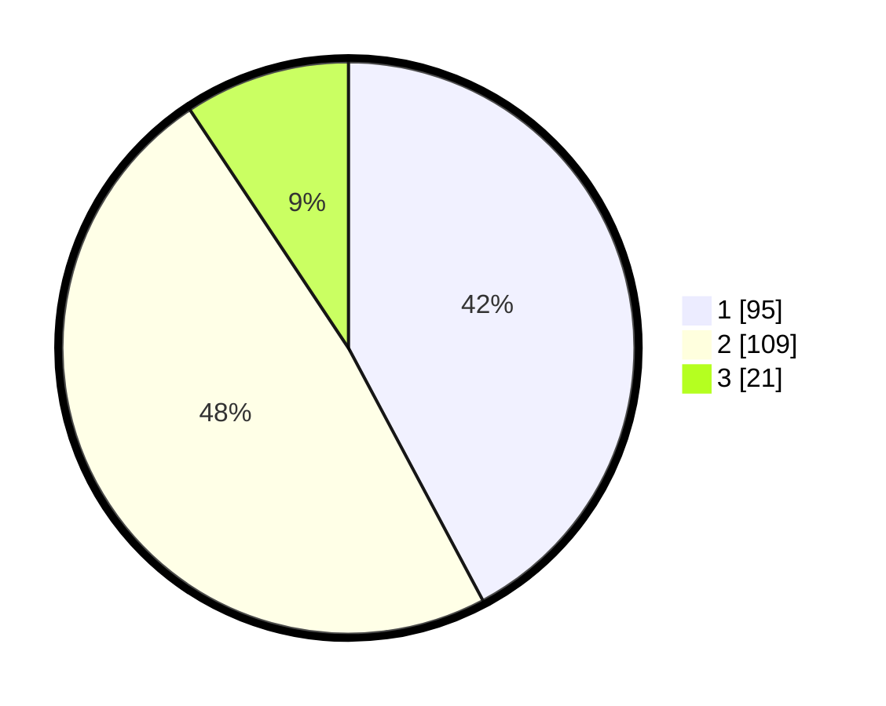

# Hasil

## Grafik

## Tabel

| No. | Nama Paslon    | Suara | Suara (raw) | Persentase |
|:--- |:-------------- | -----:| -----------:| ----------:|
| 1   | ANIES MUHAIMIN | 95    | [95][p-1]   | 42,22      |
| 2   | PRABOWO GIBRAN | 109   | [109][p-2]  | 48,44      |
| 3   | GANJAR MAHFUD  | 21    | [21][p-3]   | 9,33       |

[p-1]: https://github.com/gigit-pemilu/pemilu-2024-35-jawa-timur/blob/main/pilpres/hitung-suara/sub/35-jawa-timur/sub/09-jember/sub/13-rambipuji/sub/2003-rowotamtu/sub/007-tps/sub/paslon-1.txt
[p-2]: https://github.com/gigit-pemilu/pemilu-2024-35-jawa-timur/blob/main/pilpres/hitung-suara/sub/35-jawa-timur/sub/09-jember/sub/13-rambipuji/sub/2003-rowotamtu/sub/007-tps/sub/paslon-2.txt
[p-3]: https://github.com/gigit-pemilu/pemilu-2024-35-jawa-timur/blob/main/pilpres/hitung-suara/sub/35-jawa-timur/sub/09-jember/sub/13-rambipuji/sub/2003-rowotamtu/sub/007-tps/sub/paslon-3.txt

## Foto C Plano

https://sirekap-obj-formc.kpu.go.id/9f5e/pemilu/ppwp/35/09/13/20/03/3509132003007-20240221-112645--154a93f0-9622-432d-ba63-21dd2f27761e.jpg

https://sirekap-obj-formc.kpu.go.id/9f5e/pemilu/ppwp/35/09/13/20/03/3509132003007-20240221-112728--fa40a182-d0aa-46a3-bbd2-dd04a968eb14.jpg

https://sirekap-obj-formc.kpu.go.id/9f5e/pemilu/ppwp/35/09/13/20/03/3509132003007-20240221-112826--3e5dc78f-d9f9-40c3-acf2-981859dcbe4d.jpg

## Metadata

| Key        | Value               |
| ---------- | ------------------- |
| Time Stamp | 2024-02-25 11:00:00 |

