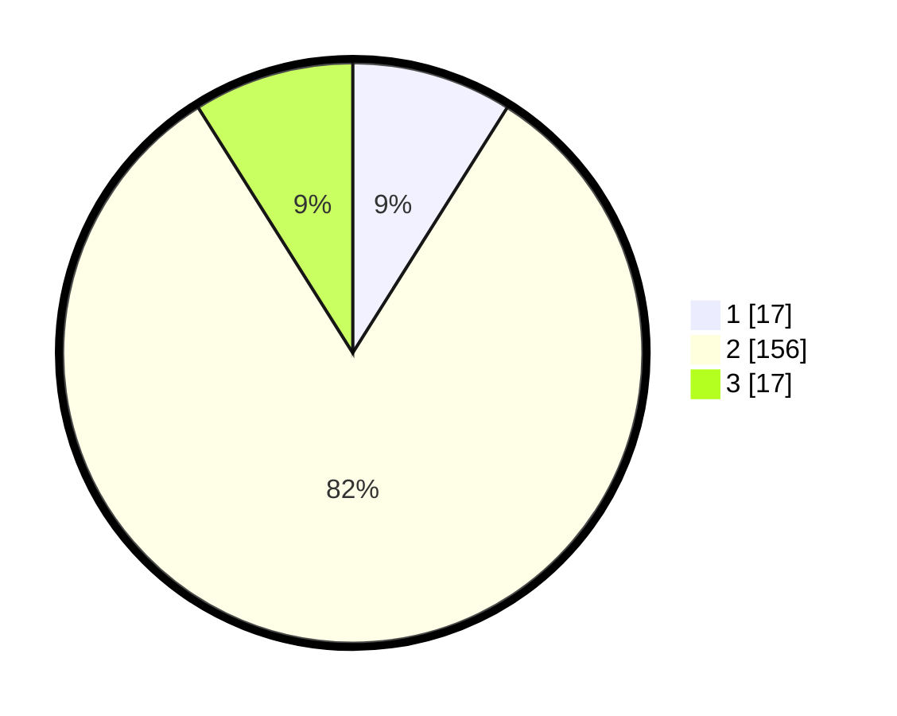

# Hasil

## Grafik

## Tabel

| No. | Nama Paslon    | Suara | Suara (raw) | Persentase |
|:--- |:-------------- | -----:| -----------:| ----------:|
| 1   | ANIES MUHAIMIN | 17    | [17][p-1]   | 8,95       |
| 2   | PRABOWO GIBRAN | 156   | [156][p-2]  | 82,11      |
| 3   | GANJAR MAHFUD  | 17    | [17][p-3]   | 8,95       |

[p-1]: https://github.com/gigit-pemilu/pemilu-2024/blob/main/pilpres/hitung-suara/sub/35-jawa-timur/sub/09-jember/sub/13-rambipuji/sub/2003-rowotamtu/sub/019-tps/sub/paslon-1.txt
[p-2]: https://github.com/gigit-pemilu/pemilu-2024/blob/main/pilpres/hitung-suara/sub/35-jawa-timur/sub/09-jember/sub/13-rambipuji/sub/2003-rowotamtu/sub/019-tps/sub/paslon-2.txt
[p-3]: https://github.com/gigit-pemilu/pemilu-2024/blob/main/pilpres/hitung-suara/sub/35-jawa-timur/sub/09-jember/sub/13-rambipuji/sub/2003-rowotamtu/sub/019-tps/sub/paslon-3.txt

## Foto C Plano

https://sirekap-obj-formc.kpu.go.id/33cd/pemilu/ppwp/35/09/13/20/03/3509132003019-20240218-082737--e7322d2f-514c-40b1-a665-120a6f211c16.jpg

https://sirekap-obj-formc.kpu.go.id/33cd/pemilu/ppwp/35/09/13/20/03/3509132003019-20240214-231313--1316604d-bf34-4d08-9d24-fa2c764d18a4.jpg

https://sirekap-obj-formc.kpu.go.id/33cd/pemilu/ppwp/35/09/13/20/03/3509132003019-20240214-231429--1ec6b6b1-3b80-4856-84e7-8ccf1d943397.jpg

## Metadata

| Key        | Value               |
| ---------- | ------------------- |
| Time Stamp | 2024-02-25 21:00:00 |

