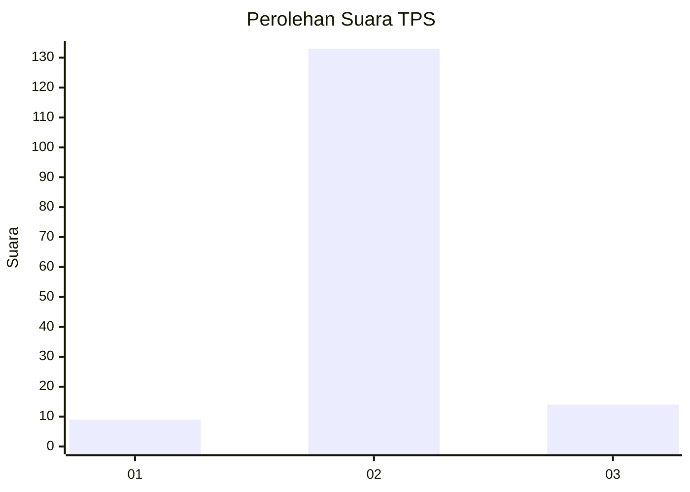
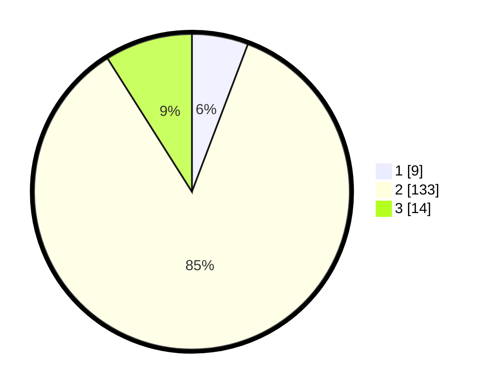

# Hasil

## Grafik

## Tabel

| No. | Nama Paslon    | Suara | Suara (raw) | Persentase |
|:--- |:-------------- | -----:| -----------:| ----------:|
| 1   | ANIES MUHAIMIN | 9     | [9][p-1]    | 5,77       |
| 2   | PRABOWO GIBRAN | 133   | [133][p-2]  | 85,26      |
| 3   | GANJAR MAHFUD  | 14    | [14][p-3]   | 8,97       |

[p-1]: https://github.com/gigit-pemilu/pemilu-2024-35-jawa-timur/blob/main/pilpres/hitung-suara/sub/35-jawa-timur/sub/09-jember/sub/13-rambipuji/sub/2003-rowotamtu/sub/023-tps/sub/paslon-1.txt
[p-2]: https://github.com/gigit-pemilu/pemilu-2024-35-jawa-timur/blob/main/pilpres/hitung-suara/sub/35-jawa-timur/sub/09-jember/sub/13-rambipuji/sub/2003-rowotamtu/sub/023-tps/sub/paslon-2.txt
[p-3]: https://github.com/gigit-pemilu/pemilu-2024-35-jawa-timur/blob/main/pilpres/hitung-suara/sub/35-jawa-timur/sub/09-jember/sub/13-rambipuji/sub/2003-rowotamtu/sub/023-tps/sub/paslon-3.txt

## Foto C Plano

https://sirekap-obj-formc.kpu.go.id/e618/pemilu/ppwp/35/09/13/20/03/3509132003023-20240214-190423--89f080c7-8b30-4a0a-ac35-042067428f37.jpg

https://sirekap-obj-formc.kpu.go.id/e618/pemilu/ppwp/35/09/13/20/03/3509132003023-20240214-190612--6ce3adae-0815-45a2-8357-8ee3b771e5eb.jpg

https://sirekap-obj-formc.kpu.go.id/e618/pemilu/ppwp/35/09/13/20/03/3509132003023-20240214-190809--fd59c031-0399-4279-82e1-064f5ff87f7a.jpg

## Metadata

| Key        | Value               |
| ---------- | ------------------- |
| Time Stamp | 2024-02-25 17:00:00 |

