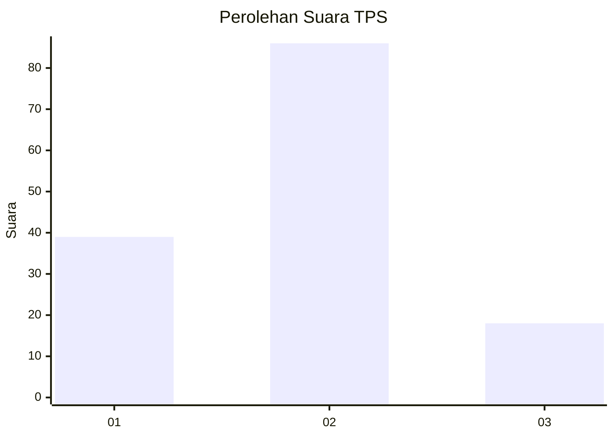
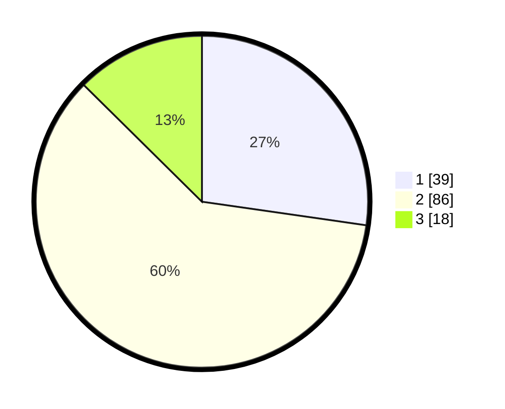

# Hasil

## Grafik

## Tabel

| No. | Nama Paslon    | Suara | Suara (raw) | Persentase |
|:--- |:-------------- | -----:| -----------:| ----------:|
| 1   | ANIES MUHAIMIN | 39    | [39][p-1]   | 27,27      |
| 2   | PRABOWO GIBRAN | 86    | [86][p-2]   | 60,14      |
| 3   | GANJAR MAHFUD  | 18    | [18][p-3]   | 12,59      |

[p-1]: https://github.com/gigit-pemilu/pemilu-2024/blob/main/pilpres/hitung-suara/sub/35-jawa-timur/sub/09-jember/sub/13-rambipuji/sub/2004-kaliwining/sub/002-tps/sub/paslon-1.txt
[p-2]: https://github.com/gigit-pemilu/pemilu-2024/blob/main/pilpres/hitung-suara/sub/35-jawa-timur/sub/09-jember/sub/13-rambipuji/sub/2004-kaliwining/sub/002-tps/sub/paslon-2.txt
[p-3]: https://github.com/gigit-pemilu/pemilu-2024/blob/main/pilpres/hitung-suara/sub/35-jawa-timur/sub/09-jember/sub/13-rambipuji/sub/2004-kaliwining/sub/002-tps/sub/paslon-3.txt

## Foto C Plano

https://sirekap-obj-formc.kpu.go.id/2e70/pemilu/ppwp/35/09/13/20/04/3509132004002-20240219-202913--173fa012-4ae9-472e-9c1d-b0aff6480a39.jpg

https://sirekap-obj-formc.kpu.go.id/2e70/pemilu/ppwp/35/09/13/20/04/3509132004002-20240219-203100--db3118d1-1ba9-4346-9c90-d54c5b390e31.jpg

https://sirekap-obj-formc.kpu.go.id/2e70/pemilu/ppwp/35/09/13/20/04/3509132004002-20240219-203209--0bb9d70f-78e4-4d74-b2f9-0e25672bb494.jpg

## Metadata

| Key        | Value               |
| ---------- | ------------------- |
| Time Stamp | 2024-02-25 19:00:00 |

