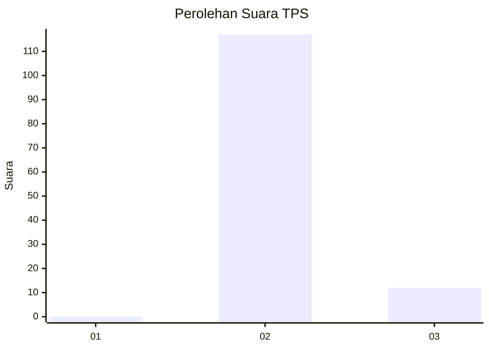
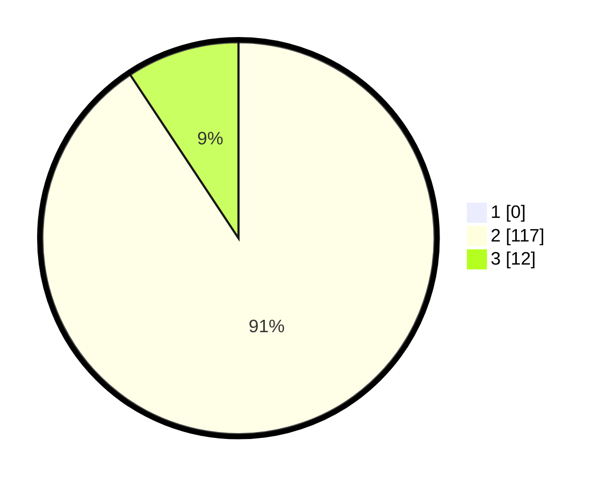

# Hasil

## Grafik

## Tabel

| No. | Nama Paslon    | Suara | Suara (raw) | Persentase |
|:--- |:-------------- | -----:| -----------:| ----------:|
| 1   | ANIES MUHAIMIN | 0     | [0][p-1]    | 0,00       |
| 2   | PRABOWO GIBRAN | 117   | [117][p-2]  | 90,70      |
| 3   | GANJAR MAHFUD  | 12    | [12][p-3]   | 9,30       |

[p-1]: https://github.com/gigit-pemilu/pemilu-2024/blob/main/pilpres/hitung-suara/sub/35-jawa-timur/sub/09-jember/sub/13-rambipuji/sub/2004-kaliwining/sub/003-tps/sub/paslon-1.txt
[p-2]: https://github.com/gigit-pemilu/pemilu-2024/blob/main/pilpres/hitung-suara/sub/35-jawa-timur/sub/09-jember/sub/13-rambipuji/sub/2004-kaliwining/sub/003-tps/sub/paslon-2.txt
[p-3]: https://github.com/gigit-pemilu/pemilu-2024/blob/main/pilpres/hitung-suara/sub/35-jawa-timur/sub/09-jember/sub/13-rambipuji/sub/2004-kaliwining/sub/003-tps/sub/paslon-3.txt

## Foto C Plano

https://sirekap-obj-formc.kpu.go.id/e57b/pemilu/ppwp/35/09/13/20/04/3509132004003-20240219-205808--1bd63558-8f8e-4418-a62b-7ef154642ac1.jpg

https://sirekap-obj-formc.kpu.go.id/e57b/pemilu/ppwp/35/09/13/20/04/3509132004003-20240219-205501--46251e87-f5dc-4cfb-9957-e79588a0f038.jpg

https://sirekap-obj-formc.kpu.go.id/e57b/pemilu/ppwp/35/09/13/20/04/3509132004003-20240219-205648--988018c5-b5c9-4314-a593-f2c87bd6702e.jpg

## Metadata

| Key        | Value               |
| ---------- | ------------------- |
| Time Stamp | 2024-02-19 21:00:00 |

## DATA PEMILIH TETAP

Jumlah pemilih dalam DPT: **261**.
 * L: **423**.
 * P: **632**.

## DATA PENGGUNA HAK PILIH

Jumlah pengguna hak pilih dalam DPT: **204**.
 * L: **98**.
 * P: **106**.

Jumlah pengguna hak pilih dalam DPTb: **696**.
 * L: **400**.
 * P: **0**.

Jumlah pengguna hak pilih dalam DPK: **0**.
 * L: **74**.
 * P: **400**.

Jumlah pengguna hak pilih: **204**.
 * L: **48**.
 * P: **206**.

## JUMLAH SUARA SAH DAN TIDAK SAH

JUMLAH SELURUH SUARA SAH: **199**.

JUMLAH SUARA TIDAK SAH: **5**.

JUMLAH SELURUH SUARA SAH DAN SUARA TIDAK SAH: **202**.

