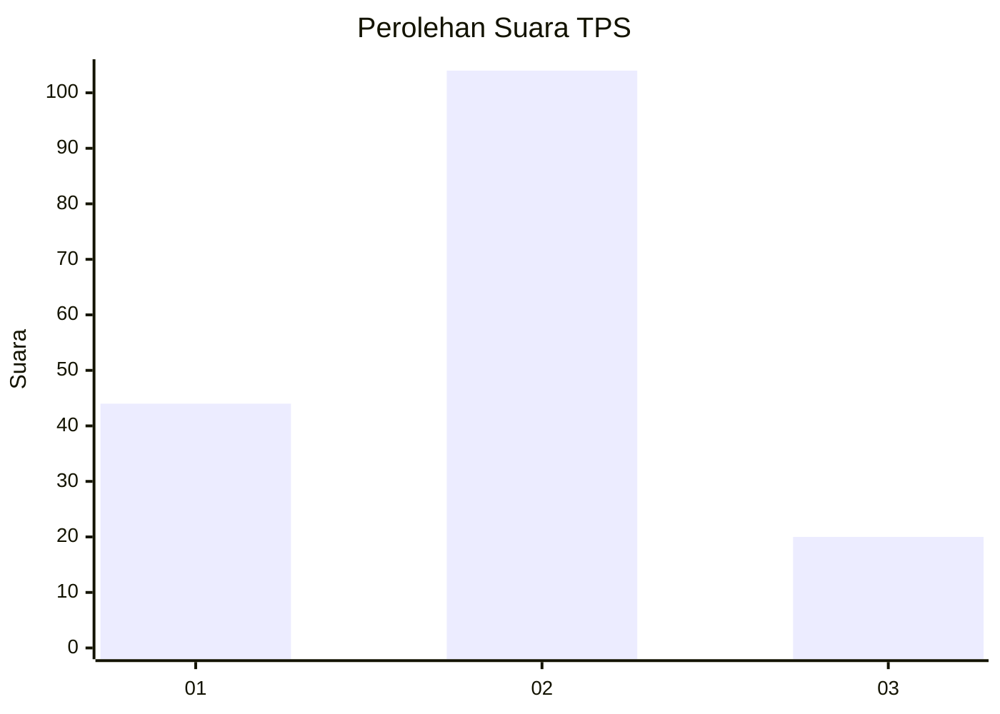
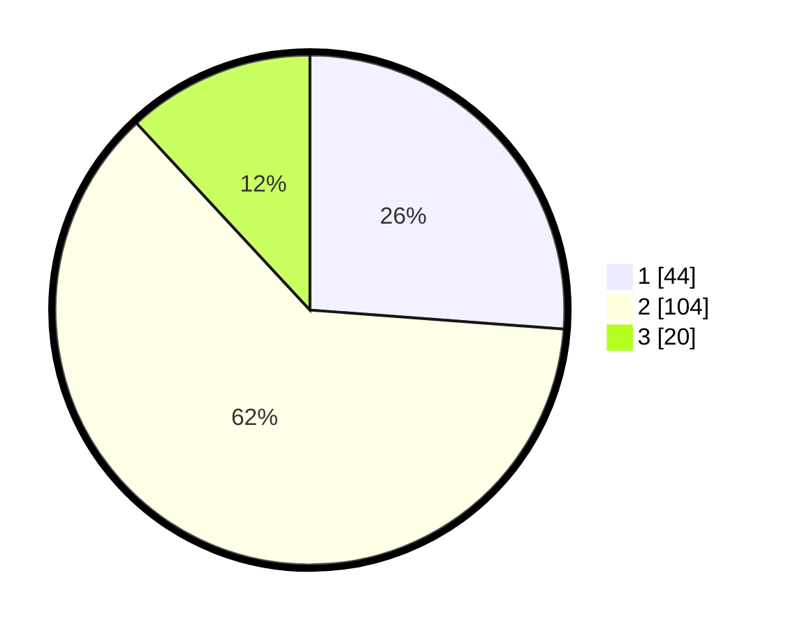

# Hasil

## Grafik

## Tabel

| No. | Nama Paslon    | Suara | Suara (raw) | Persentase |
|:--- |:-------------- | -----:| -----------:| ----------:|
| 1   | ANIES MUHAIMIN | 44    | [44][p-1]   | 26,19      |
| 2   | PRABOWO GIBRAN | 104   | [104][p-2]  | 61,90      |
| 3   | GANJAR MAHFUD  | 20    | [20][p-3]   | 11,90      |

[p-1]: https://github.com/gigit-pemilu/pemilu-2024/blob/main/pilpres/hitung-suara/sub/35-jawa-timur/sub/09-jember/sub/13-rambipuji/sub/2004-kaliwining/sub/004-tps/sub/paslon-1.txt
[p-2]: https://github.com/gigit-pemilu/pemilu-2024/blob/main/pilpres/hitung-suara/sub/35-jawa-timur/sub/09-jember/sub/13-rambipuji/sub/2004-kaliwining/sub/004-tps/sub/paslon-2.txt
[p-3]: https://github.com/gigit-pemilu/pemilu-2024/blob/main/pilpres/hitung-suara/sub/35-jawa-timur/sub/09-jember/sub/13-rambipuji/sub/2004-kaliwining/sub/004-tps/sub/paslon-3.txt

## Foto C Plano

https://sirekap-obj-formc.kpu.go.id/c5d0/pemilu/ppwp/35/09/13/20/04/3509132004004-20240214-210010--82e602d3-2697-4e37-bc27-e5c26c87465e.jpg

https://sirekap-obj-formc.kpu.go.id/c5d0/pemilu/ppwp/35/09/13/20/04/3509132004004-20240214-203816--4cf9412b-83da-4609-bb1a-47028004981b.jpg

https://sirekap-obj-formc.kpu.go.id/c5d0/pemilu/ppwp/35/09/13/20/04/3509132004004-20240214-204300--df72aa7b-a131-4490-93f2-787f16904095.jpg

## Metadata

| Key        | Value               |
| ---------- | ------------------- |
| Time Stamp | 2024-02-15 12:00:28 |

