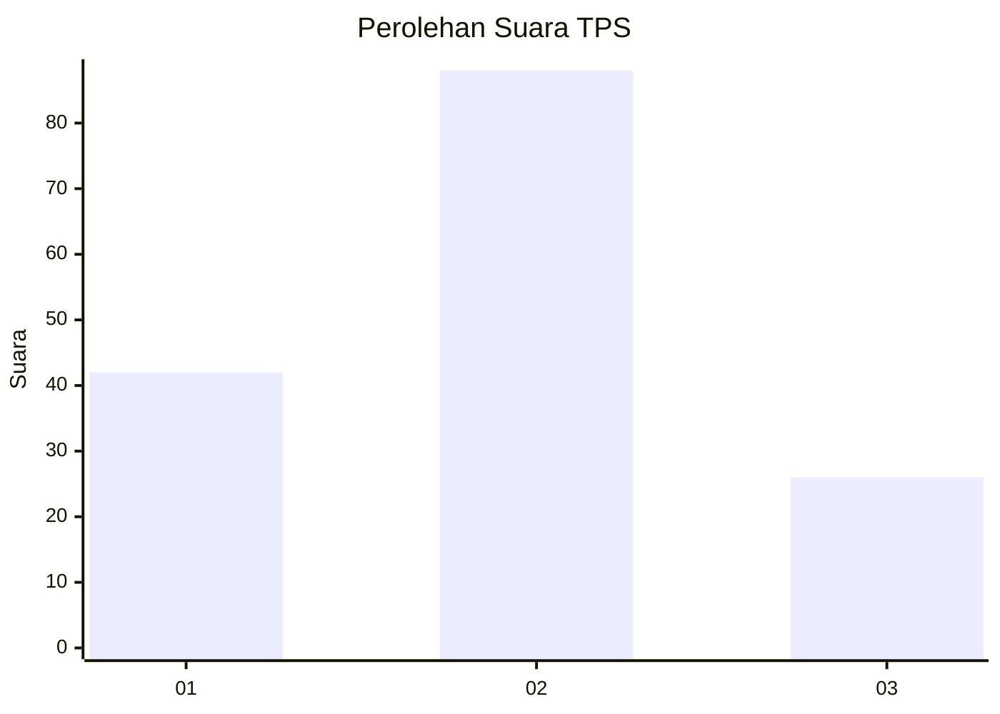
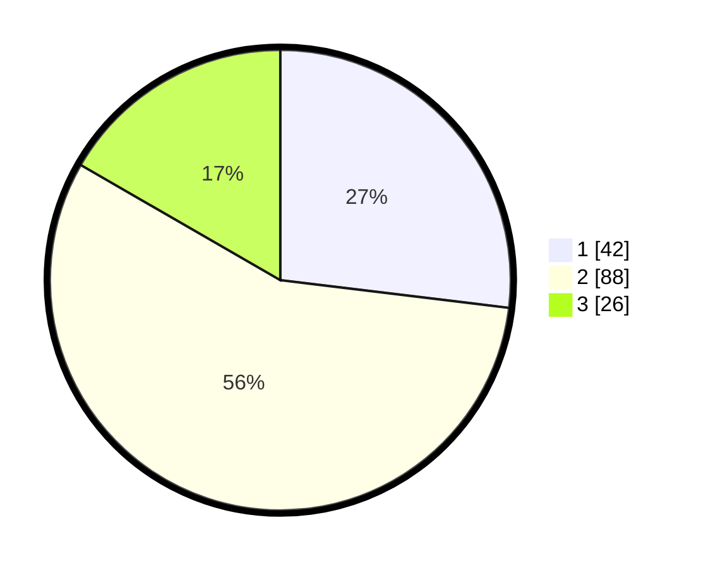

# Hasil

## Grafik

## Tabel

| No. | Nama Paslon    | Suara | Suara (raw) | Persentase |
|:--- |:-------------- | -----:| -----------:| ----------:|
| 1   | ANIES MUHAIMIN | 42    | [42][p-1]   | 26,92      |
| 2   | PRABOWO GIBRAN | 88    | [88][p-2]   | 56,41      |
| 3   | GANJAR MAHFUD  | 26    | [26][p-3]   | 16,67      |

[p-1]: https://github.com/gigit-pemilu/pemilu-2024-35-jawa-timur/blob/main/pilpres/hitung-suara/sub/35-jawa-timur/sub/09-jember/sub/13-rambipuji/sub/2004-kaliwining/sub/009-tps/sub/paslon-1.txt
[p-2]: https://github.com/gigit-pemilu/pemilu-2024-35-jawa-timur/blob/main/pilpres/hitung-suara/sub/35-jawa-timur/sub/09-jember/sub/13-rambipuji/sub/2004-kaliwining/sub/009-tps/sub/paslon-2.txt
[p-3]: https://github.com/gigit-pemilu/pemilu-2024-35-jawa-timur/blob/main/pilpres/hitung-suara/sub/35-jawa-timur/sub/09-jember/sub/13-rambipuji/sub/2004-kaliwining/sub/009-tps/sub/paslon-3.txt

## Foto C Plano

https://sirekap-obj-formc.kpu.go.id/49b8/pemilu/ppwp/35/09/13/20/04/3509132004009-20240215-083113--acc62885-0f12-4efa-87f9-88018b0c7519.jpg

https://sirekap-obj-formc.kpu.go.id/49b8/pemilu/ppwp/35/09/13/20/04/3509132004009-20240215-083128--f92caf62-1312-4242-baf8-49528710d9e9.jpg

https://sirekap-obj-formc.kpu.go.id/49b8/pemilu/ppwp/35/09/13/20/04/3509132004009-20240215-083145--6e5f4a79-0959-4052-9211-761f97e91968.jpg

## Metadata

| Key        | Value               |
| ---------- | ------------------- |
| Time Stamp | 2024-02-25 15:00:00 |

