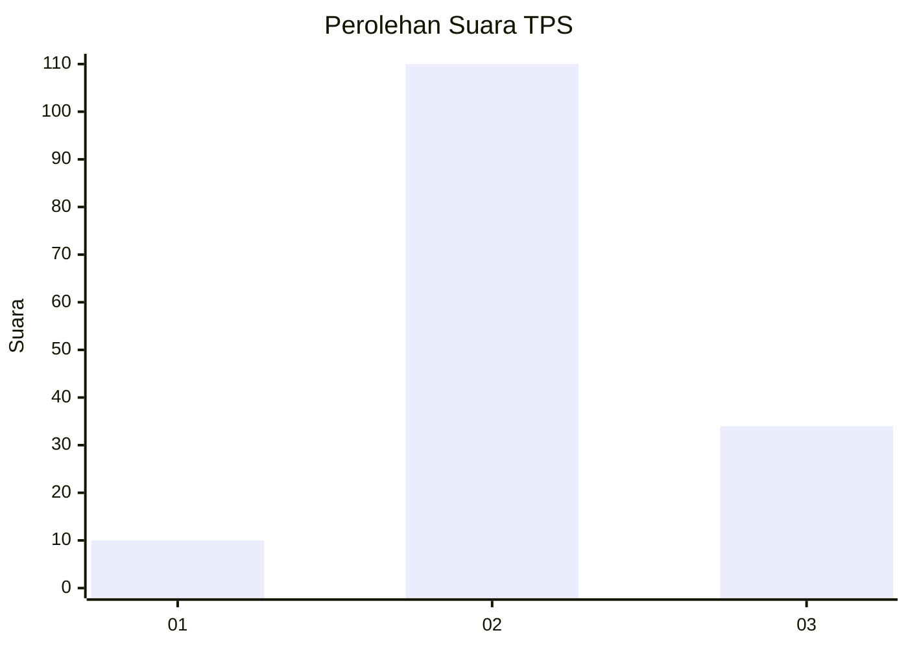
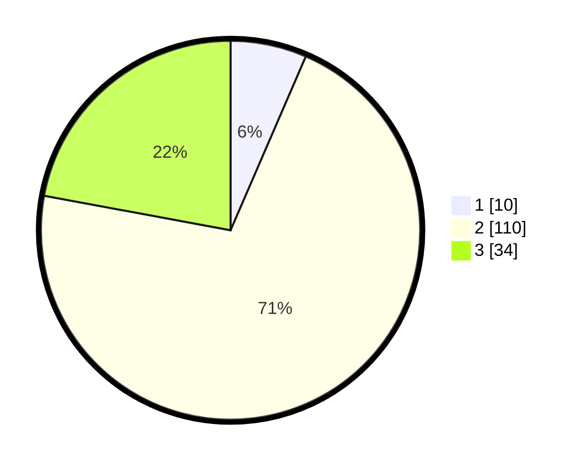

# Hasil

## Grafik

## Tabel

| No. | Nama Paslon    | Suara | Suara (raw) | Persentase |
|:--- |:-------------- | -----:| -----------:| ----------:|
| 1   | ANIES MUHAIMIN | 10    | [10][p-1]   | 6,49       |
| 2   | PRABOWO GIBRAN | 110   | [110][p-2]  | 71,43      |
| 3   | GANJAR MAHFUD  | 34    | [34][p-3]   | 22,08      |

[p-1]: https://github.com/gigit-pemilu/pemilu-2024-35-jawa-timur/blob/main/pilpres/hitung-suara/sub/35-jawa-timur/sub/09-jember/sub/13-rambipuji/sub/2004-kaliwining/sub/012-tps/sub/paslon-1.txt
[p-2]: https://github.com/gigit-pemilu/pemilu-2024-35-jawa-timur/blob/main/pilpres/hitung-suara/sub/35-jawa-timur/sub/09-jember/sub/13-rambipuji/sub/2004-kaliwining/sub/012-tps/sub/paslon-2.txt
[p-3]: https://github.com/gigit-pemilu/pemilu-2024-35-jawa-timur/blob/main/pilpres/hitung-suara/sub/35-jawa-timur/sub/09-jember/sub/13-rambipuji/sub/2004-kaliwining/sub/012-tps/sub/paslon-3.txt

## Foto C Plano

https://sirekap-obj-formc.kpu.go.id/d7c6/pemilu/ppwp/35/09/13/20/04/3509132004012-20240220-091959--9c77b5b7-09ff-4f3b-8f94-1c5bb558fda5.jpg

https://sirekap-obj-formc.kpu.go.id/d7c6/pemilu/ppwp/35/09/13/20/04/3509132004012-20240215-002107--75ebefc5-32a6-4f30-bc84-01ccc4ef09bf.jpg

https://sirekap-obj-formc.kpu.go.id/d7c6/pemilu/ppwp/35/09/13/20/04/3509132004012-20240215-002415--f9da5954-bdb5-4c76-88ee-daf5420a1085.jpg

## Metadata

| Key        | Value               |
| ---------- | ------------------- |
| Time Stamp | 2024-02-20 10:00:00 |

