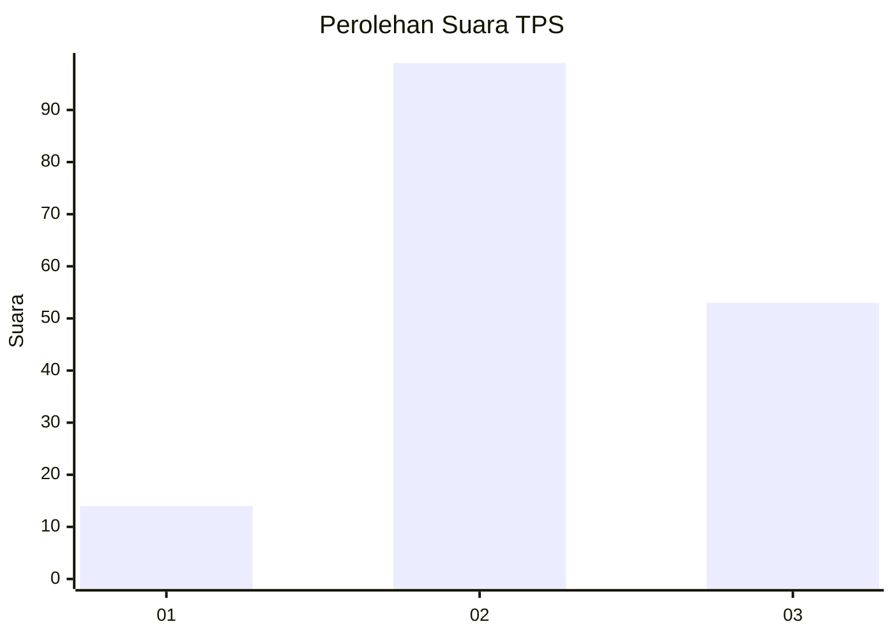
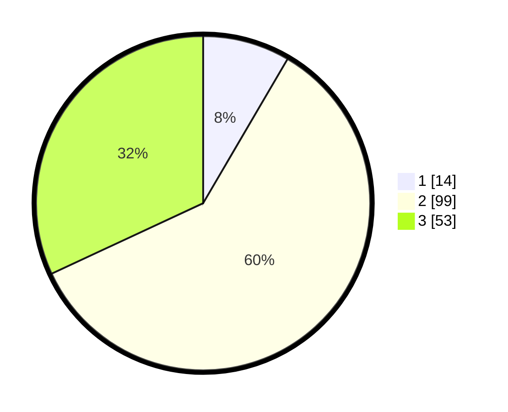

# Hasil

## Grafik

## Tabel

| No. | Nama Paslon    | Suara | Suara (raw) | Persentase |
|:--- |:-------------- | -----:| -----------:| ----------:|
| 1   | ANIES MUHAIMIN | 14    | [14][p-1]   | 8,43       |
| 2   | PRABOWO GIBRAN | 99    | [99][p-2]   | 59,64      |
| 3   | GANJAR MAHFUD  | 53    | [53][p-3]   | 31,93      |

[p-1]: https://github.com/gigit-pemilu/pemilu-2024/blob/main/pilpres/hitung-suara/sub/35-jawa-timur/sub/09-jember/sub/13-rambipuji/sub/2004-kaliwining/sub/013-tps/sub/paslon-1.txt
[p-2]: https://github.com/gigit-pemilu/pemilu-2024/blob/main/pilpres/hitung-suara/sub/35-jawa-timur/sub/09-jember/sub/13-rambipuji/sub/2004-kaliwining/sub/013-tps/sub/paslon-2.txt
[p-3]: https://github.com/gigit-pemilu/pemilu-2024/blob/main/pilpres/hitung-suara/sub/35-jawa-timur/sub/09-jember/sub/13-rambipuji/sub/2004-kaliwining/sub/013-tps/sub/paslon-3.txt

## Foto C Plano

https://sirekap-obj-formc.kpu.go.id/a075/pemilu/ppwp/35/09/13/20/04/3509132004013-20240214-141224--1b2ebc22-0841-417a-a228-d3fa7d033e48.jpg

https://sirekap-obj-formc.kpu.go.id/a075/pemilu/ppwp/35/09/13/20/04/3509132004013-20240214-141312--89a75b2b-a9d5-4af2-a52e-fdb596347541.jpg

https://sirekap-obj-formc.kpu.go.id/a075/pemilu/ppwp/35/09/13/20/04/3509132004013-20240214-141406--6eda81cf-471e-454b-8c48-f2043302095b.jpg

## Metadata

| Key        | Value               |
| ---------- | ------------------- |
| Time Stamp | 2024-02-24 22:31:28 |

