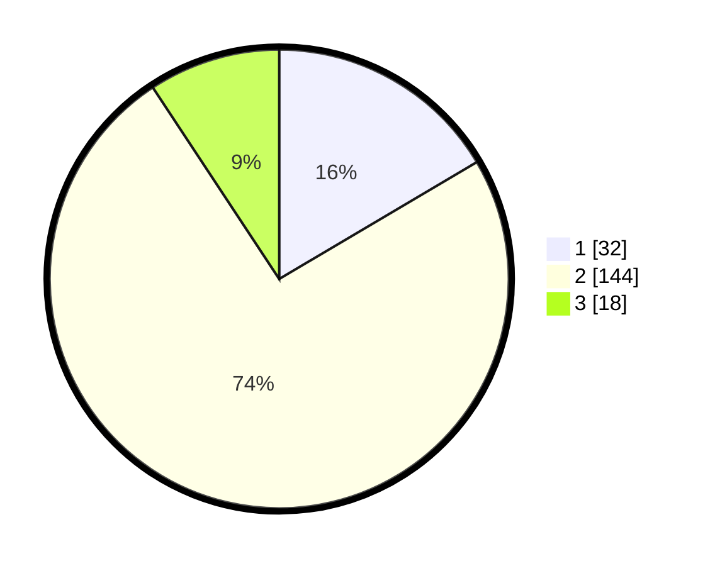

# Hasil

## Grafik

## Tabel

| No. | Nama Paslon    | Suara | Suara (raw) | Persentase |
|:--- |:-------------- | -----:| -----------:| ----------:|
| 1   | ANIES MUHAIMIN | 32    | [32][p-1]   | 16,49      |
| 2   | PRABOWO GIBRAN | 144   | [144][p-2]  | 74,23      |
| 3   | GANJAR MAHFUD  | 18    | [18][p-3]   | 9,28       |

[p-1]: https://github.com/gigit-pemilu/pemilu-2024-35-jawa-timur/blob/main/pilpres/hitung-suara/sub/35-jawa-timur/sub/09-jember/sub/13-rambipuji/sub/2004-kaliwining/sub/023-tps/sub/paslon-1.txt
[p-2]: https://github.com/gigit-pemilu/pemilu-2024-35-jawa-timur/blob/main/pilpres/hitung-suara/sub/35-jawa-timur/sub/09-jember/sub/13-rambipuji/sub/2004-kaliwining/sub/023-tps/sub/paslon-2.txt
[p-3]: https://github.com/gigit-pemilu/pemilu-2024-35-jawa-timur/blob/main/pilpres/hitung-suara/sub/35-jawa-timur/sub/09-jember/sub/13-rambipuji/sub/2004-kaliwining/sub/023-tps/sub/paslon-3.txt

## Foto C Plano

https://sirekap-obj-formc.kpu.go.id/556d/pemilu/ppwp/35/09/13/20/04/3509132004023-20240220-130432--ad7e11c1-95a1-4407-a670-8e2b15fa985d.jpg

https://sirekap-obj-formc.kpu.go.id/556d/pemilu/ppwp/35/09/13/20/04/3509132004023-20240220-130513--e32d1e14-f5f7-40b4-8a40-bf164310fcbd.jpg

https://sirekap-obj-formc.kpu.go.id/556d/pemilu/ppwp/35/09/13/20/04/3509132004023-20240220-130552--25dbec46-9b8e-45f8-90b3-4abc61014d7b.jpg

## Metadata

| Key        | Value               |
| ---------- | ------------------- |
| Time Stamp | 2024-02-24 22:31:28 |

